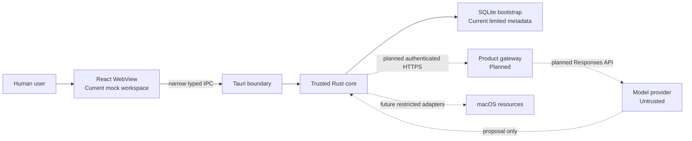
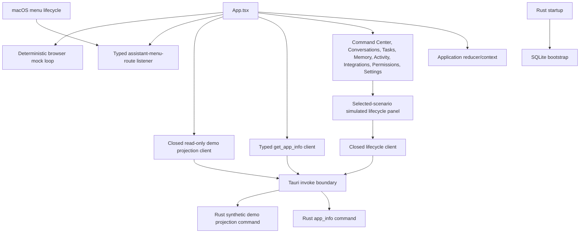
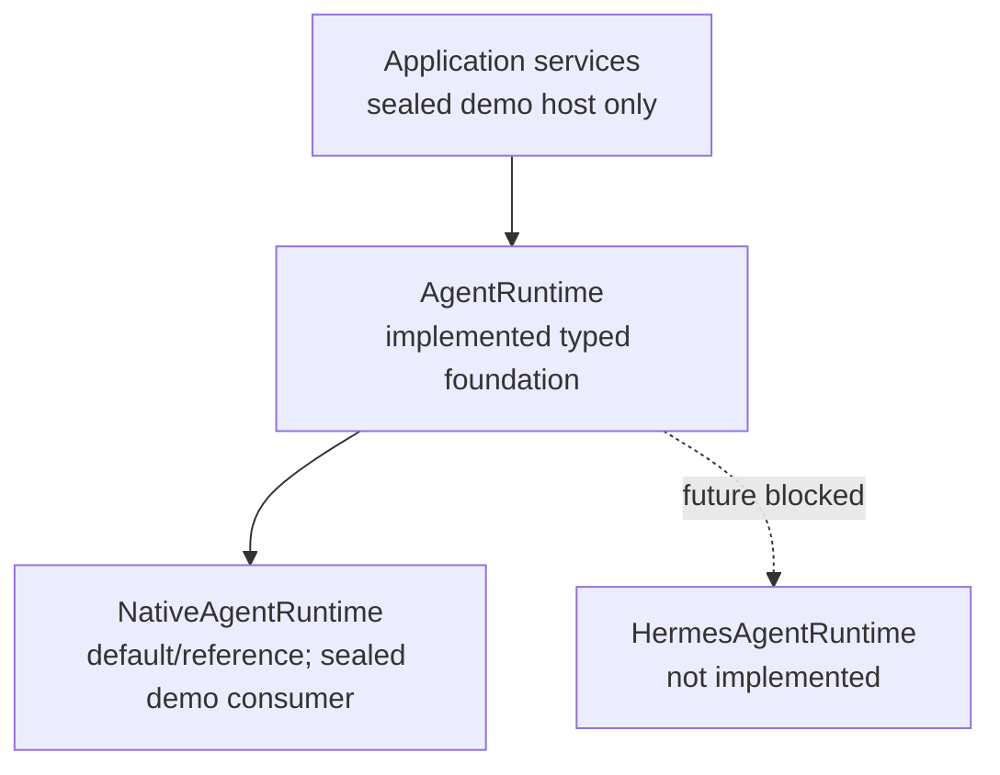
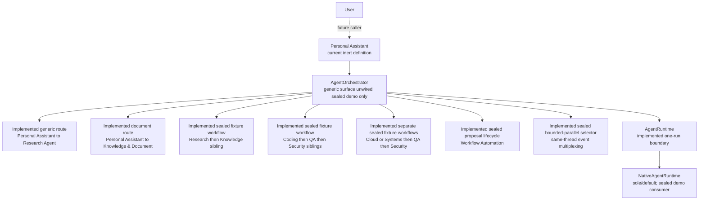
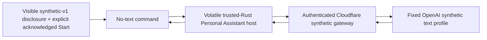
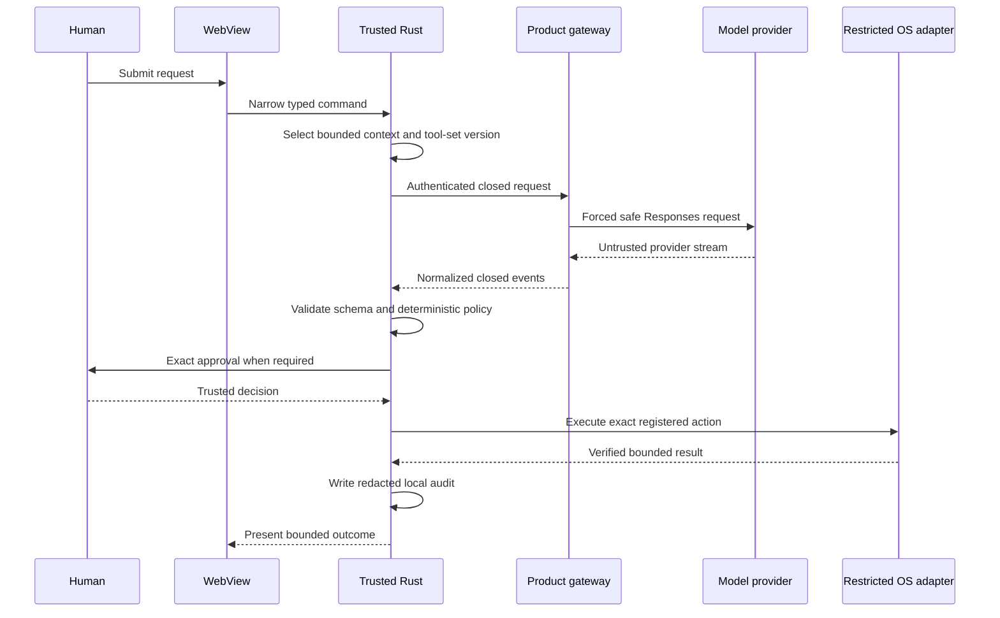

# Cortexa architecture

Status: Authoritative current-state architecture
Last updated: 2026-08-29

## Reading this document

This document distinguishes four states:

- **Current**: present in production source and covered by repository evidence.
- **Mocked**: present only as deterministic, non-authorizing test or UI behavior.
- **Planned**: approved direction without a shipping implementation.
- **Prohibited**: intentionally excluded by product or security policy.

`docs/product/ARCHITECTURE_BASELINE.md` preserves the target baseline. Accepted
decisions in `DECISIONS.md` govern when that target changes. Neither a plan nor a
diagram proves implementation.

## System context

There is no direct model-to-device or WebView-to-device execution path.

## Trust boundaries

1. **Human authority**: supplies intent and explicit approval.
2. **React WebView**: untrusted presentation and volatile interaction state.
3. **Tauri IPC**: narrow serialization boundary; not authorization.
4. **Trusted Rust core**: validates, applies deterministic policy, manages exact
   approval state, and will eventually coordinate restricted execution.
5. **Local storage and OS resources**: protected resources available only
   through reviewed Rust boundaries.
6. **Product gateway**: planned authenticated service with no local authority.
7. **Model and third-party services**: untrusted external processors.

Files, websites, clipboard data, contacts, calendar data, model output, gateway
events, and tool results remain untrusted regardless of their source.

The D-096 Developer ID present-use evidence standard and its local-signing plan
govern a possible future disposable target-Mac proof; they are not a product
architecture edge. They cannot establish historic private-key custody or non-
extractability and grant the application, WebView, Rust runtime, or build system
no Keychain or signing authority. The current topology remains unchanged.

D-097 is also repository-governance state, not a product architecture edge.
The local post-increment hook can now record exact terminal `failed` evidence
without a completion marker. Its report and workspace hashes detect ordinary
unreclosed drift only; they are not authentication, durable audit, or product
authority. In the checkout retaining the ignored state, the current failed
record is `FAIL`/Blocked and cannot admit a successor. A fresh clone does not
inherit that state; repository policy and owner authority prohibit using one to
bypass the recorded disposition.

D-098 implements one exceptional repository-governance recovery from clean
synchronized baseline
`a417e5f1c1c602b917ca27c65af71480e3db6a45`. Its exact one-shot design may add
only bounded schema-v3 lineage from the published D-097 failure to
`personal-assistant-v0-signing-security-prerequisite-planning` through the
argument-free `record-failed-disposition` command. The original state remains
`failed` / `FAIL` / `Blocked` with no completion marker. The historical
screenshot failure and Pending Open Directory boundary remain carried evidence
for that exact documentation-only target; they are not converted to passing
results. The tracked evidence necessarily freezes before the argument-free
transition; it therefore records that transition as Not run and delegates the
sole post-freeze outcome to the ignored schema-v3 state plus redacted `status`
output. Tracked text must not be used to infer whether that later transition
ran. No successor begins automatically. Build-script containment, operational
signing, V0-3, and every product or external-system edge remain Blocked, so the
current product topology is unchanged.

## Current application topology

The React mock loop and the transport-free Rust gateway turn are not wired to
each other. A separate Rust-owned `ResearchKnowledgeDemoHost` manually drives
one application-owned sealed D-086 fixture through `NativeAgentRuntime`; its
narrow Tauri adapter reaches only the separately labelled lifecycle panel in
the selected scenario. It has no edge to the fixture graph, Conversations,
provider transport, tools, persistence, or device execution.

## React presentation layer

**Current**:

- `src/App.tsx` composes the application shell and injects typed services.
- `src/application/` owns reducer-based volatile state, conversations, mock run
  lifecycle, provenance, mock results, and menu-route navigation.
- `src/features/` renders conversations, mock approval, Activity, Tasks,
  Permissions, Settings, placeholders for Memory and Integrations, and a lazy
  deterministic Command Center projection.
- `src/features/command-center/` owns closed fixture projection/validation,
  seven scenarios, feature-local presentation state, graph/structured
  alternatives, inspector, and bounded activity. Those fixture controls remain
  IPC-free. Only the selected Research and Knowledge scenario may explicitly
  refresh a separate read-only Rust synthetic projection, and it separately
  mounts one prop-free simulated lifecycle panel. Neither native result
  populates or controls the fixture graph. React Flow types stop at one adapter.
- `src/infrastructure/tauri/` runtime-narrows the app-info response from
  `unknown` to one exact bounded six-field DTO. It separately narrows the
  synthetic demo-projection reply from `unknown` to one exact versioned DTO
  with fixed scenario, provenance, three ready roles, and three
  presentation-only outcomes. Rejected data maps to fixed application copy.
  The menu-route event is also runtime narrowed. A separate lifecycle client
  accepts only the exact content-free lifecycle DTO and journal grammar.
  Explicit command responses are the sole presentation authority; malformed,
  older, and same-revision events do not mutate state, while every parser-valid
  newer notification requires explicit snapshot recovery. The client
  is created and disposed only with the selected-scenario lifecycle panel.
- Conversations, activity, approval state, tool results, and settings are not
  persisted by the WebView.

**Mocked**: assistant streaming, context provenance, tool activity, approval,
simulated tool results, final answers, Stop, Retry, Activity, and Command Center
agent/task/workflow state are fixed local behaviors. They perform no model
request, IPC agent request, or operating-system action. Command Center state is
persistently labeled `DEMO MODE · SIMULATED AGENT DATA`. The separate Rust
projection is also synthetic and descriptive; it does not start a run or prove
that any displayed outcome occurred.

**Prohibited**: authorization, policy override, generic database access, raw
provider calls, arbitrary command selection, and operating-system execution in
the WebView.

## Tauri IPC boundary

**Current**:

- `get_app_info`, `get_research_knowledge_demo_projection`, and four fixed
  Research/Knowledge lifecycle commands are the only custom invoke commands.
  The projection is argument-free, application-owned, volatile, read-only, and
  returns only the closed synthetic v1 projection. Lifecycle snapshot, start,
  advance, and cancel accept no caller values and return only the closed
  content-free lifecycle snapshot/error.
- `assistant-menu-route` is a closed native-to-WebView event for Open, New
  Request, and Tasks navigation.
- `research-knowledge-demo-lifecycle-v1` is a fixed notification-only snapshot
  event. The lifecycle client listens only while its panel is mounted, but an
  event never commits presentation state or proves an outcome; only an exact
  command response can do so.
- The main window has only `core:default` capability permission.
- The capability file contains no shell, filesystem, network, database, or
  privileged macOS plugin permission. The production CSP excludes development
  WebSocket sources and inline-script execution. Its separate development CSP
  adds only `ws://localhost:1420` for the fixed local Vite server. Both retain
  inline styles because current React/React Flow rendering uses element style
  attributes; Tauri's default asset nonce/hash modification remains enabled.

**Planned**: any future product command must be narrow, typed, locally
validated, capability-scoped, and separately approved. A generic
`execute_action`, SQL, shell, filesystem, provider, or tool-dispatch command is
prohibited. No additional workflow/control IPC exists beyond the fixed
simulated lifecycle adapter; no polling, provider, generic runtime-selectable,
or general agent-control IPC exists.

## Trusted Rust core

`src-tauri/src/lib.rs` assembles current startup and Tauri behavior. The trusted
modules are intentionally transport-free where runtime coordination is absent.

### Volatile Research/Knowledge demo lifecycle

**Current, Tauri-adapted and narrowly connected to one simulated panel**:
`research_knowledge_demo_lifecycle` owns one manually stepped, process-local
D-086 workflow. Its public host accepts no
caller data: production owns the runtime, objective, sources, private scripts
and schedule, identities, and envelopes. `start`, `advance`, and `cancel` project only a
versioned content-free lifecycle snapshot/transition with a Rust-issued epoch,
monotonic revision, and eight-entry cap. Internal task/run/request/context,
fixture content, results, and raw errors never cross the contract.

Completed epochs use a private application-owned success -> synthesis-failure
-> success schedule. Only a returned terminal completion advances the schedule;
cancellation during research, knowledge, or synthesis consumes no slot. No UI
or IPC value can select the script or outcome.

The host retains the orchestrator through cancellation and rejected-run cleanup.
An active cleanup failure blocks restart and is retried only by no-argument
`cancel`. If Drop-time cleanup persistently fails, the owner is retained until
process exit and a private process-wide atomic sentinel blocks replacement
`start`, `advance`, and `cancel`. This sentinel is fail-closed only; it is not a
lock, scheduler, concurrency coordinator, or future Tauri state design. One
private Tauri state owns the host behind a mutex and exposes exactly four
no-input commands plus a notification-only event. One prop-free panel consumes
that fixed adapter only in the selected scenario; start, advance, and cancel
remain explicit user actions. No timer, thread, provider, tool, persistence,
filesystem, or device effect exists.

### Initial gateway turn and protocol

**Current**:

- `agent::gateway_request` creates one bounded serialized initial request and
  binds a transport-free `InitialGatewayTurn`.
- `agent::gateway_protocol` validates closed normalized event frames, protocol
  identity, sequence, size, cancellation, text bounds, function-call bounds,
  and exactly one terminal outcome.
- `agent::function_call_validation` consumes a normalized function call and
  independently validates its local tool identity and arguments.
- The turn binds terminal function validation, deterministic policy, exact
  approval presentation, native resolution on macOS, and run-termination denial
  to one privately owned manager. Successful native and run-termination
  resolutions are validated and recorded by the turn's private typed in-memory
  approval-audit adapter before a closed resolution-plus-receipt value leaves
  the turn.

Every emitted value remains non-authorizing. There is no direct or generic
gateway Tauri caller, live transport, provider adapter, runtime coordinator,
continuation loop, dispatcher, or executor. The sealed demo host reaches the
turn only indirectly through `NativeAgentRuntime`.

### Personal Assistant v0 sealed turn and volatile host

**Current, transport-free and unwired**: `agent::runtime` privately distinguishes
the unchanged Initial request from one fixed Personal Assistant synthetic-v0
profile. The latter accepts only Rust-issued correlation identities; it pins
the application-owned fixture, exact instructions, provider/model profile,
lower limits, `empty@1`, zero retries, and no fallback. `agent::gateway_request`
owns its text-only transactional validator and rejects tools, retry metadata,
unknown or late events, and scalar/byte/event limit violations.

`NativeAgentRuntime` still exposes the sole `AgentRuntime::start` path and owns
the Initial or Personal Assistant turn behind one private boxed enum. Existing
Initial concrete frame/approval methods remain Initial-only and fail closed or
safely no-op on the new profile. The private `personal_assistant_v0` module
owns one public no-input volatile host. It issues predictable process-local
correlation IDs, compares the complete returned runtime identity and exact
initial status, holds one process-wide lease, and terminal-cleans or privately
quarantines rejected ownership before replacement. Its public surface contains
only closed status, request-byte length, and local cancellation; request bytes
remain crate-private and response frames/content have no host ingress.

The crate-private turn and Native shared-event tests prove deterministic
success, failure, cancellation, limits, and late-event rejection. Those are
fixture-only results. There is no Tauri/WebView consumer, event pump,
transport, provider call, credential, persistence, tool execution, durable
audit, filesystem access, background work, or device effect.

### Runtime adapter direction

**Current foundation; not generically or runtime-selectably wired**: D-079's
application-owned runtime foundation now exists in Rust. `AgentRuntime`
constructs one bounded run from application-owned typed input. `RuntimeRun`
exposes closed identity, status, bounded untrusted-event acceptance, typed
failure, and exact idempotent cancellation. The repository still has no live
general application-session runtime consumer, runtime selector, provider
transport, live model, Hermes adapter, or OpenClaw adapter. The sealed
Research -> Knowledge demo remains the sole Tauri/UI runtime consumer; the
Personal Assistant v0 host is a Rust-only no-input caller with no response
ingress.

`NativeAgentRuntime` is the sole/default implementation. It constructs and owns
either the unchanged `InitialGatewayTurn` or the sealed Personal Assistant
text-only turn behind a private boxed enum. Its Initial concrete surface still
delegates the exact request bytes, normalized-frame validation, policy and
approval results, trusted macOS approval resolution, and audited run-termination
cleanup. The common shared-event lane privately translates only closed
lifecycle, text, and failure values. Native does not claim shared tool-proposal
capability because the Initial tool lane produces governance-owned results and
the Personal Assistant profile rejects every tool. Concrete frames and shared
runtime events cannot be mixed within one run.

`RuntimeCapabilities` is a fixed closed representation. Capability declarations
grant no permission. Run/request/response/tool-call identities, selected text,
output text, and arguments use bounded application-owned types with redacted
Debug output. Generic cancellation closes either a nonterminal stream or a
run-owned pending approval through the existing typed audited termination path;
approval and audit values never enter the generic result.

`MockAgentRuntime` exists only as a private deterministic Rust contract fixture.
It uses fixed application-owned events, supports controlled unavailability,
start/event failure, invalid transitions, capability contradiction, terminal
cancellation, and late-event rejection, and has no clock, thread, filesystem,
network, process, model, provider, or Hermes prerequisite. The separate visible
React mock is unchanged.

“Fallback” remains an explicit future application-owned runtime choice; no
selector or automatic fallback code exists, and automatic model-provider
failover is not authorized.

`HermesAgentRuntime` would keep all Hermes types, configuration, events, and
errors inside one adapter and translate them to closed bounded Cortexa-owned
types. OpenClaw is only a possible later evaluation and is not a current or
selected adapter. No external runtime may own validation, policy, approval,
restricted execution, cancellation, audit, credentials, or direct device
access. Its output remains untrusted and must traverse the same deterministic
Rust gates as any other proposal.

This conceptual runtime seam is separate from model-provider transport. It does
not restore D-032's deleted synchronous arbitrary-string `AgentProvider` or
authorize networking, dependencies, credentials, provider selection, a live
model, dispatch, execution, or a Tauri capability. D-082 separately accepts the
multi-agent application-service target below; it does not add current behavior.

#### Native catalog, task, and bounded orchestration foundation

**Current Rust foundation; generic/catalog surface unwired**: D-082 established
the native multi-agent ownership model and D-083 combined its former task and
first-flow phases. The Rust core now contains the closed catalog, bounded task
domain, and one deterministic application-owned orchestration service above the
unchanged one-run runtime seam. The sealed Research -> Knowledge demo host is
the sole current Tauri/UI consumer and exposes no generic task or runtime
selection.

Agent-role arrows show logical assignment/delegation, not component authority.
The orchestrator invokes the runtime for each root or child run; definitions do
not call runtimes.

The current `AgentDefinition` is immutable, application-owned identity,
purpose, versioned instructions, and a non-authorizing activation disposition.
The catalog documents the closed functional groups, including cross-cutting
membership, without adding a routing field. The current `AgentRegistry`
performs validated deterministic lookup/listing of all nine definitions and
their closed `Initial`/`Deferred` catalog state. Discovery is non-authorizing;
operational selection and task creation fail closed for deferred definitions.
Neither registration, grouping, nor activation grants tools, routing, policy,
memory, provider, or device authority.
The catalog marks all nine definitions, including Workflow Automation,
`Initial`; none is a direct or autonomous UI endpoint or a shipping assistant.
The sealed demo host consumes only its fixed Personal, Research, and Knowledge
roles through the orchestrator. Knowledge
eligibility applies only to D-085's separate approved-document route and
D-086's sealed fixture workflow. Coding, QA, and Security eligibility applies
only to D-087's sealed fixture-only proposal workflow. None grants a generic
route. Cloud and Systems eligibility applies only to D-088's two separate
sealed fixture-only/no-I/O selectors. None grants a generic
delegation edge, tool, memory, or device capability. The embedded instruction
sources are closed application-owned Rust assets rather than runtime-loaded
files.

`AgentTask` now owns one bounded objective, exact agent/root/parent/depth
lineage, the closed `Pending`/`Running`/`WaitingForChild`/terminal state
machine, and at most one typed terminal outcome. `AgentExecutionContext` is
derived from live task and runtime-run state and binds the agent, task, root,
optional parent, runtime, depth, run, request, and exact versioned policy- and
memory-profile identities. Both profiles are captured from the sealed built-in
definition identity rather than supplied independently by a caller.

`AgentOrchestrator<R: AgentRuntime>` is a separate application service. One
instance owns at most one root workflow. Its generic and approved-document
paths retain two tasks, three sequential runtime runs, one non-replenishing
child, one active child, depth one, and 32 runtime and application events.
D-086's separately selected sealed workflow expands those finite limits to
three tasks, two non-replenishing sequential children, one active child, four
runs, and the same depth-one and 32-event limits. D-087's separately selected
sealed engineering workflow uses four tasks, three non-replenishing sequential
children, one active child, five runs, depth one, and the same global 32-event
limit plus a 16-record workflow journal/audit. It owns task assignment,
D-088's Cloud and Systems selectors each use the same four-task, three-child,
five-attempt, one-active-child, depth-one, zero-retry boundary while remaining
mutually exclusive separate workflows. It owns task assignment,
exact live-context checks, the generic Personal Assistant-to-Research route,
D-085's separate approved-document Personal Assistant-to-Knowledge route,
D-086's fixed Research/Knowledge sequence, D-087's fixed Coding/QA/Security
sequence, bounded output accumulation, result attribution, synthesis
sequence, D-088's separate Cloud/QA/Security and Systems/QA/Security sequences,
D-090's fixed Personal/Workflow Automation/Personal proposal sequence and
single-use mapping to the existing sealed A-D selectors, bounded output
accumulation, result attribution, synthesis resumption, and child-first
cancellation. It is not a
runtime, provider, policy engine, tool registry, approval manager, or executor.
It directly owns one workflow-local `MemoryStore` and `ApprovedDocumentReader`
without transferring their authority to an agent or runtime, and composes the
non-executing governance service below.

A root may complete directly in one runtime run. Delegation is accepted only
before root output begins; the orchestrator then terminally cancels that first
run without cancelling the root task, starts one Research child run, treats its
bounded result/failure/cancellation as untrusted attributed data, and starts a
fresh Personal Assistant synthesis run. Runtime events must match the exact
active task, run, request, and sequence before any limit or content processing.
Tool proposals fail this text-only boundary closed and are never forwarded.
Process-local workflow namespaces prevent events or contexts from one live
orchestrator instance from binding to another.

Authoritative application boundaries remain `AgentOrchestrator`,
`AgentRuntime`, `NativeAgentRuntime`, `AgentRegistry`, `ToolRegistry`,
`PolicyEngine`, `ApprovalManager`, `AuditLogger`, `MemoryStore`, and
`PlatformAdapter`, with several still planned rather than implemented. Security
& Risk is not `PolicyEngine`, QA & Validation is not `ApprovalManager`, and
Workflow Automation is not `AgentOrchestrator`. Agents may emit bounded
recommendations or typed requests; application code owns lifecycle,
authorization, approval, execution, and audit decisions.

The generic orchestration boundary uses depth one, one child task total per
root, and one active child. Completion or cancellation does not replenish the
budget. Only the orchestrator may create a child task. Generic delegation is a
typed application-service call and remains exactly Personal Assistant to
Research Agent. D-085 adds a separate trusted application document-task call
from Personal Assistant to Knowledge & Document; it is not generic delegation,
a runtime control event, shell command, filesystem tool, or `agent.delegate`
host tool. D-086 separately expands only its sealed workflow to two sequential
sibling children, and D-087 separately expands only its sealed engineering
workflow to three sequential sibling children. Both retain depth and active-
child concurrency at one.

The initial root is exactly Personal Assistant. Research and Knowledge cannot
delegate; self, reverse, unknown, and all other generic routes fail before task
creation. Generic or direct Research-to-Knowledge remains denied. D-086 adds
only one application-selected sealed sequence in which the orchestrator creates
Knowledge as a new depth-one sibling after validating the Research result.
These allowlists are owned by the application/orchestrator. Registry membership,
activation, or a memory profile grants no route. D-087 adds no generic Coding,
QA, or Security route: only its exact application-selected sibling sequence is
implemented. D-088 likewise adds no generic Cloud, Systems, QA, or Security
route: only its two separate application-selected sibling sequences exist.
D-090 adds no generic Workflow Automation route: its application-selected
proposal sequence and take-once A-D dispatch token are separate sealed
selectors. Template E, every tool/approval step, and every later automation
workflow remain non-executable. All workflow arrows mean orchestrator-controlled
sequencing at depth one, never specialist spawning.

D-091 adds one mutually exclusive `BoundedParallel` selector with three sealed
fixture-only/no-I/O graphs. It may retain multiple independent specialist
`RuntimeRun` values and accept their events by exact task/run identity on one
application thread. Stable catalog ordinals determine admission, dependency
transfer, cancellation order, outcome projection, and Personal synthesis;
completion timing never does. The exact bounds are depth one, default active
two, hard active and total specialist children three, four tasks, five run
attempts, zero automatic retries, eight events per run, 32 records per
applicable runtime/generic/workflow/audit family, a 120-second root lease, and
60-second child leases capped by the root deadline.

Every admitted child has separate task, execution context, runtime-run,
cancellation handle, output, policy/memory attribution, and task-memory state.
Root cancellation and expiry sweep active children in ordinal order; incomplete
cancellation remains closed and resumable, and rejected run identities stay
quarantined until cleanup succeeds. `ContinuePartial`, `CancelDependentOnly`,
and specialist-lane `FailFast` are application-selected policies. Public slots
remain exactly succeeded, failed, cancelled, timed out, or skipped, and final
synthesis must disclose source agents, statuses, finding IDs, failures, and
unresolved issues.

This is an unwired cooperative orchestration proof, not simultaneous CPU or
provider work. There is no app-global capacity coordinator, provider session
registry, hard preemption, worker, scheduler, durable queue, or general graph
engine. Runtime traits and Native remain unchanged, and all prior selectors
keep their one-active-child semantics.

All runtime starts now share the same application-owned containment boundary:
the returned run/request identity must exactly match `RuntimeTurnRequest`, a
returned identity cannot duplicate a live run, and rejected nonterminal runs
remain quarantined until cancellation cleanup succeeds. Quarantine blocks new
and fallback starts. This is volatile lifecycle ownership only; it adds no
external runtime, provider session, IPC, persistence, or background cleanup.

#### Per-agent governance foundation

**Current Rust foundation; not generically or UI-control wired**: D-084 adds nine
closed versioned policy profiles and captures the exact profile in each built-in
definition, task, live execution context, delegation request, governed tool
request, approval lifecycle, and governance record. `AgentDefinition` remains
the sole AgentId-to-profile mapping. Only an orchestrator-private proof minted
after exact live task/run validation can derive `AgentAttribution`; stale or
foreign contexts fail before governance or audit mutation.

`AgentGovernanceService` composes, but does not replace, the existing
application-owned `ToolRegistry`, `DeterministicPolicyEngine`, and
`ApprovalManager`, plus a new closed volatile governance audit. Its synthetic
tool-proposal entry point is separate from runtime events and accepts only the
two already registered local schemas. Personal Assistant alone is eligible:
date/time is `Allow`, local-task creation is `RequireApproval`, and every other
profile is `Deny`. All outcomes carry `ExecutionDisposition::NotAttempted`;
there is no executor or dispatch. Runtime tool proposals remain rejected by the
text-only orchestrator boundary.

Approval origin is a closed `LegacyGateway` or exact `Agent` attribution. The
pending request, presentation, trusted target-Mac result, cancellation, expiry,
and terminal resolution preserve that origin without exposing attribution in
Debug. Pending approval blocks further runtime events and delegation for its
task. Task cancellation reconciles and audits approval first, with child-first
ordering for root cancellation. A manager failure leaves approval/task/run
state live and unchanged; a later runtime-cancellation failure leaves the
approval terminally Cancelled while the task/run remain retryable.

The governance audit is a typed, redacted, process-local family capped at 32
subjects. It reserves one slot before policy/approval/control mutation, updates
that slot through terminal disposition without new capacity, uses deterministic
logical ticks, prevents exact-subject replay, retains no arguments or content,
and grants no authority. Delegation remains outside `ToolRegistry`; the audit
records the exact Personal-to-Research matrix result independently from later
control denial or child-creation outcome.

Before memory access, a sealed built-in definition now supplies the exact
memory-profile identity carried through task, live execution context, and
attribution. Missing, unknown, stale, foreign, or mismatched live identity fails
before content clone or mutation and never defaults to Personal Assistant.
Persistence, data-bearing privileged actions, and device effects remain
separately gated.

The current baseline contains no generic or runtime-selectable multi-agent Tauri
IPC, authoritative/live multi-agent React state, provider, live model, tool
executor, platform adapter, durable audit, durable memory, or device action. A
separate frontend-only `command-center-demo-v1` fixture projection visualizes
the architecture but is not wired to the Rust catalog, tasks, orchestrator,
workflows, governance, or runtime. Those generic/catalog surfaces remain
Rust-only and unwired. The sole narrow exception is the sealed no-input
Research -> Knowledge demo lifecycle described above; it reaches only its
separately labelled simulated panel and does not populate the fixture
projection. The Tasks and Memory screens remain placeholders.

#### Volatile memory and approved-document Knowledge boundary

**Current verified Rust foundation; no direct product surface**: D-085 adds one
application-owned `MemoryStore` and one
`ApprovedDocumentReader` directly owned by each one-root `AgentOrchestrator`.
They are process-local, non-global, non-injectable application services with no
thread, database, network, provider, clock, background index, or persistence.
Dropping the orchestrator/store clears retained content; nothing crosses an
orchestrator workflow or survives process exit. The sealed demo host may use
these services only inside its fixed D-086 workflow; no memory/document value or
control crosses its lifecycle DTO.

The closed memory namespaces are approved shared, agent-private,
task-temporary, and proposed shared. Personal Assistant may read approved
shared and its own private/task records. Research and Knowledge may use only
their own private/task records and create inert proposals; the other six roles
are memory-disabled. Approved-shared promotion requires trusted application
review against an exact proposal version. Reads name exact record IDs, context
selection is bounded to eight records and 8,192 bytes, and no history,
document, namespace, sibling result, or private record is copied implicitly.
Terminal task cleanup removes only that task's temporary records. Disable
atomically clears all volatile memory and re-enable starts empty.

Agent memory access requires a non-cloneable grant derived from exact live
agent, policy profile, memory profile, task/root/parent, runtime, depth, run, and
request attribution. Application review/delete/disable and document
registration/revocation use separate application-control proof types. These
proofs have no public constructor and cannot be supplied by a model, runtime,
WebView, document, or caller-authored identity.

The document reader retains exact paths privately behind opaque workflow-bound
IDs. Trusted application code may register one user-selected file, task
attachment, generated artifact, or exact approved-root member. There is no
directory enumeration. Reads accept only nonempty lowercase `.txt` or `.md`
UTF-8 content up to 16,384 bytes. Relative paths, component counts, roots, and
references are bounded; traversal, noncanonical input, symlinks, hard-link
aliases, non-regular files, unsupported formats, replacement, detected in-read
mutation, replay, revocation, and cross-workflow binding fail closed. Supported
Unix targets compare registered, opened-handle, and final-path identity before
and after the bounded read. Pure-`std` opening retains a narrow documented
TOCTOU advisory; non-Unix targets report this boundary unavailable.

One reference is linearly reserved, then aborted or consumed. After the root
run is terminally cancelled, a consumed reference feeds exactly one direct
Personal Assistant-to-Knowledge child request. The document and an optional
explicit approved-shared selection are labeled untrusted and bounded to 26,624
raw UTF-8 bytes including framing. The result is one attributed
`DocumentTaskResult`, followed by a fresh Personal Assistant synthesis run.
Knowledge cannot choose paths, crawl roots, use tools, write artifacts,
delegate, or publish approved shared memory. The generic delegation matrix is
unchanged. At the D-085 checkpoint, Research-to-Knowledge remained blocked;
D-086 now adds only the separately selected sealed sibling sequence described
below and does not create a generic or direct delegation edge.

Focused evidence passes 6 memory units, 9 document units, 10 public memory/
document contracts, and the 7 registry, 10 governance, 22 orchestration, 20
runtime, and 10 gateway regression contracts. Both storage smoke contracts
pass. The all-target Rust suite passes 269 tests with one intentionally ignored
opt-in Hermes probe; formatting, all-target/all-feature check, strict Clippy,
complete repository verification, and independent architecture/security/code
review pass. The quality result is `PASS WITH ADVISORIES` for the accepted
pure-`std` document-open TOCTOU residual. No Tauri command, React consumer,
provider, live model, SQLite product data, dependency, permission, executor, or
device effect was added. See
[`AGENT_MEMORY_DOCUMENT_PRIVACY.md`](docs/security/AGENT_MEMORY_DOCUMENT_PRIVACY.md).

See
[`NATIVE_MULTI_AGENT_ASSESSMENT.md`](docs/architecture/NATIVE_MULTI_AGENT_ASSESSMENT.md),
[`ADR-NATIVE-MULTI-AGENT-ARCHITECTURE.md`](docs/adr/ADR-NATIVE-MULTI-AGENT-ARCHITECTURE.md),
the authoritative [`ROADMAP.md`](ROADMAP.md), and its subordinate
[`NATIVE_MULTI_AGENT_ROADMAP.md`](docs/roadmap/NATIVE_MULTI_AGENT_ROADMAP.md).

#### Sealed fixture-only Research and Knowledge workflow

**Current implemented Rust foundation; sealed and consumed only by the no-input
demo host**: D-086 adds `agent::research_knowledge` and a closed
`ResearchKnowledgeWorkflowRequest` for the versioned `research-knowledge-v1`
application-service path inside `AgentOrchestrator`. Trusted application code
selects the path from an exact live Personal Assistant root. The orchestrator
terminally cancels the initial Personal run, creates one Research child, creates
one Knowledge child only after accepting a structurally valid, source-complete
Research result, and then starts a fresh Personal synthesis run. Research and
Knowledge are sequential depth-one siblings with the same root; neither
specialist creates a task, delegates, or invokes a runtime.

The workflow's exact limits are three tasks, two non-replenishing children, one
active child, four sequential runtime-run attempts, 32 accepted runtime events,
32 generic orchestration events, 16 workflow events, 16 matching workflow audit
records, and zero automatic retries. The immutable fixture catalog contains one
to eight sources. Source IDs are canonical application-issued values of at most
64 ASCII bytes; aggregate evidence is at most 8,192 bytes and the serialized
catalog at most 16,384 bytes. The objective is bounded to 2,048 Unicode scalar
values and 8,192 bytes. Research and Knowledge inputs are each capped at 26,624
bytes; final synthesis is capped at 36,864 bytes with a separate 4,096-byte
fixture-disclosure-and-framing bound. Specialist output retains the existing
8,192-scalar/16,384-byte task-output bound.

Both specialist results are strict JSON with unknown fields and trailing or
outer content rejected. Research V1 permits at most 16 findings, four unresolved
questions, four limitations, and four source references per item. Knowledge V1
requires one to eight sections and permits at most 16 extracted facts, four
contradictions, and four references per item. Research references must exist in
the application catalog; Knowledge references must already exist in the
validated Research result. The orchestrator binds the Knowledge predecessor to
the exact Research task and result version. Missing references or an explicit
incomplete result produce a typed partial quality; unknown, duplicate, or
remapped references fail closed. Final Personal output is also one strict V1
JSON envelope with an answer bounded to 2,048 scalar values/8,192 bytes, exactly
the source-ID set preserved by the Research outcome, `fixture_based: true`, and
a stage-derived `complete` or `partial` status. Its answer must disclose fixture
evidence and, when applicable, partial status.
Missing, duplicate, unknown, or invented references, false fixture disclosure,
wrong status, URLs, live-research claims, reasoning, and unknown fields fail the
root rather than creating a completed workflow result. The final workflow
result retains that validated synthesis together with the closed Research and
Knowledge stage outcomes. No raw invalid output, arbitrary citation, URL, path,
or reasoning is forwarded.

Before an accepted D-086 terminal runtime event mutates workflow state, the
orchestrator checks the root event cap and prepares parsing, the terminal task
output, remaining capacity, the next Knowledge task/request/non-authoritative
attribution, and the applicable fallback or synthesis request. A preparation
failure leaves the live run and workflow unchanged. If a continuation runtime
cannot start after the terminal event is accepted, that event remains accepted;
the consumed task/run attempt remains consumed, fallback or root failure is
applied, and a closed `ResearchKnowledgeContinuationFailure` records only the
continuation category. There are no retries or budget replenishment.

Research failure, cancellation, invalid structured output, or a valid result
with missing source references skips Knowledge and may start truthful partial
Personal synthesis; the partial Research result is retained when it is valid.
Knowledge failure, cancellation, or invalid output preserves only the validated
Research result and may start partial synthesis. A valid incomplete Knowledge
result is retained with partial quality. Synthesis failure fails the root
without fabricating a workflow result. Root cancellation resolves pending
governance, cancels the active child before the root, records one workflow
cancellation, starts no later stage, and rejects late events. A cancellation
failure preserves the still-live state for retry.

Research and Knowledge may access only their own D-085 agent-private and
task-temporary memory through exact live grants. Terminal cleanup removes task
temporary records, sibling memory is never copied, and the structured result is
the only sibling transport. A reusable Knowledge value remains
`PendingReview`; D-086 does not create, approve, select, persist, or synthesize
from it as approved memory.

The journal exposes only the closed `ResearchStarted`, `ResearchCompleted`,
`KnowledgeOrganizationStarted`, `KnowledgeOrganizationCompleted`,
`SynthesisStarted`, `PartialFailure`, `Cancelled`, and `Completed` variants.
Each bounded volatile `ResearchKnowledgeAuditRecord` pairs a transition with a
content-free `ResearchKnowledgeAttribution` snapshot. The snapshot carries
agent, policy-profile, memory-profile, task/root/parent, runtime, and depth
identity while keeping run/request identity private and redacted. It cannot be
converted into a live execution context or used as policy, approval, memory,
runtime, or execution authority. Neither events nor audit records contain the
objective, fixture label/content, findings, summary, proposal, path, URL,
output, or reasoning.

At the D-086 increment checkpoint itself, focused evidence passed 12
contract/parser units and 18 public workflow
contracts, including exact order and provenance, partial branches, terminal
preparation failure with zero mutation, cancellation and cancellation failure,
single and combined continuation-start failures, the runtime-event cap, and the
unchanged sole/default Native construction path. That increment itself added no
provider, live model, network, process, filesystem read, tool, executor,
persistence, IPC, UI, dependency, capability, permission, Hermes/OpenClaw
adapter, or runtime-contract widening. The later bounded host/adapter/panel
described above is its sole current product consumer and preserves those
external non-goals.

#### Sealed fixture-only engineering quality workflow

**Current implemented Rust foundation; unwired and proposal-only**: D-087 adds
`agent::engineering_quality` and the fixed `engineering-quality-v1`
application-service path inside `AgentOrchestrator`. Trusted application code
selects it from an exact live Personal Assistant root. The orchestrator creates
Coding, QA & Validation, and Security & Risk as three sequential depth-one
siblings, then starts a fresh Personal synthesis run. Specialists never create
tasks, delegate, invoke one another, or authorize an action.

The request contains one bounded objective, one to eight immutable synthetic
fixture files, one to eight application-issued acceptance criteria, and up to
eight evidence records. Evidence is only `ObservedFixture` or `NotRun`; it
cannot claim a live test or external observation. Strict V1 `ChangeProposal`,
`ValidationReport`, and `RiskAssessment` results preserve exact fixture,
criterion, proposal, QA, and evidence provenance. QA must reconcile every
criterion exactly once and cannot approve or fabricate execution. Security
findings are evidence-bound or explicit hypotheses and cannot authorize,
remediate, replace policy, or expose secrets.

Patch descriptions remain inert data. Live write/delete/path escape,
dependency/package/test/formatter execution, Git operations, destructive shell,
credential access, and network access are closed denied capabilities. Final
synthesis must disclose fixture-only, proposal-only, and no-execution status.
The application derives `NotApplicable` for analysis-only or
`RequiredBeforeMutation` for a patch proposal, but creates no approval request
because no executable subject exists.

The exact limits are four tasks, three non-replenishing children, one active
child, five sequential run attempts, 32 runtime/generic events, 16 workflow
events, 16 matching descriptive audit records, and zero retries. Stage input is
capped at 24,576 bytes and tested within Native's unchanged 65,536-byte encoded
request boundary. Terminal state and successor input are prepared before event
acceptance; cancellation is child-first and partial outcomes remain truthful.
The selector is mutually exclusive with generic delegation, D-085, and D-086.

Coding, QA, and Security are `Initial` only for this sealed unwired workflow.
Their generic routes and tool-ineligible policy profiles are unchanged, memory
remains disabled, runtime tool proposals fail closed, and every execution
disposition remains `NotAttempted`. No live repository/filesystem/process/Git/
package/network access, registered tool, executor, approval request,
dependency, Tauri/React consumer, IPC, provider, external runtime, permission,
or device effect was added. `AgentRuntime` and `NativeAgentRuntime` remain
unchanged and Native remains sole/default.

#### Sealed fixture-only infrastructure and systems operations workflows

**Current implemented Rust foundation; unwired, proposal-only, and no-I/O**:
D-088 adds `agent::infrastructure_operations` and two distinct trusted
application-service selectors. The Cloud selector creates Cloud Infrastructure
-> QA & Validation -> Security & Risk; the Systems selector creates Systems
Operations -> QA & Validation -> Security & Risk. Each specialist is a
sequential depth-one sibling beneath the Personal root, followed by fresh
Personal synthesis. Specialists never spawn, invoke one another, or select a
workflow.

The immutable Cloud built-in contains synthetic Terraform configuration, Azure
architecture, and validation evidence. The immutable Systems built-in contains
a synthetic service snapshot, sanitized log excerpt, recovery scenario, and
validation evidence. Strict bounded `InfrastructureAssessment`, `ChangePlan`,
`OperationalAssessment`, `DiagnosticFinding`, module-qualified QA/Security
reports, and final synthesis preserve exact application-issued scenario,
fixture, criterion, evidence, stage, task, run, predecessor, and result
provenance. Evidence is only `ObservedFixture` or `NotRun`; no live command,
provider response, host observation, credential check, or external test can be
represented.

Both selectors use exactly four tasks, three non-replenishing children, five
runtime attempts, one active depth-one child, 32 runtime/generic events, 16
workflow/audit records, and zero retries. Terminal parsing, remaining capacity,
task output, successor input, and successor state are prepared before event
acceptance. First-stage, QA, Security, synthesis, continuation-start, and
cancellation failures preserve only validated predecessor results and produce
truthful typed partial or terminal outcomes. Root cancellation is child-first
and starts no successor.

Terraform and platform commands, live inventory/diagnostics, cloud or system
mutation, IAM/firewall/account changes, service/process control, reboot/
shutdown, configuration/package/patch operations, privileged shell, VMware/
backup mutation, credential access/rotation, filesystem/network access, and
every other consequential capability are denied inert proposal data. QA cannot
approve or fabricate execution; Security cannot authorize, remediate, replace
policy, or claim missing credential/platform evidence. Final synthesis derives
an approval requirement but creates no approval request or execution subject.

Cloud and Systems are `Initial` only for their separate sealed unwired
selectors. QA/Security remain advisory; all four policy profiles stay tool-
ineligible and all four memory profiles remain disabled. No tool schema,
command, credential, live access, executor, approval dispatch, provider, IPC/
UI, dependency, persistence, permission, external runtime, or effect is added.
String and credential-pattern guards are defense-in-depth validation only; they
cannot authorize a future live/effect path. `AgentRuntime` and
`NativeAgentRuntime` remain unchanged and Native remains sole/default.

#### Private workflow-internals ownership

D-089 preserves every D-088 contract while narrowing review ownership. The
public `agent::orchestrator` facade still owns task/run maps, central runtime
event dispatch, workflow selection, and cancellation entry points, but the
Cloud/Systems lifecycle implementation now resides in the private
`orchestrator::infrastructure_operations_workflow` child. The public
`agent::infrastructure_operations` contract facade retains all IDs, requests,
results, events, errors, and redacted accessors; immutable catalog construction,
bounded transfer framing, and strict wire validation reside in three private
children. Cross-module lifecycle visibility is no wider than `pub(super)`.

This is source decomposition only. It adds no shared workflow engine, runtime
behavior, public API, tool, policy, approval, audit authority, activation,
dependency, I/O, IPC, persistence, or effect. The remaining facade and private
lifecycle are still substantial, so later workflow work must preserve separate
reviewable private ownership rather than grow a generalized executor.

#### Typed Workflow Automation proposals and manual sealed dispatch

**Current implemented Rust foundation; unwired, fixture-only, and no-I/O**:
D-090 adds one strict Personal Assistant -> Workflow Automation -> Personal
synthesis proposal lifecycle. The application owns five immutable templates.
Complete A-D proposals alone may yield one opaque, expiring, process-local,
take-once token that a fresh orchestrator consumes to select the already
implemented Research/Knowledge, Engineering, Cloud, or Systems fixture
workflow. Template E remains proposal-only. The generic delegation matrix is
unchanged and Workflow Automation never creates a task or invokes another
agent.

The validator enforces exact template shape and dependencies, closed step
kinds, known enabled agents, cycle and count limits, strict bounded inputs,
application-derived disposition, and read-only built-in tool identity, version,
and argument inspection. Unknown tools fail closed. Known tool and approval
steps are still non-executable and cannot issue a dispatch token; no policy,
approval, tool-execution, or device boundary is called. Workflow Automation
remains tool-ineligible and memory-disabled.

The manual token is consumed on every dispatch attempt and never returned for
retry. Its original 120-second monotonic deadline propagates into the selected
destination and is checked cooperatively at trusted lifecycle ingress; expiry
performs child-first cancellation and starts no successor. This cannot preempt
a synchronous runtime call already in flight and is not a hard real-time or
background-timer claim. Events, audit, and manual-dispatch records are bounded,
content-free, and application-attributed.

Workflow Automation is `Initial` only for this sealed proposal selector. D-090
supersedes D-082's provisional QA/Security automation-review topology for this
phase: QA and Security are not invoked in the proposal lifecycle. No general
workflow engine, arbitrary DAG runner, scheduling, recurring/background/startup
execution, persistence, parallelism, template E dispatch, tool execution,
approval dispatch, provider, external runtime, Tauri/React consumer, IPC, I/O,
credential access, permission, or device effect was added. Native remains
sole/default.

#### Hermes transport evaluation

**No selected transport; three pinned-release mechanisms rejected**:
D-080 records raw TUI-gateway stdio as rejected for production at Hermes Agent
package/application version `0.20.0`, release tag `v2026.8.3`, source commit
`3c27eb6234bf91b8ceee9e9071591b31e9b148cb`. At decision time it conditionally
selected a Rust-supervised managed local `hermes serve` child plus a closed
projection of the documented TUI-gateway JSON-RPC/WebSocket surface for a
contained spike after the native boundary. That spike later returned NO-GO.
ACP was then evaluated separately and rejected under D-081.

No Hermes executable, dependency, process, socket, token, runtime home,
provider, or adapter exists in the repository. The owner supplied an external
pinned candidate and authorized Milestone 0; source/tag/commit, critical hashes,
installed metadata, and isolated module discovery passed, but no Hermes server
was started. The spike's transport verdict is FAIL / NO-GO because the supplied provenance did not
content-manifest the complete virtual environment and its external Python
runtime, while target-Mac review found no sufficient containment mechanism.

Pinned source inspection also found unavoidable update-prefetch,
dotenv/managed-secret loading, credential keepalive, skill synchronization,
plugin discovery, and privileged default-tool initialization with no supported
complete disable mode. Deprecated `sandbox-exec` alone cannot prove exact
port-zero listener restriction, package-manager execution denial, blanket
Unix-socket denial, or membership and cleanup of detached descendants.

Any renewed spike remains Blocked on exact target-Mac whole-process containment,
isolated state and environment, complete immutable whole-distribution
provenance, importable `[web]`/POSIX `[pty]` extras, supported no-update/
no-credential/no-plugin/zero-tool controls, and authenticated
`ws://127.0.0.1:<port>/api/ws?token=<per-launch-token>` startup. It must suppress
the pinned lazy-install and update-check paths, keep the candidate read-only,
deny every pinned dotenv/managed-secret source without reading secret contents,
restrict Hermes egress to the exact deterministic local fake-provider endpoint,
deny every other network/Unix-socket destination, enforce closed protocol/event
limits, and clean up containment membership including detached descendants.
Configuration and upstream allowlists are defense in depth; they do not replace
the OS boundary. A failure to prove any of these controls is NO-GO. That
WebSocket/containment basis is rejected and authorizes no adapter.

D-081 separately rejects ACP for the same pinned release. ACP has a supported
public newline-delimited JSON-RPC stdio launcher, reported protocol and
implementation version, sessions, structured updates, cancellation, and
stdout/stderr separation. Every session nevertheless hardcodes the broad
`hermes-acp` toolset inside Hermes, including terminal/process, filesystem
mutation, browser, memory, skills, code execution, and delegation. Tool
progress and selected permission callbacks do not move pre-execution
validation, policy, exact approval, restricted execution, and audit into
Cortexa-owned Rust.

The supplied candidate also lacks a complete immutable runtime/interpreter
manifest and its pinned `agent-client-protocol==0.9.0` dependency. Five
deterministic fixture tests prove only bounded host-side framing and
direct-child mechanics; no Hermes executable was run. Raw TUI-gateway stdio,
managed `hermes serve` WebSocket, and ACP are rejected for the exact pinned
release under their evaluated conditions. A different path, patched
distribution, or later Hermes release requires a separate owner-approved
ADR/plan amendment and fresh contained spike.

### Agent provider

**Planned**: trusted Rust will call one configured authenticated product gateway
using a closed request and normalized response protocol. Identity-provider,
cloud-hosting, and AI model-provider support are separate boundaries under
D-060; approval of one does not approve another.

**Current absence**: the legacy generic provider scaffold was deleted in
Increment 4K. No HTTP client, provider SDK, gateway origin, model name,
authentication, credential loader, or live Responses request exists.

**Identity-provider boundary**: D-062 selects Microsoft personal identity as
the sole Phase 1 provider for consumer and prosumer individual accounts. The
planned flow uses the system browser, OAuth 2.0 Authorization Code Flow, PKCE
S256, `state`, and OIDC `nonce` behind the pluggable OAuth/OIDC application
boundary. The authority is personal-account-only; work, school, guest, and
arbitrary Entra tenants remain outside Phase 1. No provider registration,
identity client, redirect handler, token exchange, or account path exists.
Google is deferred until demonstrated demand after Microsoft verification.
Apple is deferred until Mac App Store planning or demonstrated demand. Phase 2
may separately add Entra workforce SSO and other approved enterprise OIDC or
SAML identity providers.

The configured identity provider determines the token issuer. The gateway must
validate each trusted issuer, audience, signature, expiration, applicable
tenant context, and authorization context against closed server-owned
configuration. The planned Microsoft boundary uses separate public desktop and
gateway API resource registrations, one exact delegated gateway scope, and the
issuer returned by the approved personal-account OIDC discovery metadata. The
canonical external identity key is provider ID plus normalized issuer plus
subject. Email is optional contact data, never an identity key, and automatic
email-based linking is prohibited. Provider neutrality is not permission for
the WebView, model, user, or arbitrary configuration to select an issuer,
endpoint, audience, client identity, tenant policy, or gateway origin.

A future audience-bound gateway token has a maximum 15-minute lifetime and
belongs only to trusted Rust process memory. Phase 1 requests only `openid`,
`email`, and one exact delegated Cortexa gateway scope. `profile`, Microsoft
Graph, directory, group, mail, calendar, file, and contact scopes are excluded.
`offline_access` is excluded until a separate persistent-session decision. If
later approved, a refresh or session credential belongs only to
platform-secure credential storage: macOS Keychain on macOS and an equivalent
separately reviewed facility on any future supported platform. No credential
enters the WebView, SQLite, application logs, or ordinary CI.

Microsoft currently documents a longer default access-token lifetime. Stage B
must prove a Microsoft personal-account configuration that enforces Cortexa's
maximum 15-minute boundary, or an additive decision must define another
short-lived gateway-session exchange. Stage C stays blocked until then. The
manifest-based `127.0.0.1` ephemeral callback also requires exact Stage B and
target-Mac Stage C evidence; no redirect or lifetime fallback is implicit.

**Cloud-hosting boundary**: Cortexa AI is the planned operator. Azure Container
Apps in Central US is the initial planned platform and region, and
`https://api.cortexaai.io` is the reserved production origin. None is deployed,
active, or approved for traffic. Initial production targets one primary cloud.
The containerized gateway should remain portable enough for future AWS or
Google Cloud deployment, but those targets require separate customer,
data-residency, resilience, or commercial justification. There is no
active-active multicloud architecture, three-cloud release requirement, or
approved secondary-cloud failover.

**AI model-provider boundary**: D-066 selects OpenAI as the sole synthetic-demo
candidate behind a future trusted gateway; D-063's Azure design is superseded
before publication. No provider transport is planned or implemented by this
decision. Any later OpenAI implementation must establish its exact model,
version, data controls, limits, and server-side secret handling as separate
evidence; desktop clients never receive provider credentials. The Azure-specific
configuration below remains historical D-064 design evidence only, not the
current demo-provider direction.

D-067 selects Cloudflare Workers Free as the sole remote gateway candidate for
the internal synthetic demo. A future Worker owns the OpenAI key as a Worker
secret, accepts only authenticated bounded synthetic-text requests, emits only
closed redacted results, and gains no local tool authority. No Worker, route,
secret, authentication mechanism, or network path currently exists. This
demo-only choice does not replace the planned production hosting boundary.

D-068 permits one future demo-only Cloudflare Access service token. Its secret
remains in macOS Keychain, trusted Rust sends it only to the fixed gateway
origin, Cloudflare Access restricts it to one application, and the Worker
independently validates the Access JWT signature, issuer, and audience. This
30-day maximum machine credential is not a production pattern and does not
change D-064's 15-minute production access-token maximum.

**Current fake-only Keychain proof**: `credentials::cloudflare_access` uses
macOS-only Security.framework bindings to read exactly the fixed
`io.cortexa.demo.cloudflare-access` service with separate `client-id` and
`client-secret` accounts. It validates bounded visible-ASCII fake values and
returns only `Available` or a closed redacted error. It exposes no raw-value
accessor and has no Tauri command, WebView, SQLite, startup, network, or runtime
consumer. Target-Mac evidence passed fake-item availability and cleanup, but
the unsigned development executable required repeated authorization prompts.
That proof does not establish stable app-specific access, so D-069 keeps real
credential ingestion blocked.

D-070 additionally requires a separately approved stable signed identity or
narrow app-specific Keychain ACL, production secret-memory lifecycle, direct
owner transfer, rotation, revocation, rollback, dependency reassessment, and
target-Mac evidence before an implementation proposal can be considered. This
adds no runtime path or external authority.

D-071 keeps the future macOS access-control choice and secret-memory model out
of the current runtime. A later owner-approved decision must select a stable
signed identity or narrow app-specific ACL and define bounded one-time secret
ownership before implementation; unsigned prompts are not a fallback.

D-072 selects signed macOS application identity as that future control model.
It remains documentation-only: no signed artifact, entitlement, Keychain access,
secret consumer, or runtime path exists.

D-073 limits a future fake-only signed-identity and bounded secret-memory proof
to the existing credential module, public integration test, and status-only
example. No manifest, entitlement, Tauri, IPC, startup, WebView, network, or
runtime-consumer path is authorized.

D-095 itself remains documentation-only and preserves D-072/D-075's
outside-App-Store identity selection and D-076's deferral. A later separately
approved recovery execution caused Xcode to create one Developer ID Application
certificate record. Sanitized CLI checks reported no usable code-signing
identity, while the owner later confirmed categorically that Keychain Access
shows the certificate with a private key beneath it. After separate exact risk
acceptance and approval, one sanitized default-user-Keychain check returned one
label-matched valid code-signing identity. Local pairing and current scoped
identity visibility are now observed, but non-exported owner control, a signed
build, and the historical evidence-privacy requirement remain unproven, Not
run, or Failed. The owner reported no authorization prompt and no visible state
change. D-096 governs only prospective evidence through bounded attestation,
workflow-no-export, present-use, and explicit `not_proven` categories; it
changes no historical result. No entitlement, provisioning profile, source,
runtime, credential, or product capability changed. V0-3 remains Blocked; the
consumed diagnostic approval grants no retry, Apple/Keychain mutation, or
signing authority.

**Phase 2 target**: organization accounts and team workspaces may add
centralized administration, role-based access control, organization policy and
audit, Microsoft Entra ID workforce SSO, tenant-aware token validation, and
group-based authorization. SAML, SCIM, and other enterprise identity providers
remain demand-driven future decisions. No enterprise identity or administration
capability currently exists.

D-061 permits no current external processing. Each AI model provider requires
separate approval for retention, ZDR, data use, logging, region, and security.
Before provider-approved ZDR is verified for that provider's exact production
configuration, only synthetic test data may be considered by a separately
approved future transport test. Real user content then remains limited
initially to explicitly submitted, non-sensitive text; credentials,
attachments, regulated data, financial or healthcare data, and sensitive
personal data are prohibited. Gateway logs contain operational metadata only
for at most seven days, content logging is prohibited, and the
external-processing disclosure must precede the first transmission and remain
visible in Settings.

**Closed Phase 1 gateway configuration**: D-064 separates future work into
design, no-traffic provisioning, synthetic-only transport, and real-content
activation. The authoritative design is
[`docs/security/phase4-gateway-configuration-spec.md`](docs/security/phase4-gateway-configuration-spec.md),
and its trust boundaries, abuse cases, controls, and security-test matrix are
in
[`docs/security/phase4-gateway-threat-model.md`](docs/security/phase4-gateway-threat-model.md).

The planned identity registration uses one public Microsoft personal desktop
client and one separate gateway API resource. The closed API Application ID URI
format is `api://<gateway-api-client-id>`, its sole delegated scope is
`gateway.access`, and the callback is `127.0.0.1` on an ephemeral port at
`/oauth/callback`. Registration identifiers and observed token claims remain
future evidence. A mismatch fails closed rather than falling back to another
issuer, audience, scope, redirect, or account type.

The former Azure-design gateway uses one dedicated non-shared user-assigned managed
identity and exact-resource `Cognitive Services OpenAI User` RBAC. Azure OpenAI
must be reachable only through a private endpoint with public network access
disabled before any synthetic or real provider traffic. The public gateway
origin remains authenticated HTTPS; no Container Apps hostname, alternate
origin, public provider endpoint, API key, or unrestricted egress is a fallback.

This closed design is not a deployed architecture. D-064 grants no Stage B,
Stage C, or Stage D authority, and ARB-002 remains High and unresolved.

### Tool registry and schemas

**Current**: `tools::registry` and `tools::schema` define a closed catalog:

- `get_current_datetime@1`: information only, exact empty object.
- `create_local_task@1`: reversible local action with a canonical bounded title.

Registry validation derives tool identity, contract version, risk, and required
permission locally. It rejects unknown tools, versions, fields, malformed JSON,
duplicate keys, and invalid arguments. No tool implementation executes either
proposal.

### Policy engine

**Current**: `policy::engine` evaluates only trusted typed inputs. Information-
only proposals produce a non-authorizing Allow decision. Reversible and
personal-data modifications require approval. Missing read or permission scope,
high-impact actions, and prohibited autonomy are denied.

Policy does not execute, grant permission, authenticate a user, or replace an
approval transition.

### Approval manager

**Current**: `approvals::manager` provides an in-memory exact-subject state
machine with one pending subject, bounded lifetime capacity, manager-issued
identity, 120-second expiry, one-time presentation and resolution, replay
rejection, and terminal run-cancellation denial.

The macOS `rfd` decision source returns a sealed outcome bound to its exact
presentation and manager. It is not invoked by the shipping UI or a production
coordinator. A stale visible native dialog may outlive run termination, but its
late outcome is rejected.

Approval presentations and resolutions are non-authorizing. No execution token
or dispatch authority exists.

### Audit logger

**Current**: `audit::approval` is a typed, bounded, in-memory adapter that derives
a redacted approval record and returns a sequence-only receipt. The initial turn
owns one private adapter and exposes successful terminal approval resolutions
only through a closed non-cloneable resolution-plus-receipt value. Manager
terminalization precedes recording; a typed audit failure returns no resolution
and cannot restore manager state.

**Current absence**: the generic audit scaffold was deleted in Increment 4I.
There is no run, execution, durable, cross-run, IPC, UI, or product audit logger.
The turn-owned adapter is volatile and sequence-local; neither its record nor its
receipt authorizes dispatch, execution, or provider continuation.

### Memory store

**Mocked**: the React Memory page is a placeholder and conversation state is
volatile.

**Current, unwired and volatile**: D-085 adds a new bounded namespace-aware
`MemoryStore` owned by one `AgentOrchestrator`, with explicit selected-record
context, versioned application review, exact deletion, task cleanup, and atomic
disable. It is not the deleted legacy scaffold and does not persist, cross a
workflow, or satisfy user-facing product-memory requirements.

**Current absence**: there is no durable product memory repository, SQLite
product-data schema, encryption/key boundary, restart recovery, export, UI,
cross-session selector, vector database, embedding service, or semantic index.

### Platform adapters

**Current**: macOS-specific code is limited to menu/window lifecycle and the
disconnected native approval source. Non-macOS menu lifecycle adapters are
no-ops where required for compilation.

**Current absence**: the legacy generic platform scaffold was deleted in
Increment 4M. There are no calendar, reminders, contacts, file, clipboard,
notification, secret-store, local-authentication, Accessibility, screen-capture,
Apple Events, or microphone adapters.

### SQLite storage

**Current**:

- `storage` owns a private `rusqlite` connection with typed errors.
- Every connection enables foreign keys and a busy timeout; file databases use
  WAL.
- Embedded ordered migrations create `schema_migrations` and `app_metadata` and
  verify immutable checksums.
- Multi-step migration writes use immediate transactions.
- Startup persists only typed `app_initialized` bootstrap metadata in the debug
  app-local database. Release startup currently uses in-memory storage.
- No generic SQL or database IPC exists.

**Current absence**: no conversation, task, memory, credential, token, approval,
or audit product persistence exists. Database encryption and Keychain-held key
material are required before sensitive persistence.

## macOS menu bar and window lifecycle

**Current**:

- A tray/status item provides Open Cortexa, New Request, Tasks (Coming Soon),
  and Quit Cortexa.
- Menu actions map to closed domain actions before native dispatch.
- Closing the main window hides it; Dock reopen restores it when no application
  window is visible.
- The configured window is titled Cortexa and uses stable minimum dimensions.

Debug and release Tauri app bundles use the official Cortexa icon family from
the canonical app-icon source. The raw unbundled `tauri dev` executable retains
macOS's generic `exec` icon; D-051 records that approved development-only
baseline exception. D-052 requires ICNS verification by decoded representation
pixels because repeated Tauri CLI generation can produce byte-distinct but
visually equivalent ICNS containers; bundled resources must still match the
reviewed repository ICNS byte-for-byte.

## Current and future capability matrix

| Capability                                    | State                           | Evidence or gate                                                 |
| --------------------------------------------- | ------------------------------- | ---------------------------------------------------------------- |
| React workspace and navigation                | Current                         | Frontend tests and application source                            |
| Deterministic Command Center projection       | Current, validated fixture UI   | Frontend fixtures/tests plus passed browser/Tauri M5 matrix      |
| Synthetic Rust demo projection                | Current, read-only/descriptive  | Exact no-argument command, closed DTO, and static F-12 guard     |
| Synthetic Rust demo lifecycle                 | Current, sealed/manual UI       | Fixed no-input adapter and selected simulated panel only         |
| Assistant interaction                         | Mocked                          | Deterministic in-memory driver only                              |
| App info and menu routing                     | Current                         | Narrow Tauri command/event                                       |
| SQLite bootstrap metadata                     | Current                         | Storage tests and startup integration                            |
| Gateway request/protocol validation           | Current, transport-free         | Phase 4A and 4N-4P                                               |
| Function schema and policy binding            | Current, non-authorizing        | Phase 4B-4C and 4Q-4R                                            |
| Approval presentation/resolution/cancellation | Current, disconnected           | Phase 4D-4E and 4S-4U                                            |
| Approval audit adapter                        | Current, bound and volatile     | Phase 4H and 4V                                                  |
| Workflow-local volatile agent memory          | Current, Rust-internal          | D-085 contracts; no memory value/control crosses demo IPC        |
| Selected UTF-8 text/Markdown document reading | Current, internal/read-only     | D-085 contracts; no path/content crosses demo IPC                |
| Fixture-only Research/Knowledge workflow      | Current, sealed/demo-host-only  | D-086 contracts behind fixed no-input lifecycle host             |
| Fixture-only engineering quality workflow     | Current, unwired and sealed     | D-087 proposal contracts; no repository access or execution      |
| Fixture-only Cloud and Systems workflows      | Current, unwired and sealed     | D-088 separate no-I/O selectors; no live access or execution     |
| Typed Workflow Automation proposals           | Current, unwired and sealed     | D-090 A-D manual fixture dispatch; E/tools/approvals inert       |
| Native multi-agent acceptance suite           | Current, deterministic/unwired  | 303 library units + 207 selected contracts; no product effects   |
| Personal Assistant v0 volatile session path   | Current, transport-free/unwired | V0-1 sealed request/Native branch plus V0-2 bounded session host |
| Live gateway and model-provider transport     | Planned                         | Blocked by auth, provider evidence, HTTPS, operations, and plan  |
| Restricted tool execution                     | Planned                         | No dispatcher or executor exists                                 |
| Product memory and task persistence           | Planned                         | Phase 8 direction only                                           |
| Privileged macOS integrations                 | Planned or prohibited for MVP   | Separate permission and threat-model gates                       |
| Generic shell or model-to-device execution    | Prohibited                      | `SECURITY.md`                                                    |
| Signing, notarization, and production release | Planned                         | Phase 10 and `RELEASE_CHECKLIST.md`                              |

## Planned first usable v0 boundary

D-094 adds a narrower planned path before the action-capable target flow below:

For milestone 1, the WebView supplies no text; it supplies only the exact
versioned synthetic disclosure acknowledgment. Rust then issues an opaque
presentation handle to the WebView, which may echo it only for poll/cancel.
Rust privately owns identity,
fixture, instructions, OpenAI/`gpt-5.6-luna` configuration, `empty@1`, limits,
deadlines, cancellation, cleanup, and late-event rejection. The gateway
independently authenticates the client, matches the complete fixed synthetic
profile, normalizes bounded text events, and exposes no provider credential.

Before that product path exists, V0-9's separate zero-body Access rehearsal has
its own exact terminal disclosure and one-use Rust admission. It may contact
only the fixed auth-check route, cannot carry content or start model transport,
and cannot reuse the synthetic WebView acknowledgment. V0-5 owns the fixed
issuer/AUD/JWKS/origin; V0-8 owns the expected service-token Client ID; V0-12
owns the provider secret. `PA_V0_TRAFFIC_ENABLED=false` denies new admission.
It does not abort an active request; original-request abort remains owned by the
desktop and Worker cancellation/deadline chain.

Milestone 2 may accept bounded owner text only through a separate real-v2
contract after an explicit identity/provider/hosting decision and D-061
evidence. D-094 does not authorize reusing the synthetic service token or
widening the diagrammed contract for real content.

No node in this v0 flow can select or execute a tool, access a file or memory,
persist content, delegate, schedule, retry/fallback, run in the background, or
cause a device effect. The current Conversations mock and Command Center remain
separate deterministic frontend projections. V0-1 implements the sealed fixed
synthetic request, empty-tool Native runtime branch, exact returned-runtime
identity/status checks, and fail-closed rejected-run quarantine. V0-2 extends
that same local host with Rust-issued presentation correlation, one bounded
volatile chronological journal, closed snapshots/updates, monotonic
connect/idle/provider/total deadline state, resumable cancellation cleanup,
restart, and late-event rejection. Its deterministic success/failure/stream
driver is test-only but crosses the real `RuntimeRun::accept_event` boundary;
record bounds and transitions are production-private. The public host still has
no response-frame or user-text ingress. No WebView, Tauri, transport,
authentication, gateway, provider, network, credential, persistence, or live-
model edge in this diagram exists. The dependency-ordered program is
[`2026-08-28-personal-assistant-v0-program.md`](docs/plans/2026-08-28-personal-assistant-v0-program.md).

## Approved future data flow

This flow is a target, not current end-to-end behavior. Every dotted or future
boundary requires its own approved plan and verification.

## Prohibited execution paths

- Model or gateway directly invoking device APIs.
- WebView directly invoking a generic executor, shell, filesystem, SQL, or
  provider command.
- Caller-supplied tool schemas, model parameters, approval evidence, risk, or
  permission metadata becoming trusted.
- Approval or audit receipts being treated as execution authority.
- Production credentials in the desktop bundle, WebView, SQLite, logs, crash
  reports, or audit records.
- Autonomous email, messages, purchases, bookings, uploads, public posting,
  deletion, or account-setting changes in the MVP.

## References

- `PRODUCT_REQUIREMENTS.md`
- `SECURITY.md`
- `DECISIONS.md`
- `PROJECT_STATUS.md`
- `docs/product/ARCHITECTURE_BASELINE.md`
- `docs/branding/PRESENTATION_GUIDELINES.md`
