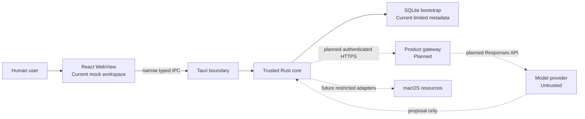
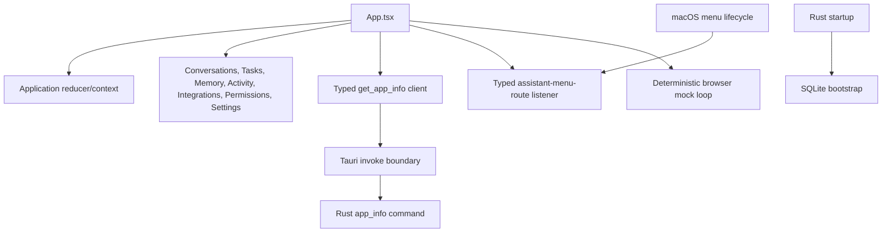
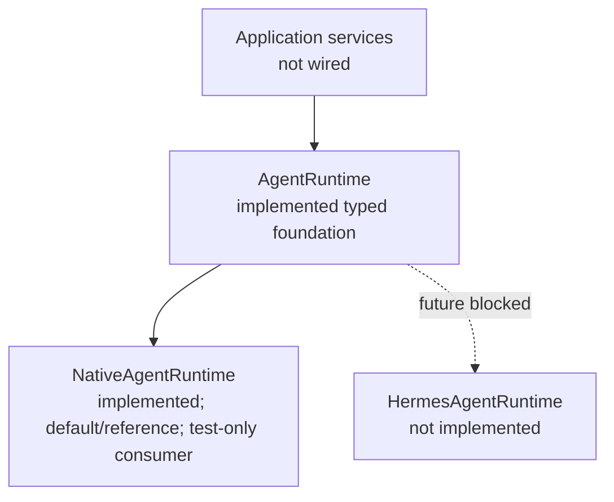
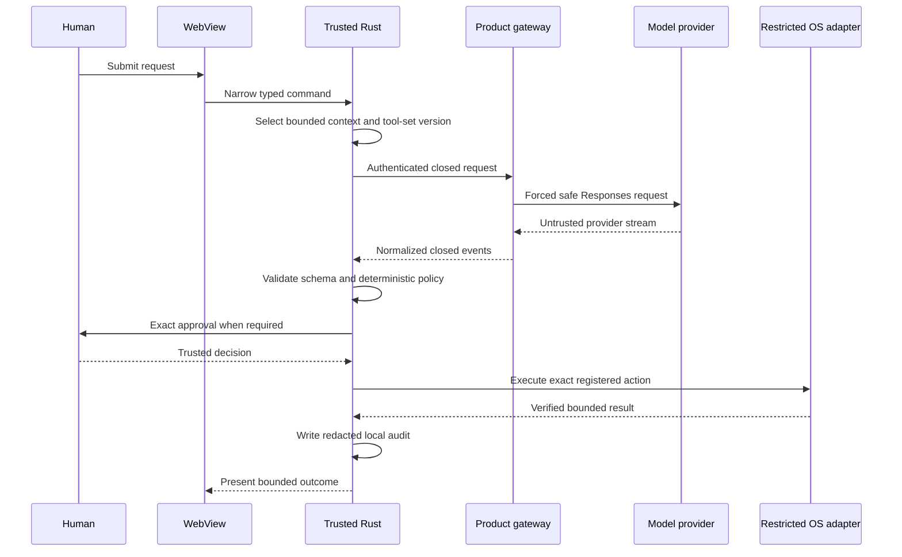

# Cortexa architecture

Status: Authoritative current-state architecture
Last updated: 2026-08-11

## Reading this document

This document distinguishes four states:

- **Current**: present in production source and covered by repository evidence.
- **Mocked**: present only as deterministic, non-authorizing test or UI behavior.
- **Planned**: approved direction without a shipping implementation.
- **Prohibited**: intentionally excluded by product or security policy.

`docs/product/ARCHITECTURE_BASELINE.md` preserves the target baseline. Accepted
decisions in `DECISIONS.md` govern when that target changes. Neither a plan nor a
diagram proves implementation.

## System context

There is no direct model-to-device or WebView-to-device execution path.

## Trust boundaries

1. **Human authority**: supplies intent and explicit approval.
2. **React WebView**: untrusted presentation and volatile interaction state.
3. **Tauri IPC**: narrow serialization boundary; not authorization.
4. **Trusted Rust core**: validates, applies deterministic policy, manages exact
   approval state, and will eventually coordinate restricted execution.
5. **Local storage and OS resources**: protected resources available only
   through reviewed Rust boundaries.
6. **Product gateway**: planned authenticated service with no local authority.
7. **Model and third-party services**: untrusted external processors.

Files, websites, clipboard data, contacts, calendar data, model output, gateway
events, and tool results remain untrusted regardless of their source.

## Current application topology

The React mock loop and the transport-free Rust gateway turn are not wired to
each other.

## React presentation layer

**Current**:

- `src/App.tsx` composes the application shell and injects typed services.
- `src/application/` owns reducer-based volatile state, conversations, mock run
  lifecycle, provenance, mock results, and menu-route navigation.
- `src/features/` renders conversations, mock approval, Activity, Tasks,
  Permissions, Settings, and placeholders for Memory and Integrations.
- `src/infrastructure/tauri/` narrows the app-info response and menu-route event.
- Conversations, activity, approval state, tool results, and settings are not
  persisted by the WebView.

**Mocked**: assistant streaming, context provenance, tool activity, approval,
simulated tool results, final answers, Stop, Retry, and Activity are fixed local
behaviors. They perform no model request or operating-system action.

**Prohibited**: authorization, policy override, generic database access, raw
provider calls, arbitrary command selection, and operating-system execution in
the WebView.

## Tauri IPC boundary

**Current**:

- `get_app_info` is the only custom invoke command.
- `assistant-menu-route` is a closed native-to-WebView event for Open, New
  Request, and Tasks navigation.
- The main window has only `core:default` capability permission.
- The CSP and capability files contain no shell, filesystem, network, database,
  or privileged macOS plugin permission.

**Planned**: any future product command must be narrow, typed, locally
validated, capability-scoped, and separately approved. A generic
`execute_action`, SQL, shell, filesystem, provider, or tool-dispatch command is
prohibited.

## Trusted Rust core

`src-tauri/src/lib.rs` assembles current startup and Tauri behavior. The trusted
modules are intentionally transport-free where runtime coordination is absent.

### Initial gateway turn and protocol

**Current**:

- `agent::gateway_request` creates one bounded serialized initial request and
  binds a transport-free `InitialGatewayTurn`.
- `agent::gateway_protocol` validates closed normalized event frames, protocol
  identity, sequence, size, cancellation, text bounds, function-call bounds,
  and exactly one terminal outcome.
- `agent::function_call_validation` consumes a normalized function call and
  independently validates its local tool identity and arguments.
- The turn binds terminal function validation, deterministic policy, exact
  approval presentation, native resolution on macOS, and run-termination denial
  to one privately owned manager. Successful native and run-termination
  resolutions are validated and recorded by the turn's private typed in-memory
  approval-audit adapter before a closed resolution-plus-receipt value leaves
  the turn.

Every emitted value remains non-authorizing. There is no Tauri caller, live
transport, provider adapter, runtime coordinator, continuation loop, dispatcher,
or executor.

### Runtime adapter direction

**Current foundation; not wired to the application**: D-079's application-owned
runtime foundation now exists in Rust. `AgentRuntime` constructs one bounded
run from application-owned typed input. `RuntimeRun` exposes closed identity,
status, bounded untrusted-event acceptance, typed failure, and exact idempotent
cancellation. The repository still has no runtime coordinator, selector,
provider transport, live model, Hermes adapter, OpenClaw adapter, or Tauri/UI
consumer.

`NativeAgentRuntime` is the sole/default implementation. It constructs and owns
exactly one unchanged `InitialGatewayTurn`; its concrete surface delegates the
turn's exact request bytes, normalized-frame validation, policy and approval
results, trusted macOS approval resolution, and audited run-termination cleanup.
The common shared-event lane privately translates only closed lifecycle, text,
and failure values through the unchanged gateway validator. Native does not
claim shared tool-proposal capability because the existing tool lane produces
governance-owned results. Concrete frames and shared runtime events cannot be
mixed within one run.

`RuntimeCapabilities` is a fixed closed representation. Capability declarations
grant no permission. Run/request/response/tool-call identities, selected text,
output text, and arguments use bounded application-owned types with redacted
Debug output. Generic cancellation closes either a nonterminal stream or a
run-owned pending approval through the existing typed audited termination path;
approval and audit values never enter the generic result.

`MockAgentRuntime` exists only as a private deterministic Rust contract fixture.
It uses fixed application-owned events, supports controlled unavailability,
start/event failure, invalid transitions, capability contradiction, terminal
cancellation, and late-event rejection, and has no clock, thread, filesystem,
network, process, model, provider, or Hermes prerequisite. The separate visible
React mock is unchanged.

“Fallback” remains an explicit future application-owned runtime choice; no
selector or automatic fallback code exists, and automatic model-provider
failover is not authorized.

`HermesAgentRuntime` would keep all Hermes types, configuration, events, and
errors inside one adapter and translate them to closed bounded Cortexa-owned
types. OpenClaw is only a possible later evaluation and is not a current or
selected adapter. No external runtime may own validation, policy, approval,
restricted execution, cancellation, audit, credentials, or direct device
access. Its output remains untrusted and must traverse the same deterministic
Rust gates as any other proposal.

This conceptual runtime seam is separate from model-provider transport. It does
not restore D-032's deleted synchronous arbitrary-string `AgentProvider` or
authorize networking, dependencies, credentials, provider selection, a live
model, coordination, dispatch, execution, multi-agent behavior, or a Tauri
capability.

#### Hermes transport evaluation

**Accepted evaluation direction; negative spike complete at Milestone 0**:
D-080 rejects raw TUI-gateway stdio for production at Hermes Agent package/application version
`0.20.0`, release tag `v2026.8.3`, source commit
`3c27eb6234bf91b8ceee9e9071591b31e9b148cb`. It conditionally selects a
Rust-supervised managed local `hermes serve` child plus a closed projection of
the documented TUI-gateway JSON-RPC/WebSocket surface for a contained spike
only after the native runtime boundary is verified complete. ACP remains a
deferred fallback.

No Hermes executable, dependency, process, socket, token, runtime home,
provider, or adapter exists in the repository. The owner supplied an external
pinned candidate and authorized Milestone 0; source/tag/commit, critical hashes,
installed metadata, and isolated module discovery passed, but no Hermes server
was started. The spike's transport verdict is FAIL / NO-GO because the supplied provenance did not
content-manifest the complete virtual environment and its external Python
runtime, while target-Mac review found no sufficient containment mechanism.

Pinned source inspection also found unavoidable update-prefetch,
dotenv/managed-secret loading, credential keepalive, skill synchronization,
plugin discovery, and privileged default-tool initialization with no supported
complete disable mode. Deprecated `sandbox-exec` alone cannot prove exact
port-zero listener restriction, package-manager execution denial, blanket
Unix-socket denial, or membership and cleanup of detached descendants.

Any renewed spike remains Blocked on exact target-Mac whole-process containment,
isolated state and environment, complete immutable whole-distribution
provenance, importable `[web]`/POSIX `[pty]` extras, supported no-update/
no-credential/no-plugin/zero-tool controls, and authenticated
`ws://127.0.0.1:<port>/api/ws?token=<per-launch-token>` startup. It must suppress
the pinned lazy-install and update-check paths, keep the candidate read-only,
deny every pinned dotenv/managed-secret source without reading secret contents,
restrict Hermes egress to the exact deterministic local fake-provider endpoint,
deny every other network/Unix-socket destination, enforce closed protocol/event
limits, and clean up containment membership including detached descendants.
Configuration and upstream allowlists are defense in depth; they do not replace
the OS boundary. A failure to prove any of these controls is NO-GO. The current
negative result does not select ACP or authorize an adapter; a different path or
patched distribution requires a separate owner-approved ADR/plan amendment.

### Agent provider

**Planned**: trusted Rust will call one configured authenticated product gateway
using a closed request and normalized response protocol. Identity-provider,
cloud-hosting, and AI model-provider support are separate boundaries under
D-060; approval of one does not approve another.

**Current absence**: the legacy generic provider scaffold was deleted in
Increment 4K. No HTTP client, provider SDK, gateway origin, model name,
authentication, credential loader, or live Responses request exists.

**Identity-provider boundary**: D-062 selects Microsoft personal identity as
the sole Phase 1 provider for consumer and prosumer individual accounts. The
planned flow uses the system browser, OAuth 2.0 Authorization Code Flow, PKCE
S256, `state`, and OIDC `nonce` behind the pluggable OAuth/OIDC application
boundary. The authority is personal-account-only; work, school, guest, and
arbitrary Entra tenants remain outside Phase 1. No provider registration,
identity client, redirect handler, token exchange, or account path exists.
Google is deferred until demonstrated demand after Microsoft verification.
Apple is deferred until Mac App Store planning or demonstrated demand. Phase 2
may separately add Entra workforce SSO and other approved enterprise OIDC or
SAML identity providers.

The configured identity provider determines the token issuer. The gateway must
validate each trusted issuer, audience, signature, expiration, applicable
tenant context, and authorization context against closed server-owned
configuration. The planned Microsoft boundary uses separate public desktop and
gateway API resource registrations, one exact delegated gateway scope, and the
issuer returned by the approved personal-account OIDC discovery metadata. The
canonical external identity key is provider ID plus normalized issuer plus
subject. Email is optional contact data, never an identity key, and automatic
email-based linking is prohibited. Provider neutrality is not permission for
the WebView, model, user, or arbitrary configuration to select an issuer,
endpoint, audience, client identity, tenant policy, or gateway origin.

A future audience-bound gateway token has a maximum 15-minute lifetime and
belongs only to trusted Rust process memory. Phase 1 requests only `openid`,
`email`, and one exact delegated Cortexa gateway scope. `profile`, Microsoft
Graph, directory, group, mail, calendar, file, and contact scopes are excluded.
`offline_access` is excluded until a separate persistent-session decision. If
later approved, a refresh or session credential belongs only to
platform-secure credential storage: macOS Keychain on macOS and an equivalent
separately reviewed facility on any future supported platform. No credential
enters the WebView, SQLite, application logs, or ordinary CI.

Microsoft currently documents a longer default access-token lifetime. Stage B
must prove a Microsoft personal-account configuration that enforces Cortexa's
maximum 15-minute boundary, or an additive decision must define another
short-lived gateway-session exchange. Stage C stays blocked until then. The
manifest-based `127.0.0.1` ephemeral callback also requires exact Stage B and
target-Mac Stage C evidence; no redirect or lifetime fallback is implicit.

**Cloud-hosting boundary**: Cortexa AI is the planned operator. Azure Container
Apps in Central US is the initial planned platform and region, and
`https://api.cortexaai.io` is the reserved production origin. None is deployed,
active, or approved for traffic. Initial production targets one primary cloud.
The containerized gateway should remain portable enough for future AWS or
Google Cloud deployment, but those targets require separate customer,
data-residency, resilience, or commercial justification. There is no
active-active multicloud architecture, three-cloud release requirement, or
approved secondary-cloud failover.

**AI model-provider boundary**: D-066 selects OpenAI as the sole synthetic-demo
candidate behind a future trusted gateway; D-063's Azure design is superseded
before publication. No provider transport is planned or implemented by this
decision. Any later OpenAI implementation must establish its exact model,
version, data controls, limits, and server-side secret handling as separate
evidence; desktop clients never receive provider credentials. The Azure-specific
configuration below remains historical D-064 design evidence only, not the
current demo-provider direction.

D-067 selects Cloudflare Workers Free as the sole remote gateway candidate for
the internal synthetic demo. A future Worker owns the OpenAI key as a Worker
secret, accepts only authenticated bounded synthetic-text requests, emits only
closed redacted results, and gains no local tool authority. No Worker, route,
secret, authentication mechanism, or network path currently exists. This
demo-only choice does not replace the planned production hosting boundary.

D-068 permits one future demo-only Cloudflare Access service token. Its secret
remains in macOS Keychain, trusted Rust sends it only to the fixed gateway
origin, Cloudflare Access restricts it to one application, and the Worker
independently validates the Access JWT signature, issuer, and audience. This
30-day maximum machine credential is not a production pattern and does not
change D-064's 15-minute production access-token maximum.

**Current fake-only Keychain proof**: `credentials::cloudflare_access` uses
macOS-only Security.framework bindings to read exactly the fixed
`io.cortexa.demo.cloudflare-access` service with separate `client-id` and
`client-secret` accounts. It validates bounded visible-ASCII fake values and
returns only `Available` or a closed redacted error. It exposes no raw-value
accessor and has no Tauri command, WebView, SQLite, startup, network, or runtime
consumer. Target-Mac evidence passed fake-item availability and cleanup, but
the unsigned development executable required repeated authorization prompts.
That proof does not establish stable app-specific access, so D-069 keeps real
credential ingestion blocked.

D-070 additionally requires a separately approved stable signed identity or
narrow app-specific Keychain ACL, production secret-memory lifecycle, direct
owner transfer, rotation, revocation, rollback, dependency reassessment, and
target-Mac evidence before an implementation proposal can be considered. This
adds no runtime path or external authority.

D-071 keeps the future macOS access-control choice and secret-memory model out
of the current runtime. A later owner-approved decision must select a stable
signed identity or narrow app-specific ACL and define bounded one-time secret
ownership before implementation; unsigned prompts are not a fallback.

D-072 selects signed macOS application identity as that future control model.
It remains documentation-only: no signed artifact, entitlement, Keychain access,
secret consumer, or runtime path exists.

D-073 limits a future fake-only signed-identity and bounded secret-memory proof
to the existing credential module, public integration test, and status-only
example. No manifest, entitlement, Tauri, IPC, startup, WebView, network, or
runtime-consumer path is authorized.

**Phase 2 target**: organization accounts and team workspaces may add
centralized administration, role-based access control, organization policy and
audit, Microsoft Entra ID workforce SSO, tenant-aware token validation, and
group-based authorization. SAML, SCIM, and other enterprise identity providers
remain demand-driven future decisions. No enterprise identity or administration
capability currently exists.

D-061 permits no current external processing. Each AI model provider requires
separate approval for retention, ZDR, data use, logging, region, and security.
Before provider-approved ZDR is verified for that provider's exact production
configuration, only synthetic test data may be considered by a separately
approved future transport test. Real user content then remains limited
initially to explicitly submitted, non-sensitive text; credentials,
attachments, regulated data, financial or healthcare data, and sensitive
personal data are prohibited. Gateway logs contain operational metadata only
for at most seven days, content logging is prohibited, and the
external-processing disclosure must precede the first transmission and remain
visible in Settings.

**Closed Phase 1 gateway configuration**: D-064 separates future work into
design, no-traffic provisioning, synthetic-only transport, and real-content
activation. The authoritative design is
[`docs/security/phase4-gateway-configuration-spec.md`](docs/security/phase4-gateway-configuration-spec.md),
and its trust boundaries, abuse cases, controls, and security-test matrix are
in
[`docs/security/phase4-gateway-threat-model.md`](docs/security/phase4-gateway-threat-model.md).

The planned identity registration uses one public Microsoft personal desktop
client and one separate gateway API resource. The closed API Application ID URI
format is `api://<gateway-api-client-id>`, its sole delegated scope is
`gateway.access`, and the callback is `127.0.0.1` on an ephemeral port at
`/oauth/callback`. Registration identifiers and observed token claims remain
future evidence. A mismatch fails closed rather than falling back to another
issuer, audience, scope, redirect, or account type.

The former Azure-design gateway uses one dedicated non-shared user-assigned managed
identity and exact-resource `Cognitive Services OpenAI User` RBAC. Azure OpenAI
must be reachable only through a private endpoint with public network access
disabled before any synthetic or real provider traffic. The public gateway
origin remains authenticated HTTPS; no Container Apps hostname, alternate
origin, public provider endpoint, API key, or unrestricted egress is a fallback.

This closed design is not a deployed architecture. D-064 grants no Stage B,
Stage C, or Stage D authority, and ARB-002 remains High and unresolved.

### Tool registry and schemas

**Current**: `tools::registry` and `tools::schema` define a closed catalog:

- `get_current_datetime@1`: information only, exact empty object.
- `create_local_task@1`: reversible local action with a canonical bounded title.

Registry validation derives tool identity, contract version, risk, and required
permission locally. It rejects unknown tools, versions, fields, malformed JSON,
duplicate keys, and invalid arguments. No tool implementation executes either
proposal.

### Policy engine

**Current**: `policy::engine` evaluates only trusted typed inputs. Information-
only proposals produce a non-authorizing Allow decision. Reversible and
personal-data modifications require approval. Missing read or permission scope,
high-impact actions, and prohibited autonomy are denied.

Policy does not execute, grant permission, authenticate a user, or replace an
approval transition.

### Approval manager

**Current**: `approvals::manager` provides an in-memory exact-subject state
machine with one pending subject, bounded lifetime capacity, manager-issued
identity, 120-second expiry, one-time presentation and resolution, replay
rejection, and terminal run-cancellation denial.

The macOS `rfd` decision source returns a sealed outcome bound to its exact
presentation and manager. It is not invoked by the shipping UI or a production
coordinator. A stale visible native dialog may outlive run termination, but its
late outcome is rejected.

Approval presentations and resolutions are non-authorizing. No execution token
or dispatch authority exists.

### Audit logger

**Current**: `audit::approval` is a typed, bounded, in-memory adapter that derives
a redacted approval record and returns a sequence-only receipt. The initial turn
owns one private adapter and exposes successful terminal approval resolutions
only through a closed non-cloneable resolution-plus-receipt value. Manager
terminalization precedes recording; a typed audit failure returns no resolution
and cannot restore manager state.

**Current absence**: the generic audit scaffold was deleted in Increment 4I.
There is no run, execution, durable, cross-run, IPC, UI, or product audit logger.
The turn-owned adapter is volatile and sequence-local; neither its record nor its
receipt authorizes dispatch, execution, or provider continuation.

### Memory store

**Mocked**: the React Memory page is a placeholder and conversation state is
volatile.

**Current absence**: the legacy generic Rust memory scaffold was deleted in
Increment 4L. No product memory repository, retention control, encryption,
review/delete flow, or model-context selector exists.

### Platform adapters

**Current**: macOS-specific code is limited to menu/window lifecycle and the
disconnected native approval source. Non-macOS menu lifecycle adapters are
no-ops where required for compilation.

**Current absence**: the legacy generic platform scaffold was deleted in
Increment 4M. There are no calendar, reminders, contacts, file, clipboard,
notification, secret-store, local-authentication, Accessibility, screen-capture,
Apple Events, or microphone adapters.

### SQLite storage

**Current**:

- `storage` owns a private `rusqlite` connection with typed errors.
- Every connection enables foreign keys and a busy timeout; file databases use
  WAL.
- Embedded ordered migrations create `schema_migrations` and `app_metadata` and
  verify immutable checksums.
- Multi-step migration writes use immediate transactions.
- Startup persists only typed `app_initialized` bootstrap metadata in the debug
  app-local database. Release startup currently uses in-memory storage.
- No generic SQL or database IPC exists.

**Current absence**: no conversation, task, memory, credential, token, approval,
or audit product persistence exists. Database encryption and Keychain-held key
material are required before sensitive persistence.

## macOS menu bar and window lifecycle

**Current**:

- A tray/status item provides Open Cortexa, New Request, Tasks (Coming Soon),
  and Quit Cortexa.
- Menu actions map to closed domain actions before native dispatch.
- Closing the main window hides it; Dock reopen restores it when no application
  window is visible.
- The configured window is titled Cortexa and uses stable minimum dimensions.

Debug and release Tauri app bundles use the official Cortexa icon family from
the canonical app-icon source. The raw unbundled `tauri dev` executable retains
macOS's generic `exec` icon; D-051 records that approved development-only
baseline exception. D-052 requires ICNS verification by decoded representation
pixels because repeated Tauri CLI generation can produce byte-distinct but
visually equivalent ICNS containers; bundled resources must still match the
reviewed repository ICNS byte-for-byte.

## Current and future capability matrix

| Capability                                    | State                         | Evidence or gate                                               |
| --------------------------------------------- | ----------------------------- | -------------------------------------------------------------- |
| React workspace and navigation                | Current                       | Frontend tests and application source                          |
| Assistant interaction                         | Mocked                        | Deterministic in-memory driver only                            |
| App info and menu routing                     | Current                       | Narrow Tauri command/event                                     |
| SQLite bootstrap metadata                     | Current                       | Storage tests and startup integration                          |
| Gateway request/protocol validation           | Current, transport-free       | Phase 4A and 4N-4P                                             |
| Function schema and policy binding            | Current, non-authorizing      | Phase 4B-4C and 4Q-4R                                          |
| Approval presentation/resolution/cancellation | Current, disconnected         | Phase 4D-4E and 4S-4U                                          |
| Approval audit adapter                        | Current, bound and volatile   | Phase 4H and 4V                                                |
| Live gateway and model-provider transport     | Planned                       | Blocked by O-006, per-provider O-007 evidence, and future plan |
| Restricted tool execution                     | Planned                       | No dispatcher or executor exists                               |
| Product memory and task persistence           | Planned                       | Phase 8 direction only                                         |
| Privileged macOS integrations                 | Planned or prohibited for MVP | Separate permission and threat-model gates                     |
| Generic shell or model-to-device execution    | Prohibited                    | `SECURITY.md`                                                  |
| Signing, notarization, and production release | Planned                       | Phase 10 and `RELEASE_CHECKLIST.md`                            |

## Approved future data flow

This flow is a target, not current end-to-end behavior. Every dotted or future
boundary requires its own approved plan and verification.

## Prohibited execution paths

- Model or gateway directly invoking device APIs.
- WebView directly invoking a generic executor, shell, filesystem, SQL, or
  provider command.
- Caller-supplied tool schemas, model parameters, approval evidence, risk, or
  permission metadata becoming trusted.
- Approval or audit receipts being treated as execution authority.
- Production credentials in the desktop bundle, WebView, SQLite, logs, crash
  reports, or audit records.
- Autonomous email, messages, purchases, bookings, uploads, public posting,
  deletion, or account-setting changes in the MVP.

## References

- `PRODUCT_REQUIREMENTS.md`
- `SECURITY.md`
- `DECISIONS.md`
- `PROJECT_STATUS.md`
- `docs/product/ARCHITECTURE_BASELINE.md`
- `docs/branding/PRESENTATION_GUIDELINES.md`
