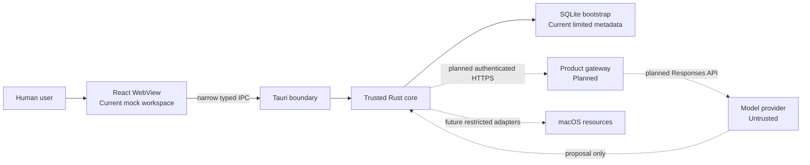
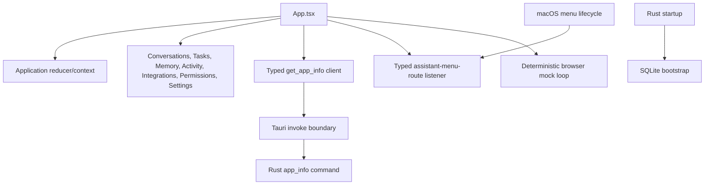
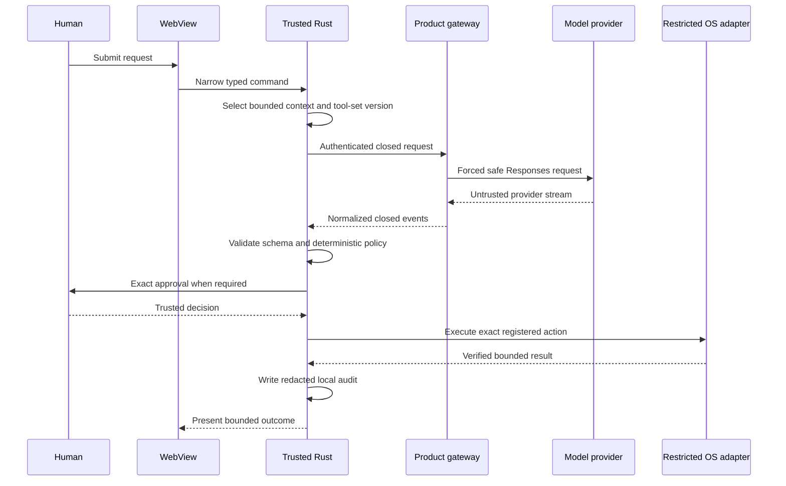

# Cortexa architecture

Status: Authoritative current-state architecture
Last updated: 2026-07-15

## Reading this document

This document distinguishes four states:

- **Current**: present in production source and covered by repository evidence.
- **Mocked**: present only as deterministic, non-authorizing test or UI behavior.
- **Planned**: approved direction without a shipping implementation.
- **Prohibited**: intentionally excluded by product or security policy.

`docs/product/ARCHITECTURE_BASELINE.md` preserves the target baseline. Accepted
decisions in `DECISIONS.md` govern when that target changes. Neither a plan nor a
diagram proves implementation.

## System context

There is no direct model-to-device or WebView-to-device execution path.

## Trust boundaries

1. **Human authority**: supplies intent and explicit approval.
2. **React WebView**: untrusted presentation and volatile interaction state.
3. **Tauri IPC**: narrow serialization boundary; not authorization.
4. **Trusted Rust core**: validates, applies deterministic policy, manages exact
   approval state, and will eventually coordinate restricted execution.
5. **Local storage and OS resources**: protected resources available only
   through reviewed Rust boundaries.
6. **Product gateway**: planned authenticated service with no local authority.
7. **Model and third-party services**: untrusted external processors.

Files, websites, clipboard data, contacts, calendar data, model output, gateway
events, and tool results remain untrusted regardless of their source.

## Current application topology

The React mock loop and the transport-free Rust gateway turn are not wired to
each other.

## React presentation layer

**Current**:

- `src/App.tsx` composes the application shell and injects typed services.
- `src/application/` owns reducer-based volatile state, conversations, mock run
  lifecycle, provenance, mock results, and menu-route navigation.
- `src/features/` renders conversations, mock approval, Activity, Tasks,
  Permissions, Settings, and placeholders for Memory and Integrations.
- `src/infrastructure/tauri/` narrows the app-info response and menu-route event.
- Conversations, activity, approval state, tool results, and settings are not
  persisted by the WebView.

**Mocked**: assistant streaming, context provenance, tool activity, approval,
simulated tool results, final answers, Stop, Retry, and Activity are fixed local
behaviors. They perform no model request or operating-system action.

**Prohibited**: authorization, policy override, generic database access, raw
provider calls, arbitrary command selection, and operating-system execution in
the WebView.

## Tauri IPC boundary

**Current**:

- `get_app_info` is the only custom invoke command.
- `assistant-menu-route` is a closed native-to-WebView event for Open, New
  Request, and Tasks navigation.
- The main window has only `core:default` capability permission.
- The CSP and capability files contain no shell, filesystem, network, database,
  or privileged macOS plugin permission.

**Planned**: any future product command must be narrow, typed, locally
validated, capability-scoped, and separately approved. A generic
`execute_action`, SQL, shell, filesystem, provider, or tool-dispatch command is
prohibited.

## Trusted Rust core

`src-tauri/src/lib.rs` assembles current startup and Tauri behavior. The trusted
modules are intentionally transport-free where runtime coordination is absent.

### Initial gateway turn and protocol

**Current**:

- `agent::gateway_request` creates one bounded serialized initial request and
  binds a transport-free `InitialGatewayTurn`.
- `agent::gateway_protocol` validates closed normalized event frames, protocol
  identity, sequence, size, cancellation, text bounds, function-call bounds,
  and exactly one terminal outcome.
- `agent::function_call_validation` consumes a normalized function call and
  independently validates its local tool identity and arguments.
- The turn binds terminal function validation, deterministic policy, exact
  approval presentation, native resolution on macOS, and run-termination denial
  to one privately owned manager.

Every emitted value remains non-authorizing. There is no Tauri caller, live
transport, provider adapter, runtime coordinator, continuation loop, dispatcher,
or executor.

### Agent provider

**Planned**: trusted Rust will call one configured authenticated product gateway
using a closed request and normalized response protocol.

**Current absence**: the legacy generic provider scaffold was deleted in
Increment 4K. No HTTP client, provider SDK, gateway origin, model name,
authentication, credential loader, or live Responses request exists.

The production OpenAI credential belongs only to the future gateway. A future
short-lived gateway token belongs to trusted Rust memory and platform secret
storage, never the WebView or SQLite.

### Tool registry and schemas

**Current**: `tools::registry` and `tools::schema` define a closed catalog:

- `get_current_datetime@1`: information only, exact empty object.
- `create_local_task@1`: reversible local action with a canonical bounded title.

Registry validation derives tool identity, contract version, risk, and required
permission locally. It rejects unknown tools, versions, fields, malformed JSON,
duplicate keys, and invalid arguments. No tool implementation executes either
proposal.

### Policy engine

**Current**: `policy::engine` evaluates only trusted typed inputs. Information-
only proposals produce a non-authorizing Allow decision. Reversible and
personal-data modifications require approval. Missing read or permission scope,
high-impact actions, and prohibited autonomy are denied.

Policy does not execute, grant permission, authenticate a user, or replace an
approval transition.

### Approval manager

**Current**: `approvals::manager` provides an in-memory exact-subject state
machine with one pending subject, bounded lifetime capacity, manager-issued
identity, 120-second expiry, one-time presentation and resolution, replay
rejection, and terminal run-cancellation denial.

The macOS `rfd` decision source returns a sealed outcome bound to its exact
presentation and manager. It is not invoked by the shipping UI or a production
coordinator. A stale visible native dialog may outlive run termination, but its
late outcome is rejected.

Approval presentations and resolutions are non-authorizing. No execution token
or dispatch authority exists.

### Audit logger

**Current**: `audit::approval` is a typed, bounded, in-memory adapter that can
derive a redacted approval record and return a sequence-only receipt. It is not
yet bound to the initial turn, durable storage, IPC, or UI.

**Current absence**: the generic audit scaffold was deleted in Increment 4I.
There is no run, execution, durable, or product audit logger. Increment 4V is
proposed, not Ready, and would only bind the existing in-memory approval audit
to terminal resolution.

### Memory store

**Mocked**: the React Memory page is a placeholder and conversation state is
volatile.

**Current absence**: the legacy generic Rust memory scaffold was deleted in
Increment 4L. No product memory repository, retention control, encryption,
review/delete flow, or model-context selector exists.

### Platform adapters

**Current**: macOS-specific code is limited to menu/window lifecycle and the
disconnected native approval source. Non-macOS menu lifecycle adapters are
no-ops where required for compilation.

**Current absence**: the legacy generic platform scaffold was deleted in
Increment 4M. There are no calendar, reminders, contacts, file, clipboard,
notification, secret-store, local-authentication, Accessibility, screen-capture,
Apple Events, or microphone adapters.

### SQLite storage

**Current**:

- `storage` owns a private `rusqlite` connection with typed errors.
- Every connection enables foreign keys and a busy timeout; file databases use
  WAL.
- Embedded ordered migrations create `schema_migrations` and `app_metadata` and
  verify immutable checksums.
- Multi-step migration writes use immediate transactions.
- Startup persists only typed `app_initialized` bootstrap metadata in the debug
  app-local database. Release startup currently uses in-memory storage.
- No generic SQL or database IPC exists.

**Current absence**: no conversation, task, memory, credential, token, approval,
or audit product persistence exists. Database encryption and Keychain-held key
material are required before sensitive persistence.

## macOS menu bar and window lifecycle

**Current**:

- A tray/status item provides Open Cortexa, New Request, Tasks (Coming Soon),
  and Quit Cortexa.
- Menu actions map to closed domain actions before native dispatch.
- Closing the main window hides it; Dock reopen restores it when no application
  window is visible.
- The configured window is titled Cortexa and uses stable minimum dimensions.

Production Tauri icons still use the previous icon family. Meta Increment 4 is
the separately gated Ready rollout from the canonical app-icon source.

## Current and future capability matrix

| Capability                                    | State                         | Evidence or gate                            |
| --------------------------------------------- | ----------------------------- | ------------------------------------------- |
| React workspace and navigation                | Current                       | Frontend tests and application source       |
| Assistant interaction                         | Mocked                        | Deterministic in-memory driver only         |
| App info and menu routing                     | Current                       | Narrow Tauri command/event                  |
| SQLite bootstrap metadata                     | Current                       | Storage tests and startup integration       |
| Gateway request/protocol validation           | Current, transport-free       | Phase 4A and 4N-4P                          |
| Function schema and policy binding            | Current, non-authorizing      | Phase 4B-4C and 4Q-4R                       |
| Approval presentation/resolution/cancellation | Current, disconnected         | Phase 4D-4E and 4S-4U                       |
| Approval audit adapter                        | Current, unbound              | Phase 4H; 4V proposed                       |
| Live gateway and Responses transport          | Planned                       | Blocked by O-006 and O-007 plus future plan |
| Restricted tool execution                     | Planned                       | No dispatcher or executor exists            |
| Product memory and task persistence           | Planned                       | Phase 8 direction only                      |
| Privileged macOS integrations                 | Planned or prohibited for MVP | Separate permission and threat-model gates  |
| Generic shell or model-to-device execution    | Prohibited                    | `SECURITY.md`                               |
| Signing, notarization, and production release | Planned                       | Phase 10 and `RELEASE_CHECKLIST.md`         |

## Approved future data flow

This flow is a target, not current end-to-end behavior. Every dotted or future
boundary requires its own approved plan and verification.

## Prohibited execution paths

- Model or gateway directly invoking device APIs.
- WebView directly invoking a generic executor, shell, filesystem, SQL, or
  provider command.
- Caller-supplied tool schemas, model parameters, approval evidence, risk, or
  permission metadata becoming trusted.
- Approval or audit receipts being treated as execution authority.
- Production credentials in the desktop bundle, WebView, SQLite, logs, crash
  reports, or audit records.
- Autonomous email, messages, purchases, bookings, uploads, public posting,
  deletion, or account-setting changes in the MVP.

## References

- `PRODUCT_REQUIREMENTS.md`
- `SECURITY.md`
- `DECISIONS.md`
- `PROJECT_STATUS.md`
- `docs/product/ARCHITECTURE_BASELINE.md`
- `docs/branding/PRESENTATION_GUIDELINES.md`
