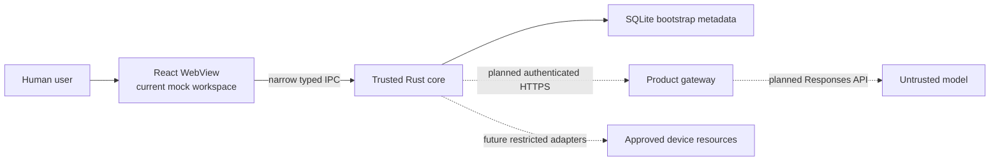

# Cortexa

[](https://github.com/SillyRbbit/ai-agent-assistant/actions/workflows/ci.yml)
[](https://github.com/SillyRbbit/ai-agent-assistant/actions/workflows/documentation.yml)
[](https://github.com/SillyRbbit/ai-agent-assistant/actions/workflows/security.yml)


Cortexa is a local-first Tauri desktop application exploring a controlled
executive-assistant workflow. The model is treated as an untrusted planner;
deterministic Rust boundaries remain responsible for validation, policy,
approval, eventual restricted execution, and audit.

> **Pre-production status:** this repository is an engineering proof, not a
> production-ready assistant. The current interaction is a deterministic local
> mock. There is no live model, product gateway, tool executor, product-data
> persistence, durable audit, signed installer, or production support promise.

## Current status

| State          | Repository evidence                                                                                                                                      |
| -------------- | -------------------------------------------------------------------------------------------------------------------------------------------------------- |
| Available now  | Native Cortexa window and menu lifecycle, React workspace, typed app-info IPC, SQLite bootstrap metadata, strict transport-free Rust security primitives |
| Mocked         | Assistant streaming, context provenance, approval, simulated tool result, final answer, Stop, Retry, and Activity                                        |
| Planned        | Authenticated gateway, live Responses transport, product persistence, restricted tools, integrations, durable audit, signing, and notarization           |
| Prohibited MVP | Generic shell, direct model-to-device execution, unrestricted filesystem or SQL, autonomous consequential external actions                               |

Detailed evidence lives in [PROJECT_STATUS.md](PROJECT_STATUS.md). Milestone
status and acceptance gates live in [ROADMAP.md](ROADMAP.md).

## Architecture summary



There is no direct model-to-device or generic WebView-to-device execution path.
The React mock loop and transport-free Rust gateway turn are not wired together.
See [ARCHITECTURE.md](ARCHITECTURE.md) for current trust boundaries and the
current-versus-future capability matrix.

## Security principles

- Treat model output, gateway events, the WebView, files, websites, clipboard
  content, connected-system data, and tool results as untrusted.
- Keep production provider credentials out of the desktop application,
  WebView, SQLite, logs, and audit records.
- Validate tool identity, arguments, policy, approval state, replay,
  cancellation, expiry, and limits in trusted Rust.
- Keep approval decisions, policy outcomes, and audit receipts non-authorizing.
- Fail closed on unknown tools, fields, states, identities, or evidence.
- Request no privileged operating-system permission without a separately
  approved threat model and user-initiated flow.

Read [SECURITY.md](SECURITY.md) before reporting or changing a trust boundary.

## Development prerequisites

- macOS with Xcode command-line tools for native Tauri development
- Node.js `26.3.0` and npm `11.16.0` preferred
- Rust `1.90.0` with Clippy and rustfmt

The repository also accepts the Node.js and npm ranges declared in
[`package.json`](package.json).

```bash
xcode-select --install
brew install rustup
export PATH="$(brew --prefix rustup)/bin:$PATH"
rustup toolchain install 1.90.0 --profile minimal --component clippy,rustfmt
```

Verify the active tools:

```bash
node --version
npm --version
cargo --version
rustc --version
```

## Setup and run

```bash
npm ci
npm run tauri -- dev
```

Expected development result: a native window titled **Cortexa** opens and the
Settings diagnostics report **Rust core connected**. This does not prove a live
assistant or production release.

## Verification

Run the complete local gate:

```bash
npm run verify
```

Useful focused commands:

```bash
npm run format:check
npm run lint
npm run typecheck
npm run test:unit
npm run test:integration
npm run test:repository
npm run docs:check
npm run repository:check
npm run build
```

The repository also defines read-only [CI](.github/workflows/ci.yml),
[documentation](.github/workflows/documentation.yml), and
[security](.github/workflows/security.yml) workflows. A green development build
is not a signed, notarized, or supported production release.

## Contributing and planning

Read [CONTRIBUTING.md](CONTRIBUTING.md) before opening an issue or pull request.
Current work is selected from [NEXT_STEPS.md](NEXT_STEPS.md), and durable
engineering rules live in [ENGINEERING_GUIDE.md](ENGINEERING_GUIDE.md).

Useful references:

- [Product requirements](PRODUCT_REQUIREMENTS.md)
- [Architecture](ARCHITECTURE.md)
- [Roadmap](ROADMAP.md)
- [Testing guide](TESTING_GUIDE.md)
- [Security checklist](SECURITY_CHECKLIST.md)
- [Release checklist](RELEASE_CHECKLIST.md)
- [Brand guidelines](docs/branding/BRAND_GUIDELINES.md)
- [GitHub labels](docs/github/LABELS.md)
- [GitHub milestones](docs/github/MILESTONES.md)

## Compatibility identifiers

Human-facing product text uses `Cortexa`. The repository, npm package, Cargo
package, executable, bundle identifier, database, IPC, and other compatibility
identifiers intentionally retain the historical `ai-agent-assistant` naming.
See D-026 in [DECISIONS.md](DECISIONS.md).

## Licensing

No open-source license has been selected or granted. Repository access does not
itself grant permission to use, copy, modify, or distribute the contents. Read
the current [licensing decision record](docs/github/LICENSING.md) before
contributing or redistributing material.
