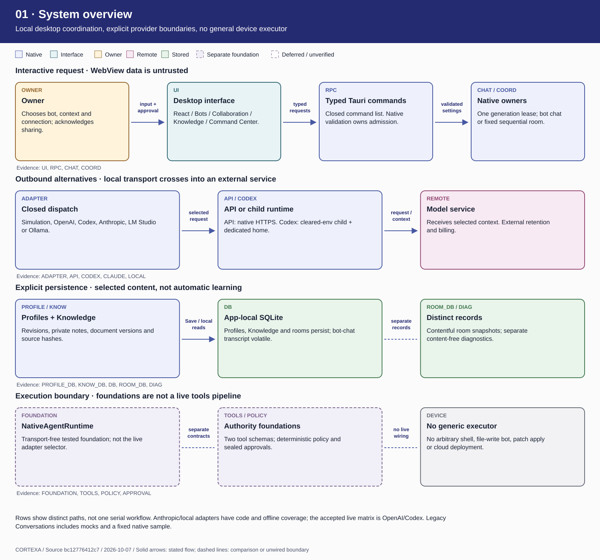
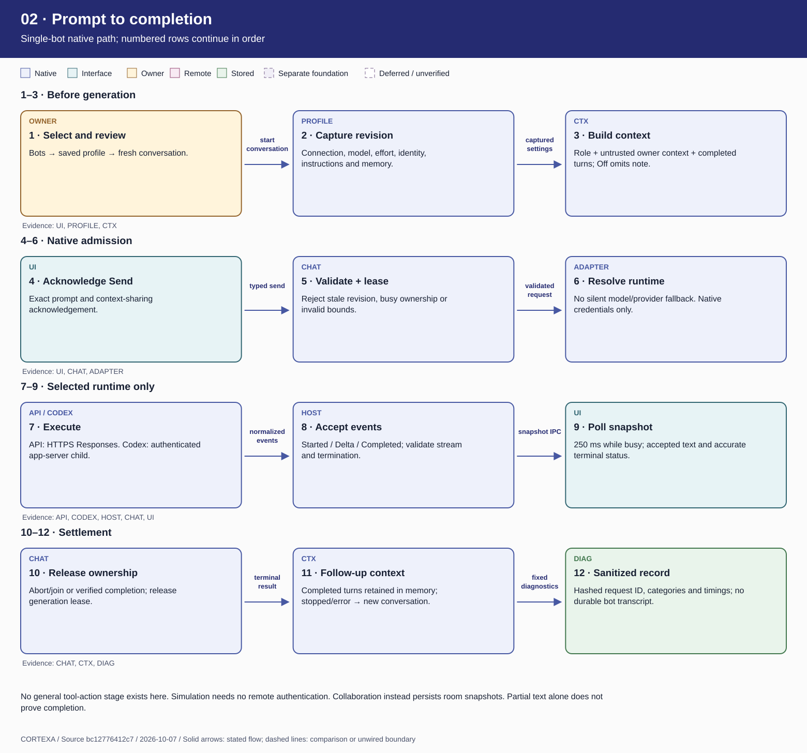
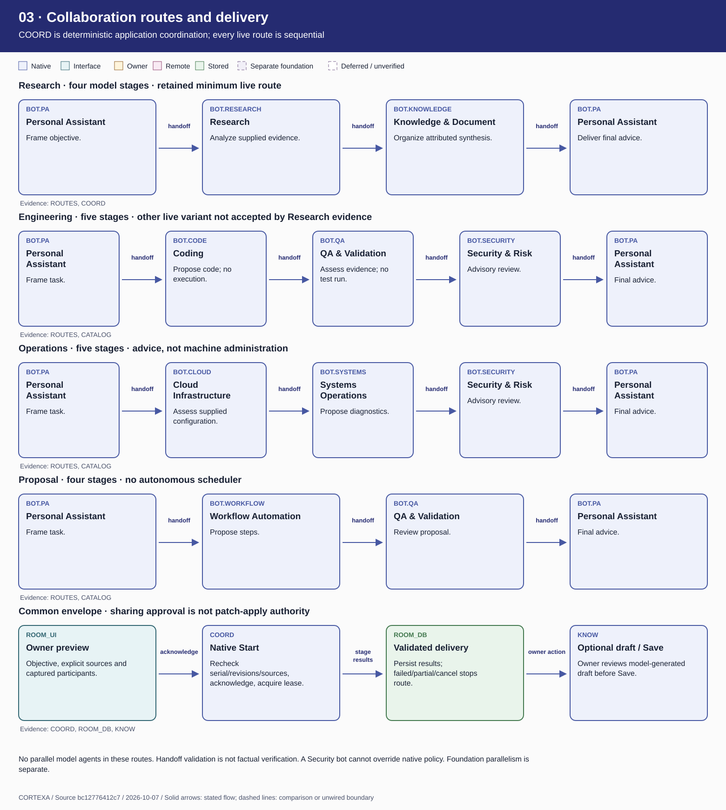
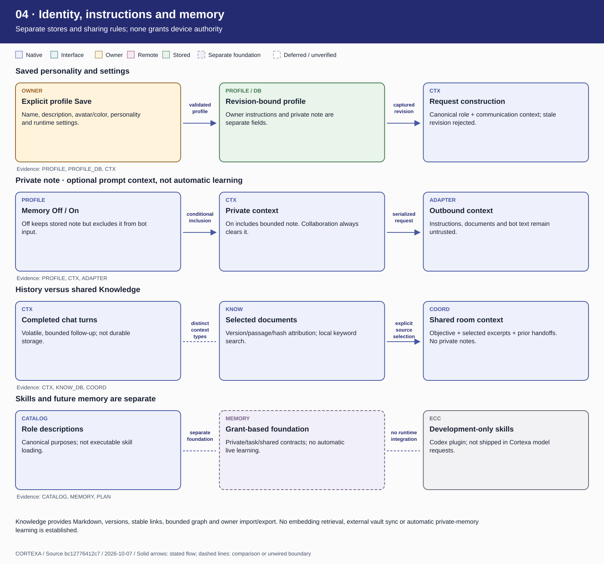
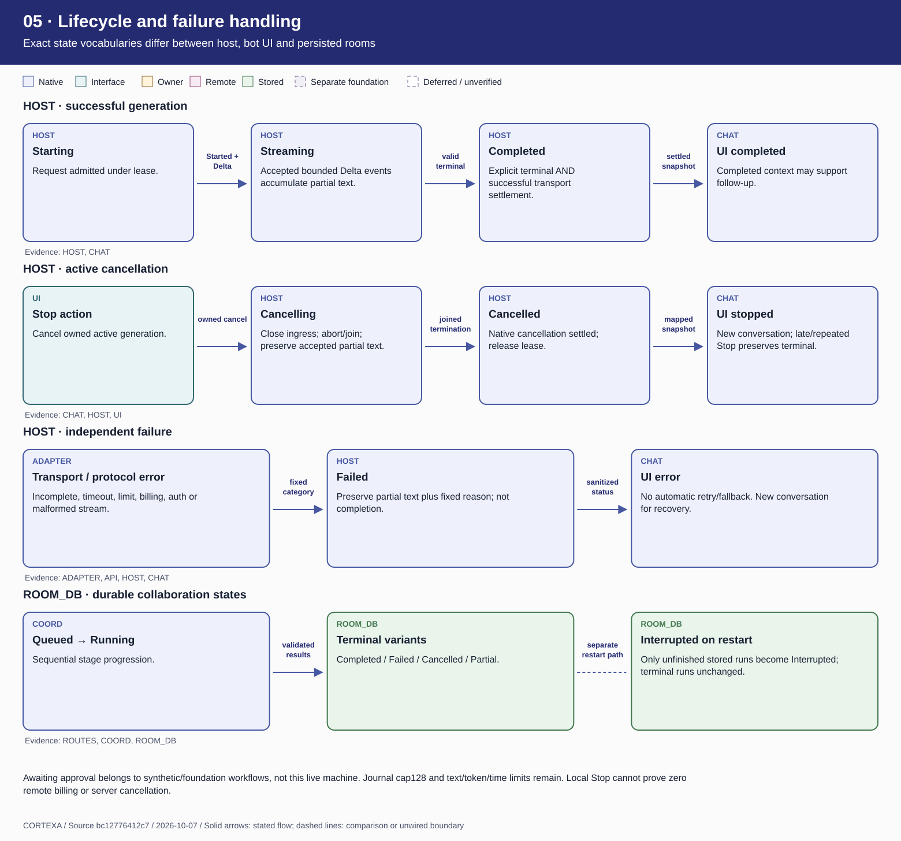
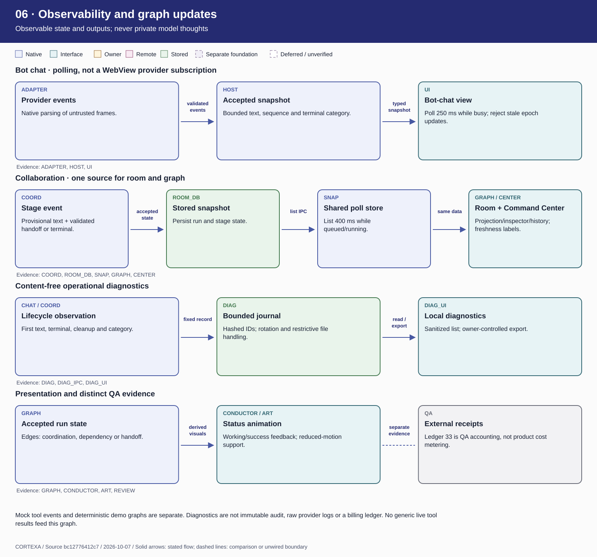
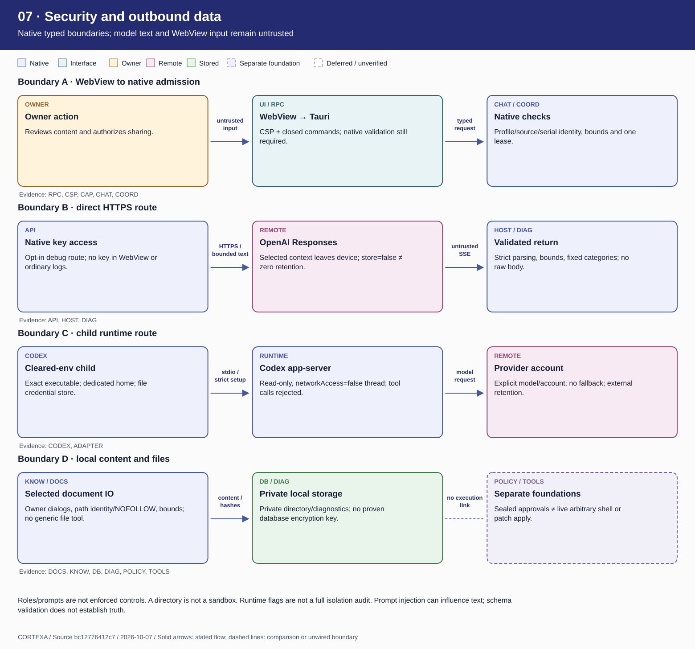
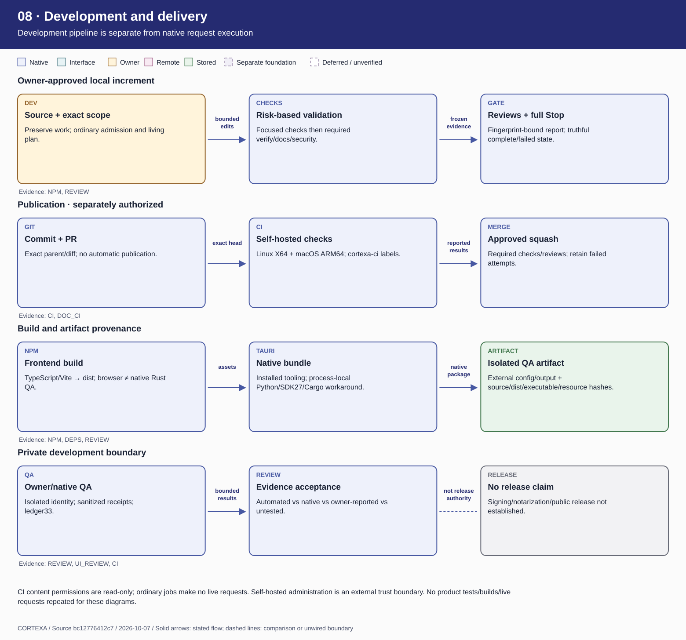
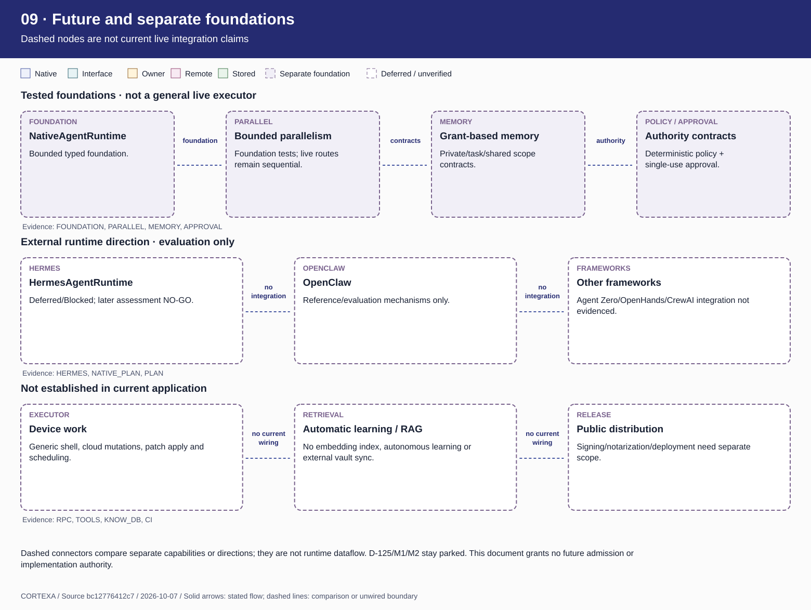

# Cortexa — current architecture and execution atlas

Snapshot: **2026-10-07**. Checkout `/Users/hdang/.codex/worktrees/live-provider-qa/ai-agent-assistant`,
branch `codex/live-provider-qa`, source commit `bc12776412c717613de1fdc42c38bf3312493726`.
Its product tree equals merged main `bbe7546281fec3c8b4b608d68a52bc9732d9ecd9` (PR137).
The checkout began clean; this increment adds documentation only. No application source,
profile, artifact or historical QA result was changed. This is an evidence snapshot,
not a claim that every runtime, account, model or workflow variant has been tested.

## Open the artifacts

- [Standalone viewer](viewer.html): all nine diagrams, full inventories, evidence, navigation and zoom; no network required.
- [PDF overview](overview.pdf): print overview of all nine views.
- [Capability inventory](capabilities.md): nine bots, six connections, settings, Knowledge, tools, graphs and lifecycle.
- [Security evidence table](security.md): enforcer, resource, source, verification and limitations.
- [External-project adoption matrix](external-projects.md): actual adoption versus evaluation and development guidance.
- [Concrete execution walkthrough](walkthrough.md): owner-approved Research collaboration and simpler single-bot route.
- [Editable diagram source](diagrams.json), [renderer](render_diagrams.py), [source/hash register](sources.json).

## Read the atlas

**Implemented and verified** means code plus the stated retained tests or native evidence,
not universal acceptance. **Implemented, not natively verified** has source/automated evidence
but no accepted live variant. **Partial** includes fixture-only UI or unwired foundation
contracts. **Deferred** describes separately approved future direction. **Unclear** means the
available evidence cannot establish the claim. Colors distinguish component boundaries;
status text and evidence qualify acceptance. Solid arrows carry the stated data. Dashed
lines compare separate capabilities or unwired boundaries and do not claim live flow.
Rows are independent paths unless explicitly numbered as a continuing sequence.

Stable IDs: **UI/RPC** are the frontend/native boundary; **CHAT/CTX/HOST** own single-bot
execution/context/events; **PROFILE** is saved bot configuration; **ADAPTER/API/CODEX/LOCAL/CLAUDE**
are connections; **COORD/ROOM_DB/SNAP/GRAPH** own collaboration and projections; **KNOW/DOCS/DB**
own documents and local persistence; **DIAG** owns sanitized operational evidence;
**FOUNDATION/POLICY/APPROVAL/TOOLS/MEMORY** are separate typed foundations. `BOT.*` IDs name
canonical roles, not additional provider implementations. Conductor is application
coordination/presentation, not a tenth model agent.

## Evidence register and limits

- [Retained live-provider review](../../reviews/2026-10-06-live-provider-e2e-post-increment-review.md):
  recorded full verification (105 hook, 94 repository, 601 frontend, 459 Rust-library,
  255 integration tests; inherited opt-in Hermes test ignored), focused repair tests,
  native API/Codex matrix and explicit limitations. Not rerun for documentation.
- [Inherited UI/UX review](../../reviews/2026-10-05-ui-ux-redesign-post-increment-review.md):
  layout/keyboard/typed native evidence. Later six-screen aesthetics are owner-reported,
  not a claim of complete ordinary workflow or all profile/provider coverage.
- Corrected Codex credential-store and saved-low A/B recheck:
  `/private/tmp/cortexa-codex-effort-recheck-3nvc11hq/FINAL-HANDOFF.md`.
  Native minimal request, discovery without Save, restart persistence and identity-bound
  cleanup passed. Backend timing-order claims remain automated, not proven by UI snapshots.
- [Post-merge Documentation](https://github.com/SillyRbbit/ai-agent-assistant/actions/runs/37649785081)
  and [CI](https://github.com/SillyRbbit/ai-agent-assistant/actions/runs/37649785034): six
  successful attempt-1 jobs at merged main, including Linux runner23 and macOS runner22.
  Earlier prerequisite failures remain historical failures.
- ECC installation/trial evidence remains external: installation handoff in
  `/Users/hdang/Developer/Cortexa-archive/2026-10-06_120320-ecc-xzfwc0cg/HANDOFF.md` and
  `/private/tmp/cortexa-ecc-review-confirmation-md8kmo8f/TRIAL.md`. Development-only,
  hooks/MCP disabled; no product runtime integration.
- New documentation evidence: `/private/tmp/cortexa-architecture-walkthrough-8sim6hio`.
  Source/hash checks, rendering and document validation are new; retained product tests,
  builds and QA are inherited. No credentials, personal databases or raw provider payloads
  inspected. Ledger33 unchanged; D-125/M1/M2 parked; all advisories/native workaround retained.

## Most important boundaries

Live bots generate text and structured handoffs; they do not execute arbitrary tools,
apply code, administer systems or browse by role name. Live routes are sequential. Native
policy/approval/tool/memory foundations are real tested code but not a generic live executor.
Simulation UI is separate from provider verification. Database storage is not proven encrypted;
`store=false` is not a retention guarantee. Codex restrictions are validated configuration,
not a complete OS sandbox audit. This atlas is not a complete security audit.

## Diagram guide

### 01 · System overview

Local desktop coordination, explicit provider boundaries, no general device executor.



Rows show distinct paths, not one serial workflow. Anthropic/local adapters have code and offline coverage; the accepted live matrix is OpenAI/Codex. Legacy Conversations includes mocks and a fixed native sample.

| Components / connections                                                 | Source symbol and location                                                                                                                                                                                                                                                                                                                                                                                                                                                                                                                                                                                                                                                                                                                                                                                                                                                 | Evidence / limit                        |
| ------------------------------------------------------------------------ | -------------------------------------------------------------------------------------------------------------------------------------------------------------------------------------------------------------------------------------------------------------------------------------------------------------------------------------------------------------------------------------------------------------------------------------------------------------------------------------------------------------------------------------------------------------------------------------------------------------------------------------------------------------------------------------------------------------------------------------------------------------------------------------------------------------------------------------------------------------------------- | --------------------------------------- |
| Interactive request · WebView data is untrusted                          | [UI: `export function AgentsPage`](https://github.com/SillyRbbit/ai-agent-assistant/blob/bc12776412c717613de1fdc42c38bf3312493726/src/features/agents/AgentsPage.tsx#L48); [RPC: `invoke_handler`](https://github.com/SillyRbbit/ai-agent-assistant/blob/bc12776412c717613de1fdc42c38bf3312493726/src-tauri/src/lib.rs#L73); [CHAT: `fn start_owned`](https://github.com/SillyRbbit/ai-agent-assistant/blob/bc12776412c717613de1fdc42c38bf3312493726/src-tauri/src/agent_chat_tauri.rs#L247); [COORD: `fn start_collaboration`](https://github.com/SillyRbbit/ai-agent-assistant/blob/bc12776412c717613de1fdc42c38bf3312493726/src-tauri/src/collaboration_tauri.rs#L172)                                                                                                                                                                                                  | Code trace; see retained evidence below |
| Outbound alternatives · local transport crosses into an external service | [ADAPTER: `enum AdapterRequest`](https://github.com/SillyRbbit/ai-agent-assistant/blob/bc12776412c717613de1fdc42c38bf3312493726/src-tauri/src/agent_adapter.rs#L16); [API: `pub(crate) const ENDPOINT`](https://github.com/SillyRbbit/ai-agent-assistant/blob/bc12776412c717613de1fdc42c38bf3312493726/src-tauri/src/personal_assistant_direct.rs#L31); [CODEX: `fn command`](https://github.com/SillyRbbit/ai-agent-assistant/blob/bc12776412c717613de1fdc42c38bf3312493726/src-tauri/src/codex_connection.rs#L156); [CLAUDE: `pub(crate) struct AnthropicKey`](https://github.com/SillyRbbit/ai-agent-assistant/blob/bc12776412c717613de1fdc42c38bf3312493726/src-tauri/src/anthropic.rs#L24); [LOCAL: `fn normalize_endpoint`](https://github.com/SillyRbbit/ai-agent-assistant/blob/bc12776412c717613de1fdc42c38bf3312493726/src-tauri/src/local_models.rs#L20)        | Code trace; see retained evidence below |
| Explicit persistence · selected content, not automatic learning          | [PROFILE_DB: `pub(super) fn save`](https://github.com/SillyRbbit/ai-agent-assistant/blob/bc12776412c717613de1fdc42c38bf3312493726/src-tauri/src/storage/agent_preferences.rs#L92); [KNOW_DB: `fn knowledge_save`](https://github.com/SillyRbbit/ai-agent-assistant/blob/bc12776412c717613de1fdc42c38bf3312493726/src-tauri/src/storage/knowledge.rs#L83); [DB: `const DEVELOPMENT_DATABASE_FILE_NAME`](https://github.com/SillyRbbit/ai-agent-assistant/blob/bc12776412c717613de1fdc42c38bf3312493726/src-tauri/src/startup.rs#L10); [ROOM_DB: `fn interrupt`](https://github.com/SillyRbbit/ai-agent-assistant/blob/bc12776412c717613de1fdc42c38bf3312493726/src-tauri/src/storage/collaboration.rs#L9); [DIAG: `pub(crate) enum Event`](https://github.com/SillyRbbit/ai-agent-assistant/blob/bc12776412c717613de1fdc42c38bf3312493726/src-tauri/src/diagnostics.rs#L39) | Code trace; see retained evidence below |
| Execution boundary · foundations are not a live tools pipeline           | [FOUNDATION: `//!`](https://github.com/SillyRbbit/ai-agent-assistant/blob/bc12776412c717613de1fdc42c38bf3312493726/src-tauri/src/agent/native_runtime.rs#L1); [TOOLS: `pub enum ToolSchema`](https://github.com/SillyRbbit/ai-agent-assistant/blob/bc12776412c717613de1fdc42c38bf3312493726/src-tauri/src/tools/schema.rs#L14); [POLICY: `fn classify`](https://github.com/SillyRbbit/ai-agent-assistant/blob/bc12776412c717613de1fdc42c38bf3312493726/src-tauri/src/policy/engine.rs#L53); [APPROVAL: `pub const APPROVAL_TTL`](https://github.com/SillyRbbit/ai-agent-assistant/blob/bc12776412c717613de1fdc42c38bf3312493726/src-tauri/src/approvals/manager.rs#L23)                                                                                                                                                                                                    | Code trace; see retained evidence below |

Live-provider final review; inherited UI/UX verification. Native acceptance is bounded to recorded models, settings and minimum Research-route scope.

### 02 · Prompt to completion

Single-bot native path; numbered rows continue in order.



No general tool-action stage exists here. Simulation needs no remote authentication. Collaboration instead persists room snapshots. Partial text alone does not prove completion.

| Components / connections    | Source symbol and location                                                                                                                                                                                                                                                                                                                                                                                                                                                                                                                                                                                                                                                                                                                                                                                                                                                              | Evidence / limit                        |
| --------------------------- | --------------------------------------------------------------------------------------------------------------------------------------------------------------------------------------------------------------------------------------------------------------------------------------------------------------------------------------------------------------------------------------------------------------------------------------------------------------------------------------------------------------------------------------------------------------------------------------------------------------------------------------------------------------------------------------------------------------------------------------------------------------------------------------------------------------------------------------------------------------------------------------- | --------------------------------------- |
| 1–3 · Before generation     | [UI: `export function AgentsPage`](https://github.com/SillyRbbit/ai-agent-assistant/blob/bc12776412c717613de1fdc42c38bf3312493726/src/features/agents/AgentsPage.tsx#L48); [PROFILE: `enum AgentConnection`](https://github.com/SillyRbbit/ai-agent-assistant/blob/bc12776412c717613de1fdc42c38bf3312493726/src-tauri/src/agent_preferences.rs#L19); [CTX: `struct BoundConversation`](https://github.com/SillyRbbit/ai-agent-assistant/blob/bc12776412c717613de1fdc42c38bf3312493726/src-tauri/src/agent_chat.rs#L56)                                                                                                                                                                                                                                                                                                                                                                  | Code trace; see retained evidence below |
| 4–6 · Native admission      | [UI: `export function AgentsPage`](https://github.com/SillyRbbit/ai-agent-assistant/blob/bc12776412c717613de1fdc42c38bf3312493726/src/features/agents/AgentsPage.tsx#L48); [CHAT: `fn start_owned`](https://github.com/SillyRbbit/ai-agent-assistant/blob/bc12776412c717613de1fdc42c38bf3312493726/src-tauri/src/agent_chat_tauri.rs#L247); [ADAPTER: `enum AdapterRequest`](https://github.com/SillyRbbit/ai-agent-assistant/blob/bc12776412c717613de1fdc42c38bf3312493726/src-tauri/src/agent_adapter.rs#L16)                                                                                                                                                                                                                                                                                                                                                                         | Code trace; see retained evidence below |
| 7–9 · Selected runtime only | [API: `pub(crate) const ENDPOINT`](https://github.com/SillyRbbit/ai-agent-assistant/blob/bc12776412c717613de1fdc42c38bf3312493726/src-tauri/src/personal_assistant_direct.rs#L31); [CODEX: `fn command`](https://github.com/SillyRbbit/ai-agent-assistant/blob/bc12776412c717613de1fdc42c38bf3312493726/src-tauri/src/codex_connection.rs#L156); [HOST: `pub enum PersonalAssistantV0Snapshot`](https://github.com/SillyRbbit/ai-agent-assistant/blob/bc12776412c717613de1fdc42c38bf3312493726/src-tauri/src/personal_assistant_v0.rs#L246); [CHAT: `fn start_owned`](https://github.com/SillyRbbit/ai-agent-assistant/blob/bc12776412c717613de1fdc42c38bf3312493726/src-tauri/src/agent_chat_tauri.rs#L247); [UI: `export function AgentsPage`](https://github.com/SillyRbbit/ai-agent-assistant/blob/bc12776412c717613de1fdc42c38bf3312493726/src/features/agents/AgentsPage.tsx#L48) | Code trace; see retained evidence below |
| 10–12 · Settlement          | [CHAT: `fn start_owned`](https://github.com/SillyRbbit/ai-agent-assistant/blob/bc12776412c717613de1fdc42c38bf3312493726/src-tauri/src/agent_chat_tauri.rs#L247); [CTX: `struct BoundConversation`](https://github.com/SillyRbbit/ai-agent-assistant/blob/bc12776412c717613de1fdc42c38bf3312493726/src-tauri/src/agent_chat.rs#L56); [DIAG: `pub(crate) enum Event`](https://github.com/SillyRbbit/ai-agent-assistant/blob/bc12776412c717613de1fdc42c38bf3312493726/src-tauri/src/diagnostics.rs#L39)                                                                                                                                                                                                                                                                                                                                                                                    | Code trace; see retained evidence below |

Adapter/host regressions plus native API/Codex completion, streaming and follow-up. Corrected Codex file-store and saved-low recheck separately retained.

### 03 · Collaboration routes and delivery

COORD is deterministic application coordination; every live route is sequential.



No parallel model agents in these routes. Handoff validation is not factual verification. A Security bot cannot override native policy. Foundation parallelism is separate.

| Components / connections                                                         | Source symbol and location                                                                                                                                                                                                                                                                                                                                                                                                                                                                                 | Evidence / limit                        |
| -------------------------------------------------------------------------------- | ---------------------------------------------------------------------------------------------------------------------------------------------------------------------------------------------------------------------------------------------------------------------------------------------------------------------------------------------------------------------------------------------------------------------------------------------------------------------------------------------------------- | --------------------------------------- |
| Research · four model stages · retained minimum live route                       | [ROUTES: `fn route`](https://github.com/SillyRbbit/ai-agent-assistant/blob/bc12776412c717613de1fdc42c38bf3312493726/src-tauri/src/collaboration.rs#L30); [COORD: `fn start_collaboration`](https://github.com/SillyRbbit/ai-agent-assistant/blob/bc12776412c717613de1fdc42c38bf3312493726/src-tauri/src/collaboration_tauri.rs#L172)                                                                                                                                                                       | Code trace; see retained evidence below |
| Engineering · five stages · other live variant not accepted by Research evidence | [ROUTES: `fn route`](https://github.com/SillyRbbit/ai-agent-assistant/blob/bc12776412c717613de1fdc42c38bf3312493726/src-tauri/src/collaboration.rs#L30); [CATALOG: `pub enum AgentId`](https://github.com/SillyRbbit/ai-agent-assistant/blob/bc12776412c717613de1fdc42c38bf3312493726/src-tauri/src/agent/definition.rs#L151)                                                                                                                                                                              | Code trace; see retained evidence below |
| Operations · five stages · advice, not machine administration                    | [ROUTES: `fn route`](https://github.com/SillyRbbit/ai-agent-assistant/blob/bc12776412c717613de1fdc42c38bf3312493726/src-tauri/src/collaboration.rs#L30); [CATALOG: `pub enum AgentId`](https://github.com/SillyRbbit/ai-agent-assistant/blob/bc12776412c717613de1fdc42c38bf3312493726/src-tauri/src/agent/definition.rs#L151)                                                                                                                                                                              | Code trace; see retained evidence below |
| Proposal · four stages · no autonomous scheduler                                 | [ROUTES: `fn route`](https://github.com/SillyRbbit/ai-agent-assistant/blob/bc12776412c717613de1fdc42c38bf3312493726/src-tauri/src/collaboration.rs#L30); [CATALOG: `pub enum AgentId`](https://github.com/SillyRbbit/ai-agent-assistant/blob/bc12776412c717613de1fdc42c38bf3312493726/src-tauri/src/agent/definition.rs#L151)                                                                                                                                                                              | Code trace; see retained evidence below |
| Common envelope · sharing approval is not patch-apply authority                  | [COORD: `fn start_collaboration`](https://github.com/SillyRbbit/ai-agent-assistant/blob/bc12776412c717613de1fdc42c38bf3312493726/src-tauri/src/collaboration_tauri.rs#L172); [ROOM_DB: `fn interrupt`](https://github.com/SillyRbbit/ai-agent-assistant/blob/bc12776412c717613de1fdc42c38bf3312493726/src-tauri/src/storage/collaboration.rs#L9); [KNOW: `fn search`](https://github.com/SillyRbbit/ai-agent-assistant/blob/bc12776412c717613de1fdc42c38bf3312493726/src-tauri/src/knowledge_tauri.rs#L80) | Code trace; see retained evidence below |

Fixed-route/schema/lifecycle tests; API/Codex Research minimum native route only. Other live workflow/provider combinations remain untested.

### 04 · Identity, instructions and memory

Separate stores and sharing rules; none grants device authority.



Knowledge provides Markdown, versions, stable links, bounded graph and owner import/export. No embedding retrieval, external vault sync or automatic private-memory learning is established.

| Components / connections                                       | Source symbol and location                                                                                                                                                                                                                                                                                                                                                                                                                                                                                                     | Evidence / limit                        |
| -------------------------------------------------------------- | ------------------------------------------------------------------------------------------------------------------------------------------------------------------------------------------------------------------------------------------------------------------------------------------------------------------------------------------------------------------------------------------------------------------------------------------------------------------------------------------------------------------------------ | --------------------------------------- |
| Saved personality and settings                                 | [PROFILE: `enum AgentConnection`](https://github.com/SillyRbbit/ai-agent-assistant/blob/bc12776412c717613de1fdc42c38bf3312493726/src-tauri/src/agent_preferences.rs#L19); [PROFILE_DB: `pub(super) fn save`](https://github.com/SillyRbbit/ai-agent-assistant/blob/bc12776412c717613de1fdc42c38bf3312493726/src-tauri/src/storage/agent_preferences.rs#L92); [CTX: `struct BoundConversation`](https://github.com/SillyRbbit/ai-agent-assistant/blob/bc12776412c717613de1fdc42c38bf3312493726/src-tauri/src/agent_chat.rs#L56) | Code trace; see retained evidence below |
| Private note · optional prompt context, not automatic learning | [PROFILE: `enum AgentConnection`](https://github.com/SillyRbbit/ai-agent-assistant/blob/bc12776412c717613de1fdc42c38bf3312493726/src-tauri/src/agent_preferences.rs#L19); [CTX: `struct BoundConversation`](https://github.com/SillyRbbit/ai-agent-assistant/blob/bc12776412c717613de1fdc42c38bf3312493726/src-tauri/src/agent_chat.rs#L56); [ADAPTER: `enum AdapterRequest`](https://github.com/SillyRbbit/ai-agent-assistant/blob/bc12776412c717613de1fdc42c38bf3312493726/src-tauri/src/agent_adapter.rs#L16)               | Code trace; see retained evidence below |
| History versus shared Knowledge                                | [CTX: `struct BoundConversation`](https://github.com/SillyRbbit/ai-agent-assistant/blob/bc12776412c717613de1fdc42c38bf3312493726/src-tauri/src/agent_chat.rs#L56); [KNOW_DB: `fn knowledge_save`](https://github.com/SillyRbbit/ai-agent-assistant/blob/bc12776412c717613de1fdc42c38bf3312493726/src-tauri/src/storage/knowledge.rs#L83); [COORD: `fn start_collaboration`](https://github.com/SillyRbbit/ai-agent-assistant/blob/bc12776412c717613de1fdc42c38bf3312493726/src-tauri/src/collaboration_tauri.rs#L172)          | Code trace; see retained evidence below |
| Skills and future memory are separate                          | [CATALOG: `pub enum AgentId`](https://github.com/SillyRbbit/ai-agent-assistant/blob/bc12776412c717613de1fdc42c38bf3312493726/src-tauri/src/agent/definition.rs#L151); [MEMORY: `pub struct MemoryStore`](https://github.com/SillyRbbit/ai-agent-assistant/blob/bc12776412c717613de1fdc42c38bf3312493726/src-tauri/src/memory.rs#L454); [PLAN: `Pinned references:`](https://github.com/SillyRbbit/ai-agent-assistant/blob/bc12776412c717613de1fdc42c38bf3312493726/docs/plans/2026-10-06-live-provider-e2e.md#L459)            | Code trace; see retained evidence below |

Profile/context/storage/Knowledge tests. Six-screen owner aesthetic approval is distinct from ordinary Knowledge-workflow comfort. No personal database inspected.

### 05 · Lifecycle and failure handling

Exact state vocabularies differ between host, bot UI and persisted rooms.



Awaiting approval belongs to synthetic/foundation workflows, not this live machine. Journal cap128 and text/token/time limits remain. Local Stop cannot prove zero remote billing or server cancellation.

| Components / connections               | Source symbol and location                                                                                                                                                                                                                                                                                                                                                                                                                                                                                                                                                                                                                                                                                          | Evidence / limit                        |
| -------------------------------------- | ------------------------------------------------------------------------------------------------------------------------------------------------------------------------------------------------------------------------------------------------------------------------------------------------------------------------------------------------------------------------------------------------------------------------------------------------------------------------------------------------------------------------------------------------------------------------------------------------------------------------------------------------------------------------------------------------------------------- | --------------------------------------- |
| HOST · successful generation           | [HOST: `pub enum PersonalAssistantV0Snapshot`](https://github.com/SillyRbbit/ai-agent-assistant/blob/bc12776412c717613de1fdc42c38bf3312493726/src-tauri/src/personal_assistant_v0.rs#L246); [CHAT: `fn start_owned`](https://github.com/SillyRbbit/ai-agent-assistant/blob/bc12776412c717613de1fdc42c38bf3312493726/src-tauri/src/agent_chat_tauri.rs#L247)                                                                                                                                                                                                                                                                                                                                                         | Code trace; see retained evidence below |
| HOST · active cancellation             | [CHAT: `fn start_owned`](https://github.com/SillyRbbit/ai-agent-assistant/blob/bc12776412c717613de1fdc42c38bf3312493726/src-tauri/src/agent_chat_tauri.rs#L247); [HOST: `pub enum PersonalAssistantV0Snapshot`](https://github.com/SillyRbbit/ai-agent-assistant/blob/bc12776412c717613de1fdc42c38bf3312493726/src-tauri/src/personal_assistant_v0.rs#L246); [UI: `export function AgentsPage`](https://github.com/SillyRbbit/ai-agent-assistant/blob/bc12776412c717613de1fdc42c38bf3312493726/src/features/agents/AgentsPage.tsx#L48)                                                                                                                                                                              | Code trace; see retained evidence below |
| HOST · independent failure             | [ADAPTER: `enum AdapterRequest`](https://github.com/SillyRbbit/ai-agent-assistant/blob/bc12776412c717613de1fdc42c38bf3312493726/src-tauri/src/agent_adapter.rs#L16); [API: `pub(crate) const ENDPOINT`](https://github.com/SillyRbbit/ai-agent-assistant/blob/bc12776412c717613de1fdc42c38bf3312493726/src-tauri/src/personal_assistant_direct.rs#L31); [HOST: `pub enum PersonalAssistantV0Snapshot`](https://github.com/SillyRbbit/ai-agent-assistant/blob/bc12776412c717613de1fdc42c38bf3312493726/src-tauri/src/personal_assistant_v0.rs#L246); [CHAT: `fn start_owned`](https://github.com/SillyRbbit/ai-agent-assistant/blob/bc12776412c717613de1fdc42c38bf3312493726/src-tauri/src/agent_chat_tauri.rs#L247) | Code trace; see retained evidence below |
| ROOM_DB · durable collaboration states | [ROUTES: `fn route`](https://github.com/SillyRbbit/ai-agent-assistant/blob/bc12776412c717613de1fdc42c38bf3312493726/src-tauri/src/collaboration.rs#L30); [COORD: `fn start_collaboration`](https://github.com/SillyRbbit/ai-agent-assistant/blob/bc12776412c717613de1fdc42c38bf3312493726/src-tauri/src/collaboration_tauri.rs#L172); [ROOM_DB: `fn interrupt`](https://github.com/SillyRbbit/ai-agent-assistant/blob/bc12776412c717613de1fdc42c38bf3312493726/src-tauri/src/storage/collaboration.rs#L9)                                                                                                                                                                                                           | Code trace; see retained evidence below |

Native cancel/recovery/UI terminal stability retained. Precise backend race ordering is controlled-regression evidence, not a screenshot claim. Historical failures remain failures.

### 06 · Observability and graph updates

Observable state and outputs; never private model thoughts.



Mock tool events and deterministic demo graphs are separate. Diagnostics are not immutable audit, raw provider logs or a billing ledger. No generic live tool results feed this graph.

| Components / connections                                | Source symbol and location                                                                                                                                                                                                                                                                                                                                                                                                                                                                                                                                                                                                                                                                                                                                                                                                                                                                                                                     | Evidence / limit                        |
| ------------------------------------------------------- | ---------------------------------------------------------------------------------------------------------------------------------------------------------------------------------------------------------------------------------------------------------------------------------------------------------------------------------------------------------------------------------------------------------------------------------------------------------------------------------------------------------------------------------------------------------------------------------------------------------------------------------------------------------------------------------------------------------------------------------------------------------------------------------------------------------------------------------------------------------------------------------------------------------------------------------------------- | --------------------------------------- |
| Bot chat · polling, not a WebView provider subscription | [ADAPTER: `enum AdapterRequest`](https://github.com/SillyRbbit/ai-agent-assistant/blob/bc12776412c717613de1fdc42c38bf3312493726/src-tauri/src/agent_adapter.rs#L16); [HOST: `pub enum PersonalAssistantV0Snapshot`](https://github.com/SillyRbbit/ai-agent-assistant/blob/bc12776412c717613de1fdc42c38bf3312493726/src-tauri/src/personal_assistant_v0.rs#L246); [UI: `export function AgentsPage`](https://github.com/SillyRbbit/ai-agent-assistant/blob/bc12776412c717613de1fdc42c38bf3312493726/src/features/agents/AgentsPage.tsx#L48)                                                                                                                                                                                                                                                                                                                                                                                                     | Code trace; see retained evidence below |
| Collaboration · one source for room and graph           | [COORD: `fn start_collaboration`](https://github.com/SillyRbbit/ai-agent-assistant/blob/bc12776412c717613de1fdc42c38bf3312493726/src-tauri/src/collaboration_tauri.rs#L172); [ROOM_DB: `fn interrupt`](https://github.com/SillyRbbit/ai-agent-assistant/blob/bc12776412c717613de1fdc42c38bf3312493726/src-tauri/src/storage/collaboration.rs#L9); [SNAP: `class CollaborationSnapshots`](https://github.com/SillyRbbit/ai-agent-assistant/blob/bc12776412c717613de1fdc42c38bf3312493726/src/features/collaboration/collaborationSnapshots.ts#L14); [GRAPH: `function projectCollaboration`](https://github.com/SillyRbbit/ai-agent-assistant/blob/bc12776412c717613de1fdc42c38bf3312493726/src/features/command-center/collaborationProjection.ts#L39); [CENTER: `type Mode`](https://github.com/SillyRbbit/ai-agent-assistant/blob/bc12776412c717613de1fdc42c38bf3312493726/src/features/command-center/OperationalCommandCenterPage.tsx#L27) | Code trace; see retained evidence below |
| Content-free operational diagnostics                    | [DIAG: `pub(crate) enum Event`](https://github.com/SillyRbbit/ai-agent-assistant/blob/bc12776412c717613de1fdc42c38bf3312493726/src-tauri/src/diagnostics.rs#L39); [DIAG_IPC: `pub(crate)`](https://github.com/SillyRbbit/ai-agent-assistant/blob/bc12776412c717613de1fdc42c38bf3312493726/src-tauri/src/diagnostics_tauri.rs#L6); [DIAG_UI: `export function DiagnosticsPanel`](https://github.com/SillyRbbit/ai-agent-assistant/blob/bc12776412c717613de1fdc42c38bf3312493726/src/features/settings/DiagnosticsPanel.tsx#L10)                                                                                                                                                                                                                                                                                                                                                                                                                 | Code trace; see retained evidence below |
| Presentation and distinct QA evidence                   | [GRAPH: `function projectCollaboration`](https://github.com/SillyRbbit/ai-agent-assistant/blob/bc12776412c717613de1fdc42c38bf3312493726/src/features/command-center/collaborationProjection.ts#L39); [CONDUCTOR: `function conductorWorking`](https://github.com/SillyRbbit/ai-agent-assistant/blob/bc12776412c717613de1fdc42c38bf3312493726/src/features/agents/ConductorIdentity.tsx#L5); [ART: `export function setBotAnimations`](https://github.com/SillyRbbit/ai-agent-assistant/blob/bc12776412c717613de1fdc42c38bf3312493726/src/features/agents/botMotion.ts#L20); [REVIEW: `## Executive summary`](https://github.com/SillyRbbit/ai-agent-assistant/blob/bc12776412c717613de1fdc42c38bf3312493726/docs/reviews/2026-10-06-live-provider-e2e-post-increment-review.md#L261)                                                                                                                                                           | Code trace; see retained evidence below |

Projection/freshness/animation tests; retained native snapshots and UI inspection. Computer Use is app-scoped, not CoreGraphics-ID-directed input.

### 07 · Security and outbound data

Native typed boundaries; model text and WebView input remain untrusted.



Roles/prompts are not enforced controls. A directory is not a sandbox. Runtime flags are not a full isolation audit. Prompt injection can influence text; schema validation does not establish truth.

| Components / connections                 | Source symbol and location                                                                                                                                                                                                                                                                                                                                                                                                                                                                                                                                                                                                                                                                                                                                                                                                                                                                                                                                                                                       | Evidence / limit                        |
| ---------------------------------------- | ---------------------------------------------------------------------------------------------------------------------------------------------------------------------------------------------------------------------------------------------------------------------------------------------------------------------------------------------------------------------------------------------------------------------------------------------------------------------------------------------------------------------------------------------------------------------------------------------------------------------------------------------------------------------------------------------------------------------------------------------------------------------------------------------------------------------------------------------------------------------------------------------------------------------------------------------------------------------------------------------------------------- | --------------------------------------- |
| Boundary A · WebView to native admission | [RPC: `invoke_handler`](https://github.com/SillyRbbit/ai-agent-assistant/blob/bc12776412c717613de1fdc42c38bf3312493726/src-tauri/src/lib.rs#L73); [CSP: `"security"`](https://github.com/SillyRbbit/ai-agent-assistant/blob/bc12776412c717613de1fdc42c38bf3312493726/src-tauri/tauri.conf.json#L26); [CAP: `"permissions"`](https://github.com/SillyRbbit/ai-agent-assistant/blob/bc12776412c717613de1fdc42c38bf3312493726/src-tauri/capabilities/default.json#L6); [CHAT: `fn start_owned`](https://github.com/SillyRbbit/ai-agent-assistant/blob/bc12776412c717613de1fdc42c38bf3312493726/src-tauri/src/agent_chat_tauri.rs#L247); [COORD: `fn start_collaboration`](https://github.com/SillyRbbit/ai-agent-assistant/blob/bc12776412c717613de1fdc42c38bf3312493726/src-tauri/src/collaboration_tauri.rs#L172)                                                                                                                                                                                                 | Code trace; see retained evidence below |
| Boundary B · direct HTTPS route          | [API: `pub(crate) const ENDPOINT`](https://github.com/SillyRbbit/ai-agent-assistant/blob/bc12776412c717613de1fdc42c38bf3312493726/src-tauri/src/personal_assistant_direct.rs#L31); [HOST: `pub enum PersonalAssistantV0Snapshot`](https://github.com/SillyRbbit/ai-agent-assistant/blob/bc12776412c717613de1fdc42c38bf3312493726/src-tauri/src/personal_assistant_v0.rs#L246); [DIAG: `pub(crate) enum Event`](https://github.com/SillyRbbit/ai-agent-assistant/blob/bc12776412c717613de1fdc42c38bf3312493726/src-tauri/src/diagnostics.rs#L39)                                                                                                                                                                                                                                                                                                                                                                                                                                                                  | Code trace; see retained evidence below |
| Boundary C · child runtime route         | [CODEX: `fn command`](https://github.com/SillyRbbit/ai-agent-assistant/blob/bc12776412c717613de1fdc42c38bf3312493726/src-tauri/src/codex_connection.rs#L156); [ADAPTER: `enum AdapterRequest`](https://github.com/SillyRbbit/ai-agent-assistant/blob/bc12776412c717613de1fdc42c38bf3312493726/src-tauri/src/agent_adapter.rs#L16)                                                                                                                                                                                                                                                                                                                                                                                                                                                                                                                                                                                                                                                                                | Code trace; see retained evidence below |
| Boundary D · local content and files     | [DOCS: `pub struct ApprovedDocumentReader`](https://github.com/SillyRbbit/ai-agent-assistant/blob/bc12776412c717613de1fdc42c38bf3312493726/src-tauri/src/documents.rs#L514); [KNOW: `fn search`](https://github.com/SillyRbbit/ai-agent-assistant/blob/bc12776412c717613de1fdc42c38bf3312493726/src-tauri/src/knowledge_tauri.rs#L80); [DB: `const DEVELOPMENT_DATABASE_FILE_NAME`](https://github.com/SillyRbbit/ai-agent-assistant/blob/bc12776412c717613de1fdc42c38bf3312493726/src-tauri/src/startup.rs#L10); [DIAG: `pub(crate) enum Event`](https://github.com/SillyRbbit/ai-agent-assistant/blob/bc12776412c717613de1fdc42c38bf3312493726/src-tauri/src/diagnostics.rs#L39); [POLICY: `fn classify`](https://github.com/SillyRbbit/ai-agent-assistant/blob/bc12776412c717613de1fdc42c38bf3312493726/src-tauri/src/policy/engine.rs#L53); [TOOLS: `pub enum ToolSchema`](https://github.com/SillyRbbit/ai-agent-assistant/blob/bc12776412c717613de1fdc42c38bf3312493726/src-tauri/src/tools/schema.rs#L14) | Code trace; see retained evidence below |

Closed-boundary/privacy regressions retained. This is source-based architecture documentation, not a complete security audit. See security.md for detailed evidence.

### 08 · Development and delivery

Development pipeline is separate from native request execution.



CI content permissions are read-only; ordinary jobs make no live requests. Self-hosted administration is an external trust boundary. No product tests/builds/live requests repeated for these diagrams.

| Components / connections            | Source symbol and location                                                                                                                                                                                                                                                                                                                                                                                                                                                                                                                                       | Evidence / limit                        |
| ----------------------------------- | ---------------------------------------------------------------------------------------------------------------------------------------------------------------------------------------------------------------------------------------------------------------------------------------------------------------------------------------------------------------------------------------------------------------------------------------------------------------------------------------------------------------------------------------------------------------- | --------------------------------------- |
| Owner-approved local increment      | [NPM: `"scripts"`](https://github.com/SillyRbbit/ai-agent-assistant/blob/bc12776412c717613de1fdc42c38bf3312493726/package.json#L12); [REVIEW: `## Executive summary`](https://github.com/SillyRbbit/ai-agent-assistant/blob/bc12776412c717613de1fdc42c38bf3312493726/docs/reviews/2026-10-06-live-provider-e2e-post-increment-review.md#L261)                                                                                                                                                                                                                    | Code trace; see retained evidence below |
| Publication · separately authorized | [CI: `name: CI`](https://github.com/SillyRbbit/ai-agent-assistant/blob/bc12776412c717613de1fdc42c38bf3312493726/.github/workflows/ci.yml#L1); [DOC_CI: `name: Documentation`](https://github.com/SillyRbbit/ai-agent-assistant/blob/bc12776412c717613de1fdc42c38bf3312493726/.github/workflows/documentation.yml#L1)                                                                                                                                                                                                                                             | Code trace; see retained evidence below |
| Build and artifact provenance       | [NPM: `"scripts"`](https://github.com/SillyRbbit/ai-agent-assistant/blob/bc12776412c717613de1fdc42c38bf3312493726/package.json#L12); [DEPS: `[dependencies]`](https://github.com/SillyRbbit/ai-agent-assistant/blob/bc12776412c717613de1fdc42c38bf3312493726/src-tauri/Cargo.toml#L17); [REVIEW: `## Executive summary`](https://github.com/SillyRbbit/ai-agent-assistant/blob/bc12776412c717613de1fdc42c38bf3312493726/docs/reviews/2026-10-06-live-provider-e2e-post-increment-review.md#L261)                                                                 | Code trace; see retained evidence below |
| Private development boundary        | [REVIEW: `## Executive summary`](https://github.com/SillyRbbit/ai-agent-assistant/blob/bc12776412c717613de1fdc42c38bf3312493726/docs/reviews/2026-10-06-live-provider-e2e-post-increment-review.md#L261); [UI_REVIEW: `## Executive summary`](https://github.com/SillyRbbit/ai-agent-assistant/blob/bc12776412c717613de1fdc42c38bf3312493726/docs/reviews/2026-10-05-ui-ux-redesign-post-increment-review.md#L165); [CI: `name: CI`](https://github.com/SillyRbbit/ai-agent-assistant/blob/bc12776412c717613de1fdc42c38bf3312493726/.github/workflows/ci.yml#L1) | Code trace; see retained evidence below |

Retained full verification, corrected Codex A/B recheck, and six successful post-merge jobs. Earlier Linux failures remain historical failures.

### 09 · Future and separate foundations

Dashed nodes are not current live integration claims.



Dashed connectors compare separate capabilities or directions; they are not runtime dataflow. D-125/M1/M2 stay parked. This document grants no future admission or implementation authority.

| Components / connections                         | Source symbol and location                                                                                                                                                                                                                                                                                                                                                                                                                                                                                                                                                                                                                                                  | Evidence / limit                           |
| ------------------------------------------------ | --------------------------------------------------------------------------------------------------------------------------------------------------------------------------------------------------------------------------------------------------------------------------------------------------------------------------------------------------------------------------------------------------------------------------------------------------------------------------------------------------------------------------------------------------------------------------------------------------------------------------------------------------------------------------- | ------------------------------------------ |
| Tested foundations · not a general live executor | [FOUNDATION: `//!`](https://github.com/SillyRbbit/ai-agent-assistant/blob/bc12776412c717613de1fdc42c38bf3312493726/src-tauri/src/agent/native_runtime.rs#L1); [PARALLEL: `//!`](https://github.com/SillyRbbit/ai-agent-assistant/blob/bc12776412c717613de1fdc42c38bf3312493726/src-tauri/src/agent/bounded_parallelism.rs#L1); [MEMORY: `pub struct MemoryStore`](https://github.com/SillyRbbit/ai-agent-assistant/blob/bc12776412c717613de1fdc42c38bf3312493726/src-tauri/src/memory.rs#L454); [APPROVAL: `pub const APPROVAL_TTL`](https://github.com/SillyRbbit/ai-agent-assistant/blob/bc12776412c717613de1fdc42c38bf3312493726/src-tauri/src/approvals/manager.rs#L23) | Code trace; separate foundation / deferred |
| External runtime direction · evaluation only     | [HERMES: `# Hermes`](https://github.com/SillyRbbit/ai-agent-assistant/blob/bc12776412c717613de1fdc42c38bf3312493726/docs/architecture/HERMES_INTEGRATION_ASSESSMENT.md#L1); [NATIVE_PLAN: `Hermes integration`](https://github.com/SillyRbbit/ai-agent-assistant/blob/bc12776412c717613de1fdc42c38bf3312493726/docs/architecture/NATIVE_MULTI_AGENT_ASSESSMENT.md#L172); [PLAN: `Pinned references:`](https://github.com/SillyRbbit/ai-agent-assistant/blob/bc12776412c717613de1fdc42c38bf3312493726/docs/plans/2026-10-06-live-provider-e2e.md#L459)                                                                                                                       | Code trace; separate foundation / deferred |
| Not established in current application           | [RPC: `invoke_handler`](https://github.com/SillyRbbit/ai-agent-assistant/blob/bc12776412c717613de1fdc42c38bf3312493726/src-tauri/src/lib.rs#L73); [TOOLS: `pub enum ToolSchema`](https://github.com/SillyRbbit/ai-agent-assistant/blob/bc12776412c717613de1fdc42c38bf3312493726/src-tauri/src/tools/schema.rs#L14); [KNOW_DB: `fn knowledge_save`](https://github.com/SillyRbbit/ai-agent-assistant/blob/bc12776412c717613de1fdc42c38bf3312493726/src-tauri/src/storage/knowledge.rs#L83); [CI: `name: CI`](https://github.com/SillyRbbit/ai-agent-assistant/blob/bc12776412c717613de1fdc42c38bf3312493726/.github/workflows/ci.yml#L1)                                     | Code trace; separate foundation / deferred |

Architecture/decision records and negative source/manifests inspection. Discussed patterns or historical experiments are not current runtime integrations.

## Regeneration

Use installed tooling only, from this checkout:

```bash
python3 -B docs/architecture/current/render_diagrams.py
```

The standard-library renderer refreshes only generated SVG/HTML/index files in this directory.
It uses the existing installed Node `marked` package for the offline HTML text. No acquisition,
application launch or provider call occurs. PDF is a separate Chromium print artifact; its
creation command and visual receipts are retained with this increment's external evidence.
JSON is the editable graph source. Change the factual source register and inventory together
with any future approved implementation; this frozen revision is not a moving architecture claim.
