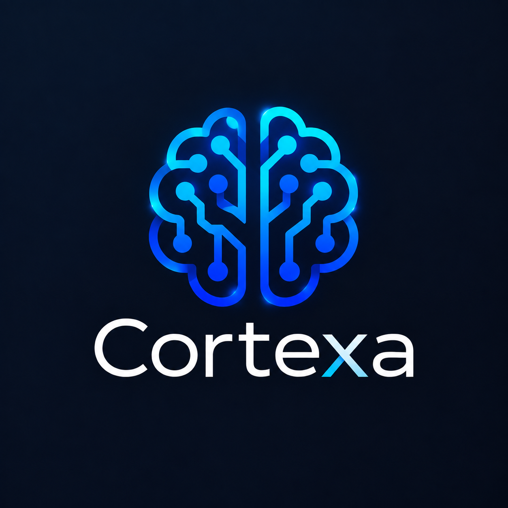

# 2026-10-03 — Approved September 23 raster identity

This owner-approved current treatment supersedes the legacy near-white-field
asset rules and table below, which remain historical. The exact source is
`approved-september23.png` (1254 × 1254 RGB, SHA-256
`12aaa6b3e3b02f69d0cc7e6b624eb3eb211b6eaabf2b831a411f8735ac0323c4`).
The primary/light/dark full-logo aliases copy those exact bytes. Keep its original
wordmark, colors, glow, geometry and opaque navy field. No SVG approximation,
recoloring or transparent replacement of the full/native artwork is approved.
The sidebar-only owner refinement is the sole extraction exception: use
`sidebar-symbol.png`, genuine RGBA transparency, 72px expanded and 28px collapsed,
with existing Cortexa/Private workspace text beneath. Full/logo/native assets
remain separate; see the generation guide for retained cutout provenance.

The owner separately approves one square brain crop `(335, 210, 910, 785)` for
compact/native assets; it ends above the wordmark. Resize proportionally with
Lanczos. Full artwork appears in README; the crop identifies the favicon/native
application. The sidebar now uses its separate transparent symbol. The dark field on light themes
is intentional. Do not add a second field, stretch or clip the artwork.

Bot mascots and Conductor remain separate identities; never use them as the app
logo. Compatibility identifiers remain unchanged under D-026. See
[repeatable generation and fidelity checks](APP_ICON_GENERATION.md).

---

# Cortexa brand guidelines

## Brand foundation

Cortexa is a local-first executive assistant designed for controlled enterprise
workflow. Its visual system should communicate clarity, judgment, security, and
operational restraint to IT leadership, operations teams, and business
executives.

The owner-supplied raster image is the authoritative logo source. The logo
combines a human brain silhouette with circuit paths. Preserve that complete
mark and its near-white protected field. Do not redraw it from screenshots,
extract only part of it, or infer a replacement symbol.

## Authoritative assets

| File                                  | Dimensions | SHA-256                                                            | Use                                               |
| ------------------------------------- | ---------: | ------------------------------------------------------------------ | ------------------------------------------------- |
| `assets/branding/logo-primary.png`    |  360 x 434 | `ecdcc56f3c9193dd7caf092778ef096c3f9af7047355e417bce7815301426ea7` | Default logo                                      |
| `assets/branding/logo-light.png`      |  360 x 434 | `ecdcc56f3c9193dd7caf092778ef096c3f9af7047355e417bce7815301426ea7` | Light-interface alias                             |
| `assets/branding/logo-dark.png`       |  360 x 434 | `ecdcc56f3c9193dd7caf092778ef096c3f9af7047355e417bce7815301426ea7` | Dark-interface alias                              |
| `assets/branding/favicon.png`         |    64 x 64 | `9458c6320bfcecd78f604b0a91547b670ba9047df9bf8d71c7fce18507e355ac` | Browser favicon                                   |
| `assets/branding/app-icon-source.png` |  512 x 512 | `e31345045817f040c9fc664d4dc090a2002a1f6d0676c870df2c7e14885afaec` | Source for a separately verified app-icon rollout |

The primary, light, and dark files are intentionally byte-identical. The
source image contains an alpha channel, but every source pixel is opaque. A
dark-mode use therefore keeps the protected near-white field instead of
attempting background removal or recoloring.

## Clear space and minimum size

Define `X` as 10% of the rendered logo height. Keep at least `X` of empty space
on every side, measured from the edge of the full image field. Do not place
text, rules, controls, other marks, or a trim boundary inside that space.

- Use the full logo at no less than 72 CSS pixels high when it appears alone in
  normal digital content. A compact product lockup may use it at no less than
  40 CSS pixels high when the adjacent text clearly says `Cortexa`.
- Use at least 25 mm high in print.
- Use `favicon.png` for sizes below the normal minimum. At 16 px it is an
  identification hint, not a detailed reproduction.
- Never upscale the 360 x 434 logo files beyond their native pixel dimensions
  in a raster export. Use the 512 x 512 app-icon source only for the separately
  planned icon-generation workflow.

## Backgrounds

- Prefer white, `#FBFBFB`, or a quiet neutral surface with sufficient clear
  space.
- On dark interfaces, use `logo-dark.png` as supplied. Its near-white field is
  part of the approved raster treatment.
- Do not place the logo over photography, gradients, patterns, or high-contrast
  detail.
- Do not add a shape, tint, keyline, or transparency treatment behind the logo
  unless a later approved source asset supplies one.

## Prohibited usage

Do not stretch, squeeze, rotate, skew, crop, trace, redraw, animate, recolor,
outline, add effects inside the image, remove the protected field, rearrange
the brain and circuit elements, or combine the mark with another logo. Do not
use the former product name as a human-facing brand. Do not use presentation
exports or screenshots as replacement source assets.

## Visual character

Use restrained layouts, direct language, compact information hierarchy, and
clear status distinctions. Brand color should identify and orient, not flood
the interface. Operational tools should remain dense enough for repeated work
and avoid decorative card stacks, atmospheric gradients, or ornamental shapes.

See `BRAND_USAGE.md`, `COLORS.md`, `TYPOGRAPHY.md`, `ICONOGRAPHY.md`, and
`PRESENTATION_GUIDELINES.md` for application-specific rules.
