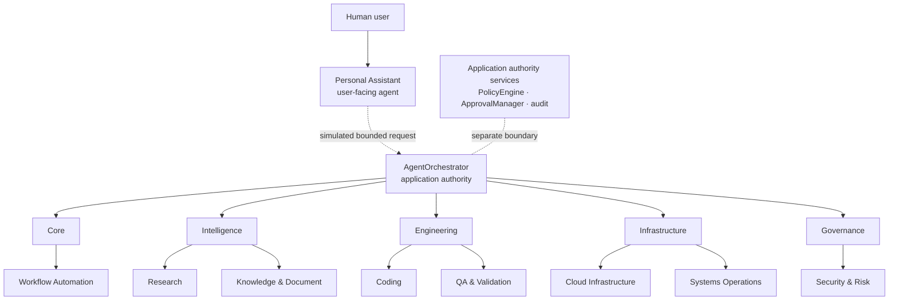

# Native multi-agent visual Command Center proposal

- Status: Verified complete; deterministic frontend source and M5 rendered validation passed
- Owner: Project owner
- Prepared: 2026-08-19
- Companion completed ExecPlan: [`2026-08-12-native-multi-agent-command-center-prototype.md`](../plans/2026-08-12-native-multi-agent-command-center-prototype.md)

> This document began as design evidence and now records the approved
> implementation checkpoint. It does not claim a live multi-agent capability:
> the implemented route is deterministic frontend presentation only. No Tauri
> command, Rust contract, provider, model, tool, runtime, storage, permission,
> or trusted authority changed.

## 1. Executive summary

Cortexa can add an original, premium operations view without replacing the
existing conversational workspace or dramatizing capabilities that do not
exist. The recommended first prototype is a dedicated, lazily loaded **Command
Center** route driven entirely by bounded, typed, deterministic frontend
fixtures. It presents `AgentOrchestrator` as application authority, Personal
Assistant as the user-facing entry agent, the other eight application-owned
agents in five understandable domain groups, one selected simulated work path,
a contextual inspector, and a structured activity stream.

The visual direction is a theme-adaptive graphite operations surface with
restrained indigo and teal accents, crisp semantic edges, compact labels, and
motion only when a fixture event represents a real state transition. Dark mode
uses the deepest graphite treatment; light mode uses the existing neutral
surfaces and the same semantic hierarchy rather than embedding an unexplained
dark island. It is a hybrid
hierarchy/network—not a circular wheel. `DEMO MODE · SIMULATED AGENT DATA`
remains persistent and is repeated in the topology and inspector.

The repository already has the right application shell, semantic page
primitives, typed reducer conventions, deterministic mocks, nine-role Rust
catalog, bounded orchestration models, and strict trust boundaries. It does not
have a multi-agent IPC consumer, frontend graph projection, graph library,
command palette, real agent activity, provider telemetry, or live runtime
session. Therefore the first prototype must not read raw Rust values or imply
that Rust-only workflows are connected to the WebView.

The recommended conditional Gate B dependency set is limited to two direct
production dependencies: `@xyflow/react` for the operational topology and
`lucide-react` for statically imported functional icons. Both and all of their
transitive lockfile consequences require a fresh exact-version, license,
React-19-compatibility, accessibility, security, and bundle-delta review before
installation. All other evaluated libraries are deferred or rejected for the
first prototype. Optional browser or accessibility tooling is a separate
dependency decision and requires separate owner approval.

### Implementation checkpoint — 2026-08-20

The owner supplied both required authorization sentences. The approved source
now implements the lazy Command Center route, exact deterministic projection,
seven closed scenarios, one distinct orchestrator, all nine roles, five
presentation groups, non-editable graph, synchronized grouped structured view
and relationship table, inspector, activity stream, local filters, and
persistent `DEMO MODE · SIMULATED AGENT DATA` disclosure.

Only `@xyflow/react@12.11.3` and `lucide-react@1.33.0` were added as exact
direct production dependencies; the reviewed lockfile consequence is 19
transitives. Production audit is zero vulnerabilities, while five pre-existing
development-only advisories remain unchanged. The graph import boundary is one
adapter file. No Rust/Tauri/IPC/capability/CSP/storage path changed.

Source-current focused tests pass 142/142 and the full frontend suite passes
211/211. Frontend formatting, lint, typecheck, and production build pass;
strict Rust checks and 481 all-target tests pass with one intentional Hermes
probe ignored. Initial JavaScript plus CSS is 76,183 gzip bytes, +1,119 from
the 75,064-byte baseline and within the +10 KiB cap. The separate lazy Command
Center JavaScript plus CSS is 86,350 gzip bytes, within the 150 KiB cap.

The mandatory real-browser/Tauri viewport, input, focus, computed-overflow,
contrast, reduced-motion, and dynamic-resize matrix is **Not run** because the
required Browser runtime tool is unavailable in this session. A local
Vite/Tauri launch succeeded, but macOS denied the assistive access required for
deterministic navigation, resize, and screenshots; no browser tooling
installation was authorized. The active ExecPlan therefore remains
validation-pending and does not claim manually verified geometry or native
behavior.

**Superseding M5 evidence — 2026-08-25:** the unavailable-runtime condition
above records the earlier M4 checkpoint and is no longer current. Browser
Control and Computer Use later completed the approved real-browser and native
Tauri viewport, resize, input, focus, overflow, light/dark, reduced-motion,
scroll, and screenshot matrix. One contrast defect was corrected and
revalidated. Manual browser zoom reached 125% (`devicePixelRatio` 1.25) and was
reset. The ExecPlan and valid completion marker record `PASS WITH ADVISORIES`;
the deterministic frontend-only and no-authority boundaries remain unchanged.

## 2. Gate A UI maturity baseline

At the 2026-08-19 Gate A checkpoint, before source implementation, the frontend
had a moderately mature application shell and a deliberately small feature
surface:

- React 19 and TypeScript render one Tauri WebView.
- `ApplicationStateProvider` plus a typed reducer owns volatile state.
- The shell has a persistent sidebar, fixed toolbar region, one primary content
  scroll owner, responsive breakpoints, light/dark tokens, visible focus, and a
  reduced-motion rule.
- Conversations provide a complete deterministic no-I/O demonstration:
  transcript, composer, streamed fixture text, context provenance, proposed
  tool activity, a mock approval dialog, mock result, Stop, Retry, and final
  answer.
- Activity provides a redacted session-event list.
- Permissions and Settings provide useful read-only views.
- Tasks, Memory, and Integrations remain placeholders.

The interface is still a workspace/demo rather than an operations console.
There is no graph, search layer, inspector, panel system, domain-status
taxonomy, accessible topology alternative, command palette, visual regression
runner, or multi-agent integration. Its icons are primarily letters, and its
1,549-line global stylesheet has useful semantic colors but no formal domain,
graph, spacing, radius, or motion token scales.

Current maturity should be described as:

| Area                                   | Classification                 | Evidence                                                        |
| -------------------------------------- | ------------------------------ | --------------------------------------------------------------- |
| Application shell and navigation       | Implemented                    | `App.tsx`, `ApplicationSidebar.tsx`, `styles.css`               |
| Conversation interaction               | Mock-only                      | Deterministic browser driver and reducer; no model or tool call |
| Activity UI                            | Mock-only                      | Current in-memory run/approval events, not authoritative audit  |
| Tasks, Memory, Integrations UI         | Partially implemented          | Route and placeholder only                                      |
| Permissions UI                         | Implemented, static            | Read-only fixed status rows                                     |
| Settings diagnostics                   | Implemented                    | Typed app-info and menu-listener states                         |
| Multi-agent Rust catalog/orchestration | Implemented, unwired           | Transport-free Rust contracts and tests                         |
| Multi-agent workflows                  | Fixture-only, unwired          | Sealed no-I/O Rust selectors                                    |
| Multi-agent frontend/IPC               | Documented but not implemented | No command, event, state, or consumer                           |
| Operational topology and inspector     | Unavailable                    | No view model or visualization component                        |
| Real provider/model/tool activity      | Unavailable                    | Explicitly outside current architecture                         |
| Hermes transport                       | Deferred / NO GO               | Rejected evaluated transports and containment                   |

## 3. Gate A route and component inventory

Routing is an application-owned `AppRoute` union and reducer state, not a URL
router. `ApplicationShell` renders one of seven entries from a typed record.

| Route         | Current purpose and hierarchy                                                                           | Data and states                                                                                         | Interaction, accessibility, scrolling, reuse                                                                                                                                         |
| ------------- | ------------------------------------------------------------------------------------------------------- | ------------------------------------------------------------------------------------------------------- | ------------------------------------------------------------------------------------------------------------------------------------------------------------------------------------ |
| Conversations | `ConversationWorkspace` -> `PageHeader`, transcript/timeline cards, composer, optional `ApprovalDialog` | Volatile `ApplicationState`; empty, streaming, stopped, failed/retry, awaiting mock approval, completed | Semantic region/form/buttons. Transcript intentionally scrolls inside the workspace to keep the composer reachable. Reuse disclosure cards, status copy, and structured event cards. |
| Tasks         | `TasksPage` -> `PlaceholderPage`                                                                        | Static empty state                                                                                      | Main page scroll owner; no actions. Keep route available.                                                                                                                            |
| Memory        | `PlaceholderPage`                                                                                       | Static empty state                                                                                      | Main page scroll owner; no memory consumer. Do not call it a knowledge graph.                                                                                                        |
| Activity      | `ActivityPage` -> `PageHeader`, `PageState` or ordered list                                             | Volatile mock events; empty or populated                                                                | Semantic ordered list and redacted copy. Strong starting pattern for the Command Center stream, but lacks time, agent/task/workflow attribution, search, and filters.                |
| Integrations  | `PlaceholderPage`                                                                                       | Static empty state                                                                                      | No connector, credential, or network integration.                                                                                                                                    |
| Permissions   | `PermissionCenter` -> header, card, fixed status list                                                   | Static nine-row status data                                                                             | Read-only native list; status uses text as well as color. Main page owns scrolling.                                                                                                  |
| Settings      | `SettingsPage` -> general and diagnostics cards                                                         | App-info and menu event states: checking, ready, error                                                  | Read-only diagnostics, semantic definition lists, main page scrolling.                                                                                                               |

### Shell and major panels

- `ApplicationSidebar`: brand, new-conversation action, conversation history,
  workspace navigation, local-first status. The entire sidebar is the one
  independent sidebar scroll owner.
- `application-toolbar`: route name and current local-core diagnostic summary.
- `application-content`: the intentional primary vertical page scroll owner.
- `PageHeader`, `PageState`, and `.page-panel`: reusable semantic and visual
  primitives.
- Conversation cards: reusable visual language for attribution, status,
  results, and bounded detail.
- `ApprovalDialog`: the only modal/dialog. It is viewport-bounded and scrolls
  internally, but focus management is incomplete.

There are no current tabs, drawers, data tables, charts, topology canvases,
command palettes, or shortcut managers. A Command Center should not introduce
new routes for every conceptual area merely because the design can depict it.

## 4. Existing models and data boundaries

### Frontend models

The frontend can directly supply only presentation/demo information:

- `ApplicationState`: active route, conversations, active deterministic mock
  run, mock approval, composer, activity, and retry state.
- `ConversationSession` and `ConversationMessage`: volatile user/assistant
  presentation records.
- `ActivityEvent`: seven fixed run/approval event kinds with redacted copy.
- `MockContextProvenance`, `ToolActivity`, `MockToolResult`, and
  `MockFinalAnswer`: explicit frontend-only demonstration values.
- `AppInfo`: typed application metadata through `get_app_info`.

These types cannot truthfully supply a native multi-agent topology. They know
nothing about the nine-agent registry, Rust task lineage, workflow stages,
runtime identities, policy, approval-manager state, or audit records.

### Rust models that inform—but do not currently feed—the design

| Model/boundary                                                            | Current evidence                                                                                                                                         | Projection-safe design use                                                                                       |
| ------------------------------------------------------------------------- | -------------------------------------------------------------------------------------------------------------------------------------------------------- | ---------------------------------------------------------------------------------------------------------------- |
| `AgentId`, `AgentDefinition`, `AgentRegistry`                             | Closed nine-role catalog; `Initial` is descriptive activation metadata checked by application-owned paths, not standalone authority or live availability | Use the exact display identities in deterministic fixtures; label them simulated and non-authorizing             |
| `AgentOrchestrator`                                                       | Separate application service owning task creation, selection, lineage, cancellation, and result routing; no Tauri/UI consumer                            | Render as a distinct authority node, never as Personal Assistant                                                 |
| `AgentTask`, `AgentTaskStatus`, task/result/failure types                 | Bounded IDs, lineage, context, status, output, failure, cancellation                                                                                     | Inform closed view-model statuses; do not serialize raw task objects in the prototype                            |
| `AgentRuntime`, `RuntimeRun`, `NativeAgentRuntime`                        | Sole/default native, transport-free, one-turn-per-run foundation; multiple independent runs are possible but unwired                                     | Show only a `Native runtime · simulated projection` fact in fixtures if selected; never imply provider execution |
| Governance service, policy engine, approval manager, audit records        | Implemented non-executing/volatile Rust boundaries, mostly unwired                                                                                       | Keep as separate authority/service concepts; QA and Security never stand in for them                             |
| `MemoryStore` and approved-document types                                 | Memory is bounded and volatile with sealed mutation paths; the approved-document content boundary is read-only; neither has a frontend consumer          | Defer from operational topology; reserve separate future knowledge projection                                    |
| Research/Knowledge, Engineering Quality, Infrastructure/Systems workflows | Sealed fixture-only/no-I/O Rust workflows                                                                                                                | Use their semantic shapes only as inspiration for deterministic presentation scenarios                           |
| Workflow Automation proposal types                                        | Five sealed proposal templates; no general engine or tool execution                                                                                      | Present proposal-only status, never an executing orchestrator                                                    |
| Bounded parallelism types/events/audit                                    | Sealed same-thread fixture workflows and ordered outcomes                                                                                                | Inform event/status taxonomy; do not claim provider or CPU parallelism                                           |

### Trust boundary

Only trusted Rust may derive authoritative task, run, policy, approval, memory,
or audit identity. React remains untrusted presentation. The first prototype
therefore uses a frontend-owned `demo-v1` projection whose provenance is
explicitly `deterministic-fixture`; it does not create trusted Rust identities,
cross IPC, or authorize any action. A later real projection requires a separate
typed Rust DTO and narrow Tauri command/event allowlist.

### Capability classification

| Capability                                                                       | Classification                                                             |
| -------------------------------------------------------------------------------- | -------------------------------------------------------------------------- |
| Nine definition catalog and registry                                             | Implemented in Rust; unwired                                               |
| Root/child lifecycle, result collection, cancellation, attribution               | Implemented in Rust; unwired and bounded                                   |
| Non-executing policy/approval/governance foundation                              | Implemented in Rust; unwired                                               |
| Sealed research, engineering, infrastructure, automation, and parallel scenarios | Fixture-only in Rust                                                       |
| Product multi-agent activity feed                                                | Unavailable                                                                |
| React multi-agent catalog/task/workflow state                                    | Unavailable                                                                |
| Multi-agent Tauri IPC                                                            | Unavailable                                                                |
| Command Center                                                                   | Fixture-only frontend source and approved browser/Tauri M5 matrix verified |
| Operational graph, search, filters, inspector                                    | Implemented as deterministic presentation-only controls                    |
| Knowledge graph                                                                  | Deferred                                                                   |
| Real provider/model/tools/MCP/connectors                                         | Unavailable                                                                |
| Live telemetry, usage, token counts, agent health                                | Unavailable                                                                |
| Hermes runtime or transport                                                      | Deferred / NO GO                                                           |

## 5. Original visual direction

The Command Center should feel like a calm, premium AI operations console—not
a circular agent company, cyberpunk control room, or imitation of any supplied
reference. The primary surface is layered graphite/midnight with crisp borders,
quiet spatial grid marks, high-contrast type, and restrained elevation. Deep
indigo identifies application authority; circuit teal identifies information
flow; domain accents distinguish clusters; warning and danger remain reserved
for semantic states.

The topology is an asymmetric hierarchy/network:

- `AgentOrchestrator` anchors the upper-left/upper-center authority band.
- Personal Assistant sits adjacent as the human-facing entry point.
- Five domain groups form readable lanes below.
- Work nodes appear only for the selected deterministic scenario.
- Approval, policy, and audit authority stays visually separate from advisory
  agent nodes.
- The inspector and activity stream provide operational depth without forcing
  every detail onto the canvas.

The complete Cortexa logo remains unmodified. New styles should extend semantic
tokens rather than restyle existing routes wholesale. New typography must avoid
the negative tracking that conflicts with the branding typography guidance.

No visual reference image was available as a repository artifact during this
Gate A run. The written qualities in the owner prompt were used only as
high-level inspiration; no layout, color assignment, icon, typeface, brand, or
animation was copied.

## 6. Design principles

1. Clarity before spectacle.
2. Information before decoration.
3. Original identity rather than imitation.
4. Progressive disclosure before canvas density.
5. Restrained, state-driven motion only.
6. Mocked behavior must be unmistakably mocked.
7. Consequential actions remain governed by application code.
8. Agent identity and authority must remain understandable.
9. Every graph interaction has an equivalent structured alternative.
10. No hidden, clipped, or unreachable content.
11. Failure, cancellation, blocked, and unavailable are first-class states.
12. Existing conversation and navigation behavior remains available.
13. Operational, availability, health, trust, approval, and demo state are
    separate dimensions.
14. Library-specific types end at adapter boundaries.
15. Small deterministic data earns a small deterministic implementation.

## 7. Proposed information architecture

| Area                              | First-prototype recommendation                                           | Primary questions                                                   | Data/actions/accessibility                                                                                        |
| --------------------------------- | ------------------------------------------------------------------------ | ------------------------------------------------------------------- | ----------------------------------------------------------------------------------------------------------------- |
| Command Center                    | Dedicated route and required rendered validation complete                | What is represented? Who owns the selected work? What is simulated? | Deterministic typed projection; selection/search/filter/viewport controls only; structured tree/table alternative |
| Conversations                     | Preserve unchanged                                                       | What does the user want and what did the mock return?               | Existing mock state and controls                                                                                  |
| Agents                            | Represent inside Command Center, not a new route                         | What is each role, domain, availability, and authority?             | Agent nodes plus inspector and accessible list                                                                    |
| Tasks                             | Preserve existing route; selected demo task may appear in Command Center | What is assigned and in what state?                                 | Fixture-only work nodes; no task creation                                                                         |
| Workflows                         | Represent selected scenario inside Command Center, not a new route       | What is the ordered flow and where is it blocked?                   | Fixture-only workflow/step projection; no execution                                                               |
| Knowledge                         | Keep Memory route; defer dense graph                                     | What approved/proposed knowledge exists?                            | No truthful frontend data today; future separate projection                                                       |
| Approvals                         | Keep existing conversation mock; depict demo checkpoint only             | Is a simulated work path waiting? Who would own the decision?       | Explicit `SIMULATED`; no approve action in Command Center                                                         |
| Activity and audit                | Reuse current visual pattern in a Command Center panel                   | What deterministic event changed and who is attributed?             | Bounded fixture event list; never call it trusted audit evidence                                                  |
| Usage                             | Do not add                                                               | Is there trustworthy measured usage?                                | No; fake telemetry is prohibited                                                                                  |
| Settings/Permissions/Integrations | Preserve existing routes                                                 | What local diagnostics and future boundaries exist?                 | Existing current/static/placeholder content                                                                       |

The existing conversation interface remains the default familiar work surface.
The Command Center complements it and is fully reversible.

## 8. Command Center composition

### Wide desktop

1. Existing persistent left navigation.
2. Existing global toolbar, plus a Command Center-local search/command header.
3. Compact status summary with counts labeled `SIMULATED`.
4. Main workbench: topology canvas and right inspector.
5. Bottom structured activity stream.
6. Persistent `DEMO MODE · SIMULATED AGENT DATA` badge in the page header and
   canvas chrome.
7. Toggle to an equivalent grouped agent tree plus relationship table. Only
   the active graph or structured view remains in the accessibility tree and
   tab order.

```text
┌──────────────┬────────────────────────────────────────────────────────────┐
│ Existing     │ Command/search · DEMO MODE · compact simulated summary    │
│ sidebar      ├───────────────────────────────────────┬────────────────────┤
│              │ Operational topology                  │ Contextual         │
│ Conversations│ Orchestrator → domains → selected     │ inspector          │
│ Tasks        │ work path                             │                    │
│ …            ├───────────────────────────────────────┴────────────────────┤
│ Settings     │ Structured activity / audit-style fixture stream          │
└──────────────┴────────────────────────────────────────────────────────────┘
```

The current sidebar is persistent but not collapsible. For the first prototype,
preserve that known behavior: the existing 760px minimum and a structured-view
fallback provide a safer bounded layout than adding another navigation state.
A desktop icon-rail collapse may be evaluated later only with visible labels or
tooltips, an accessible toggle, focus stability, and no hidden destination. It
is not required for this deterministic milestone.

### Reuse and extraction

- Reuse `PageHeader`, `PageState`, `.page-panel`, status badge patterns, the
  Activity ordered-list pattern, focus tokens, reduced-motion behavior, and the
  established shell.
- Extract or generalize `CoreStatus` only if the approved prototype needs the
  same diagnostic language; do not duplicate it.
- Do not reuse `ApprovalDialog` as an inspector. The inspector is a responsive
  complementary panel, not a modal on desktop.
- Keep selection and filters feature-local so routine topology changes do not
  rerender the entire shell/sidebar.

## 9. Operational topology strategy

Use a fixed, deterministic layout for the small first-prototype graph. A runtime
layout engine is unnecessary for one orchestrator, nine agents, five group
containers, and a small selected work path.

Default view:

- authority anchor: `AgentOrchestrator`;
- human-facing entry: Personal Assistant;
- five labeled domain lanes;
- all nine agent nodes exactly once;
- only selected scenario work/checkpoint nodes;
- semantically labeled edges;
- visible fixture provenance.



Supported first-prototype interactions:

- select/focus a node or edge;
- hover may expose the same short label available on focus, but never unique
  information or an action;
- search agents and visible work items;
- filter explicitly by agent, domain, operational status, and selected
  workflow/scenario;
- defer capability filtering because the prototype has no truthful frontend
  capability dataset; document the unavailable filter rather than fabricate it;
- center selected node or active simulated task;
- zoom in/out, fit view, and reset;
- keep all five small domain groups expanded; domain collapse/expand is
  evaluated and deferred because nine agents do not justify hidden navigation;
- expand/collapse the selected work path, not arbitrary graph editing;
- switch to the synchronized grouped tree and relationship table.

Nodes are not draggable because positions communicate a curated authority and
domain hierarchy. Disable delete/connect affordances. Ordinary wheel/trackpad
scroll must continue to scroll the page; canvas zoom requires explicit controls
or a focused modifier gesture. Drag/Space+drag performs pan.

Keyboard model: Tab enters the graph toolbar, then the graph as one composite
region. Arrow keys move among visible agent/work nodes in deterministic visual
order; Home/End move to the first/last visible node; Enter or Space selects;
Escape returns focus to the graph toolbar. Edges do not create a second long
Tab sequence: their labels and endpoints remain selectable from the
synchronized relationship table, and a selected node exposes related edges.
The adapter must provide concise instructions and preserve browser shortcuts.

## 10. Layer model

| Layer         | First prototype                                                                                         | Later/deferred                                                           |
| ------------- | ------------------------------------------------------------------------------------------------------- | ------------------------------------------------------------------------ |
| Orchestration | `AgentOrchestrator`, Personal Assistant, simulated delegation/result paths                              | Real task/run projection through separately approved IPC                 |
| Specialist    | All nine agents in five groups, availability and demo status                                            | Live capability/runtime assignment                                       |
| Work          | One selected simulated task/workflow path, validation/risk/approval checkpoints where scenario requires | Product task history and live workflow events                            |
| Integration   | Optional inspector fact `Native runtime · not connected`; no canvas nodes                               | Tools, MCP, connectors, providers, runtimes after real typed data exists |
| Knowledge     | No graph nodes                                                                                          | Separate approved/proposed/document provenance experience                |

The exact five presentation groups are:

| Group          | Agent membership                                     |
| -------------- | ---------------------------------------------------- |
| Core           | Personal Assistant; Workflow Automation Agent        |
| Intelligence   | Research Agent; Knowledge & Document Agent           |
| Engineering    | Coding Agent; QA & Validation Agent                  |
| Infrastructure | Cloud Infrastructure Agent; Systems Operations Agent |
| Governance     | Security & Risk Agent                                |

QA and Security may participate in cross-domain fixture paths without being
duplicated. Group membership is view metadata, not routing or authority.

Layer visibility never implies operational availability. Proposed or unavailable
layers use dashed treatment and explicit text, or remain absent.

## 11. Node taxonomy

### First prototype

- `orchestrator`: one application-authority node.
- `agent`: exactly nine catalog roles.
- `domain-group`: five non-authorizing visual containers.
- `task`: one root and bounded child fixtures in selected scenarios.
- `workflow`: one selected scenario header/aggregate where useful.
- `workflow-step`: only when it materially explains sequence.
- `approval-checkpoint`: demo-only, clearly owned by application approval
  boundary rather than an agent.
- `validation-checkpoint`: advisory QA work.
- `security-risk-checkpoint`: advisory Security work.

### Deferred

Tool, memory namespace, document source, MCP server, external connector, mock
provider, model provider, runtime, and dense knowledge nodes. Runtime may appear
as inspector metadata, but the first canvas should not imply a connected
provider stack.

Every node has a visible label, kind, domain, operational status, availability,
trust classification, and demo provenance. Shape and icon reinforce kind;
color never carries kind or status alone.

## 12. Edge taxonomy

First-prototype edge kinds:

- `orchestrates`: application authority to user-facing/root work boundary;
- `delegates`: orchestrator-owned assignment to a specialist;
- `owns-task`: task-to-agent assignment;
- `depends-on`: ordered prerequisite;
- `validation-review`: QA advisory review;
- `risk-review`: Security advisory review;
- `approval-dependency`: simulated wait on application approval;
- `result-flow`: specialist result toward Personal synthesis;
- `cancellation`: explicit simulated cancellation propagation;
- `failure-propagation`: typed simulated failure consequence.

Artifact transfer may be added only when a fixture represents a bounded typed
result. Tool request/result, memory read/proposal, document input, and connector
edges are deferred. Each edge has a text-accessible semantic label, direction,
source, target, and current/fixture state. Dashed lines distinguish unavailable
or proposed relationships; patterns and labels supplement color.

## 13. Status, health, approval, availability, and demo taxonomies

Do not collapse these dimensions into a single traffic-light badge.

| Dimension    | Closed first-prototype values                                                                                                                              | Rule                                                     |
| ------------ | ---------------------------------------------------------------------------------------------------------------------------------------------------------- | -------------------------------------------------------- |
| Operational  | `idle`, `queued`, `running`, `delegating`, `waiting-child`, `waiting-approval`, `validating`, `risk-review`, `blocked`, `cancelled`, `failed`, `completed` | Derived only from fixture scenario state                 |
| Availability | `available-in-fixture`, `preview-only`, `disabled`, `unavailable`                                                                                          | Never label a Rust-only/unwired agent “live”             |
| Health       | `not-measured`, `simulated-healthy`, `simulated-degraded`, `simulated-failed`                                                                              | Default is `not-measured`; never fabricate telemetry     |
| Trust        | `application-authority`, `advisory-agent`, `untrusted-input`, `presentation-fixture`                                                                       | Visible in inspector and alternative view                |
| Approval     | `not-required`, `simulated-pending`, `simulated-approved`, `simulated-rejected`, `unavailable`                                                             | QA is never approver; Security is never policy authority |
| Demo origin  | `deterministic-fixture`, `frontend-mock`, `rust-fixture-only`, `unavailable`                                                                               | Always displayed as text                                 |

Operational state uses text, an icon, node border/pattern, and optional restrained
motion. Health uses no green dot unless a fixture explicitly says
`simulated-healthy`, and the qualifier remains visible.

## 14. Contextual inspector design

The inspector is selected-entity detail, not a control plane. Desktop presents
it beside the canvas; narrow layouts place it after the canvas in document
order. Opening it moves no keyboard focus unless initiated as a disclosure;
closing returns focus to the selected topology/list item.

Shared sections:

- identity, kind, domain, and persistent demo provenance;
- status, availability, trust, and health-not-measured state;
- responsibility and authority boundary;
- current simulated assignment;
- inputs/outputs and dependencies;
- recent deterministic activity;
- findings and failure/unresolved information;
- related audit-style fixture records.

Selection modes are closed and explicit:

| Selection                               | Inspector content                                                                          |
| --------------------------------------- | ------------------------------------------------------------------------------------------ |
| Orchestrator                            | Application authority, fixture limits, routing/cancellation responsibility                 |
| Agent                                   | Role, domain, advisory boundary, simulated assignment, findings, related fixture events    |
| Domain group                            | Fixed membership and aggregate simulated state; no authority or routing controls           |
| Task                                    | Fixture owner, parent/dependency, status, bounded inputs/outputs, unresolved result        |
| Workflow or step                        | Ordered fixture position, dependencies, checkpoints, result/failure state                  |
| Approval/validation/security checkpoint | Owning application boundary or advisory role, simulated decision/finding, unresolved issue |
| Edge                                    | Semantic relationship, source/target, direction, state, and demo provenance                |

Agent mode may show responsibility, fixture assignment, policy/memory profile
names as non-authorizing facts, permitted fixture relationships, and recent
simulated activity. It must not show model/provider, token usage, connected MCP,
live tools, or history when those values do not exist. `AgentOrchestrator` mode
states that application code owns creation, lifecycle, cancellation, and
routing. QA mode says it is not `ApprovalManager`; Security mode says it is not
`PolicyEngine`; Workflow Automation says it is not the orchestrator.

No inspector control may dispatch a task, approve an action, change policy,
execute a tool, mutate memory, or reach a device.

## 15. Activity and audit stream design

Use a structured list, not a terminal. Each fixture event includes:

- opaque fixture event ID and deterministic ordinal such as `Step 04`;
- fixed ISO-8601 fixture timestamp labeled `SIMULATED TIME`;
- event kind and severity;
- short summary and expandable bounded detail;
- agent, task, and workflow references when applicable;
- demo origin;
- no unlabeled wall-clock or claim that fixture time is current;
- redaction classification;
- selected topology path references.

First-prototype events may represent task creation, delegation, validation,
risk review, simulated approval dependency/result, result flow, workflow
progression, completion, cancellation, and failure. Tool requests/results may
appear only if copied from the existing explicit frontend mock and clearly
called mock; otherwise defer them.

Controls: search, severity/event-kind/agent filters, expand/collapse details,
selectable already-redacted presentation text, and “follow selected path.” The
prototype invokes no Clipboard API and adds no Tauri clipboard capability.
Never expose chain-of-thought, raw tool arguments, request content, secrets, or
trusted audit claims. The first fixture stream is capped (recommended maximum
48 records); virtualization is unnecessary at that bound.

## 16. Search and filtering design

The persistent page search filters the fixed projection by visible label,
agent, domain, work-item ID, and fixture event summary. It never queries the
filesystem, backend, provider, or network.

Initial filters:

- domain: Core, Intelligence, Engineering, Infrastructure, Governance;
- agent: the exact nine fixture roles;
- operational status;
- entity kind;
- selected workflow/scenario;
- capability: visibly unavailable and deferred until truthful typed capability
  data exists;
- demo origin.

The search field is a plain in-page filter, not a combobox, command menu, or
popup. It updates the visible graph, grouped tree, relationship table, and event
list as the user types; ordinary buttons in those views perform selection and
centering. Filters remain feature-local and resettable. Empty results provide a
clear status message and one reset action. Filter changes never create a hidden
result list or a second keyboard interaction model.

## 17. Command-palette design

A true global command palette is deferred from the first prototype. The
repository has no palette, shortcut manager, or focus-trapping primitive, and
first-prototype actions are limited enough for labeled search and visible
controls.

If later approved, the palette may navigate routes, select an agent/work item,
toggle a filter, fit/reset the graph, or open the alternative view. It must not
create tasks or perform consequential actions. It requires a dialog label,
initial focus, listbox/combobox semantics, arrow-key behavior, Escape, focus
trap, focus return, shortcut conflict review, and help text. `cmdk` should be
re-evaluated then, not installed preemptively.

## 18. Knowledge-graph strategy

The knowledge graph is a separate future experience. It represents approved
memory, agent-private/task memory, proposed shared memory, approved documents,
sections, extracted facts, topics, relationships, provenance, confidence,
staleness, and contradictions. Its ownership and trust dimensions differ from
operational task routing.

Required future distinctions:

- temporary versus persistent;
- approved versus proposed;
- agent/task/document ownership;
- confirmed versus inferred relationship;
- available versus unavailable content;
- source provenance and confidence.

Sigma.js plus Graphology is plausible only when a separately approved dense
dataset and accessible structured list/table exist. The first prototype adds
no knowledge nodes, no memory consumer, and no Sigma/WebGL dependency.

## 19. Responsive strategy

The current Tauri window defines a 1040×700 default and 760×520 minimum. Retain
and validate those values rather than inventing a smaller desktop contract.

| Viewport                        | Proposed composition                                                                                                                                                                                                |
| ------------------------------- | ------------------------------------------------------------------------------------------------------------------------------------------------------------------------------------------------------------------- |
| Ultrawide/fullscreen (>=1600px) | Sidebar; summary/header; canvas and 320–380px inspector; full-width bounded activity below. The Command Center workspace uses the available main-column width while header prose retains its readable text measure. |
| Standard 1040×700               | Sidebar; compact two-column canvas/inspector; activity below; controls wrap without icon-only ambiguity.                                                                                                            |
| Minimum 760×520                 | Existing sidebar plus main; inspector becomes a disclosure/stacked section; compact summary; canvas finite height; page scroll reaches all sections.                                                                |
| Reduced height 1040×520         | Global toolbar remains visible; primary content scroll owns vertical overflow; no fixed bottom panel; inspector/activity scroll only when explicitly bounded.                                                       |
| Browser-only <=640px            | Stack sidebar/main under existing contract; topology switches to structured view by default and canvas becomes optional. This is below native minimum but should remain resilient.                                  |

The workbench adapts through shared semantic tokens in both system themes. Dark
mode uses graphite/midnight surfaces; light mode uses neutral light layers with
the same hierarchy, domain accents, status meanings, and measured contrast.
Current source has a specific 641–900px risk: the shell track becomes 194px
while the sidebar retains a clamp minimum of 214px. Gate B must correct that
shared token/track mismatch before relying on the breakpoint. All new grid/flex
children require `min-width: 0`, wrapping, and explicit overflow behavior.

## 20. Scrolling and overflow strategy

### Shared contract to preserve

- `html`, `body`, `#root`, and `.application-shell` use the dynamic viewport
  height variable.
- Body, shell, and `.application-main` do not scroll.
- `.application-content` is the application’s intentional primary vertical
  scroll owner for every route.
- `.application-sidebar` is the only independent sidebar scroll owner.
- A page does not use its own `100vh`; it fills or grows within the content
  owner using `min-height: 0`/`min-width: 0` through each flex/grid chain.
- The conversation transcript remains a justified independent scroll region so
  the composer stays reachable.
- Dialogs are fixed within the dynamic viewport and scroll internally.

### Command Center exceptions

- Canvas: a named topology region with fixed/minmax panel height, hidden visual
  overflow, and pan/zoom internal to the canvas. Ordinary wheel scroll passes to
  `.application-content`.
- Inspector: independent `overflow-y: auto` only on wide layouts with a bounded
  panel height and an inspector heading/name; stacked into page flow at
  narrow/reduced-height layouts.
- Activity stream: bounded internal scrolling only when expanded in the wide
  workbench and exposed as a named activity region; otherwise normal page flow.
- Grouped tree and relationship table: normal document flow on narrow layouts;
  a bounded tree/table region may scroll only with an explicit name and
  keyboard-reachable first and last item.
- Code/preformatted detail: horizontal scrolling inside the code block, never
  page clipping.

Wheel/pinch policy: drag or Space+drag pans; explicit controls always zoom;
Ctrl/Meta+wheel or a focused opt-in zoom mode may zoom; unmodified vertical
wheel/trackpad gestures scroll the page. Focused nodes auto-pan into view
without moving focus. On panel close, focus returns to the invoking element.
For `@xyflow/react`, the adapter must verify the approved version's equivalents
of `zoomOnScroll={false}`, `panOnScroll={false}`, and
`preventScrolling={false}`; names/defaults are rechecked during the dependency
gate rather than assumed from current documentation.

Automated JSDOM tests can prove ownership structure but not computed overflow,
wheel physics, touch, or focus visibility. A real browser/Tauri matrix is
mandatory in Gate B.

## 21. Accessibility requirements

Current strengths include semantic `main`, `nav`, `aside`, sections, forms,
ordered lists, labeled transcript/history, native controls, visible focus,
non-color status copy, and reduced-motion CSS.

Current gaps recorded for follow-up:

- `ApprovalDialog` lacks verified initial focus, focus trap, Escape behavior,
  inert background, and focus restoration.
- Route activation leaves focus on the sidebar; the focusable main landmark is
  never programmatically focused and there is no skip link/route announcement.
- Conversation streaming uses the entire transcript as `aria-live`, risking
  repeated announcements.
- Conversation history can retain `aria-current="page"` while a workspace route
  is active, creating two current-page controls.
- Light-theme subtle text is approximately 3:1 on common surfaces at 10–11px,
  below the 4.5:1 normal-text target.
- No automated axe, browser keyboard, contrast, or screen-reader tooling exists.

Command Center acceptance requirements:

- named landmarks and one logical `h1`;
- skip-to-main and route-change focus/announcement strategy;
- predictable tab order; no keyboard trap in canvas;
- graph nodes follow the documented composite arrow-key model with visible
  focus; relationships remain selectable in the table without duplicating every
  edge in the Tab order;
- controls operable with keyboard and named without relying on tooltip;
- state communicated with text, icon/shape/pattern, and color;
- synchronized grouped tree plus relationship table exposes every agent,
  visible task, status, relationship, and selection; toggling views removes the
  inactive view from display, the accessibility tree, and the Tab order;
- inspector has a heading and focus-return behavior;
- activity uses polite, batched announcements for meaningful state changes, not
  every decorative animation;
- errors and empty/loading states use semantic status/alert behavior;
- reduced-motion disables edge movement, pulses, layout animation, parallax,
  and auto motion;
- all normal text reaches WCAG AA contrast, including compact labels;
- zoom does not prevent browser zoom or ordinary page scrolling.

## 22. Technology evaluation

Gate A evaluated the candidates below before installation. M0/M0.5 later
approved and installed only exact `@xyflow/react@12.11.3` and
`lucide-react@1.33.0`; every other candidate remains deferred or rejected as
recorded.

### `@xyflow/react`

Best fit for the small operational topology: React integration, custom HTML
nodes/edges, controlled selection, pan/zoom, fit-view controls, and built-in
keyboard/screen-reader hooks. Its types must remain in one adapter; app code
consumes only the framework-neutral projection. Disable editing/deletion and
ordinary wheel zoom. Cost is a meaningful addition to the current small eager
bundle, so lazy-load the route and measure raw/gzip deltas. React Flow documents
focusable nodes/edges, keyboard selection, auto-pan on focus, and configurable
ARIA labels: [official accessibility guide](https://reactflow.dev/learn/advanced-use/accessibility).

Recommendation: **conditional use for Gate B**, pending exact review.

### Sigma.js and Graphology

WebGL Sigma plus Graphology is designed for large interactive graphs and graph
algorithms, which may suit a future dense knowledge view. It is unnecessary for
ten fixed operational nodes, harder to integrate declaratively, weak as the
sole screen-reader surface, harder to snapshot/test, and adds GPU/layout
validation. Sigma describes itself as WebGL rendering built on Graphology:
[official overview](https://v4.sigmajs.org/).

Recommendation: **defer to a separate knowledge-graph milestone**.

### Apache ECharts

Strong charting and rendering, with ARIA descriptions and decal patterns when
properly imported/configured. Cortexa currently has no trustworthy task,
performance, usage, or health metric source, so charts would be decorative or
fabricated. [Official accessibility guidance](https://echarts.apache.org/handbook/en/best-practices/aria/)
also notes that large generated descriptions need deliberate customization.

Recommendation: **defer/reject for the first prototype**.

### `xterm.js`

Provides actual terminal emulation and terminal input/output semantics. Cortexa
has no terminal model and explicitly should use structured activity. Adding it
for appearance would create needless keyboard, scroll, CSP, resize, and
security complexity. [Official project](https://xtermjs.org/).

Recommendation: **reject**.

### Motion for React

Provides declarative layout/gesture animation and explicit reduced-motion APIs;
its [official accessibility guide](https://motion.dev/docs/react-accessibility)
supports a user preference policy. Existing CSS transitions and the global
reduced-motion rule cover the restrained first milestone. No constant or
decorative animation is allowed.

Recommendation: **reuse CSS; defer Motion**.

### Zustand

A small hook-based state manager, but the current typed context/reducer model is
sufficient for bounded fixtures and feature-local selection. A competing
global store would blur ownership without solving a demonstrated problem.
[Official introduction](https://zustand.docs.pmnd.rs/learn/getting-started/introduction).

Recommendation: **reuse context/reducer; defer**.

### `cmdk`

An accessible command-menu/combobox primitive can be useful once a true
cross-application command palette exists. The first milestone needs only
visible search/filter controls, and importing a dialog/palette stack before its
command ownership is defined is premature.

Recommendation: **defer**.

### Lucide React

The current interface has brand raster assets and letter glyphs, not a scalable
functional icon system. Lucide offers consistent, customizable, tree-shakable
SVG icons ([official overview](https://lucide.dev/)). Static named imports,
visible labels, and accessible names keep the addition bounded.

Recommendation: **conditional use for Gate B**, pending exact review.

## 23. Technology decision matrix

Bundle impacts are qualitative until an approved install and production build.

| Candidate          | Existing alternative                             | Purpose/benefit                                               | Drawbacks and maintenance                                    | Accessibility/testing                                                                  | Relative bundle impact          | Decision               |
| ------------------ | ------------------------------------------------ | ------------------------------------------------------------- | ------------------------------------------------------------ | -------------------------------------------------------------------------------------- | ------------------------------- | ---------------------- |
| `@xyflow/react`    | None; custom SVG would recreate interaction work | Operational topology, custom nodes/edges, selection, pan/zoom | New adapter/CSS, peer/version review, interaction complexity | Built-in hooks help but structured alternative and browser tests remain mandatory      | Medium–high                     | Conditional use        |
| Sigma + Graphology | None needed now                                  | Future dense knowledge graph and algorithms                   | WebGL, layout/GPU lifecycle, extra packages                  | Weak as sole accessible surface; difficult deterministic geometry tests                | High                            | Defer                  |
| ECharts            | Status cards/tables                              | Real metrics and operational summaries                        | No real data; chart surface and configuration overhead       | ARIA/decal support requires deliberate imports/content; table alternative still needed | High–very high                  | Defer/reject prototype |
| `xterm.js`         | Structured Activity list                         | Real terminal semantics                                       | No terminal exists; keyboard/resize/security complexity      | Terminal-specific focus/input burden                                                   | Medium–high                     | Reject                 |
| Motion             | CSS transitions                                  | Complex layout/panel animation                                | Another animation abstraction; easy to overuse               | Strong reduced-motion API but must test every path                                     | Medium                          | Reuse CSS/defer        |
| Zustand            | Context + reducer                                | Store/selectors at larger scale                               | Competing owner and unnecessary global state                 | Straightforward unit tests, but no current need                                        | Low                             | Reuse reducer/defer    |
| `cmdk`             | Native search/filter fields                      | Future command palette                                        | Dialog/focus/command registry ownership                      | Requires full combobox/dialog keyboard tests                                           | Low–medium                      | Defer                  |
| Lucide React       | Letter glyphs                                    | Consistent functional icons                                   | New dependency; icon catalog discipline                      | Visible text/names still required                                                      | Low when statically tree-shaken | Conditional use        |

## 24. Component hierarchy

Proposed presentation hierarchy (names are design candidates, not created
symbols):

```text
ApplicationShell (existing)
├── ApplicationSidebar (existing)
├── application-toolbar (existing)
└── application-content (existing primary scroll owner)
    └── CommandCenterPage (lazy feature boundary)
        ├── PageHeader + DemoModeBadge
        ├── CommandCenterSearchBar
        ├── SystemStatusSummary
        ├── CommandCenterWorkbench
        │   ├── OperationalTopologyPanel
        │   │   ├── TopologyToolbar
        │   │   ├── OperationalTopologyAdapter (@xyflow only here)
        │   │   └── TopologyStructuredView (grouped tree + relationship table)
        │   └── ContextualInspector
        └── CommandCenterActivityStream
```

State/data hierarchy:

```text
CommandCenterFixtureCatalog
  -> buildCommandCenterProjection(fixtureId)
      -> CommandCenterProjection (framework-neutral, immutable)
          -> feature-local reducer (selection, search, filters, view mode)
              -> graph adapter + structured view + inspector + activity
```

## 25. Graph projection model

The frontend needs a typed, framework-neutral projection. Raw Tauri payloads,
open backend JSON, graph-library types, and fixture constants must not leak into
components.

Conceptual contract:

```ts
type TopologyNodeKind =
  | "orchestrator"
  | "agent"
  | "task"
  | "workflow"
  | "workflow-step"
  | "approval-checkpoint"
  | "validation-checkpoint"
  | "security-risk-checkpoint";

interface CommandCenterProjection {
  readonly version: "command-center-demo-v1";
  readonly provenance: "deterministic-fixture";
  readonly scenarioId: CommandCenterScenarioId;
  readonly groups: readonly TopologyGroup[];
  readonly nodes: readonly TopologyNode[];
  readonly edges: readonly TopologyEdge[];
  readonly events: readonly CommandCenterEvent[];
  readonly summary: CommandCenterSummary;
}

interface TopologyNode {
  readonly id: TopologyNodeId;
  readonly kind: TopologyNodeKind;
  readonly label: string;
  readonly groupId: TopologyGroupId | null;
  readonly status: OperationalStatus;
  readonly availability: AvailabilityStatus;
  readonly health: HealthStatus;
  readonly trust: TrustStatus;
  readonly demoOrigin: DemoOrigin;
  readonly position: Readonly<{ x: number; y: number }>;
  readonly inspector: InspectorProjection;
}

interface TopologyEdge {
  readonly id: TopologyEdgeId;
  readonly source: TopologyNodeId;
  readonly target: TopologyNodeId;
  readonly kind: TopologyEdgeKind;
  readonly label: string;
  readonly status: OperationalStatus;
  readonly demoOrigin: DemoOrigin;
}
```

Projection validation must prove:

- exactly one orchestrator and all nine agents exactly once;
- Personal Assistant and orchestrator IDs/kinds are different;
- exactly five closed domain groups;
- every node group and edge endpoint resolves;
- every edge kind is meaningful and directionally valid;
- no duplicate IDs, cycles where prohibited, unbounded arrays, or open status;
- every fixture value carries demo provenance;
- QA/Security/Workflow Automation authority labels remain advisory/proposal-only;
- selection and filters refer only to projection IDs;
- graph adapter types are created only at the adapter boundary.

For the prototype, TypeScript compile-time types plus a pure deterministic
builder and invariant tests are sufficient. A later IPC DTO requires Rust-side
construction, Serde bounds, versioning, redaction, and replay/staleness rules in
a separate owner-approved plan.

## 26. Anticipated file map

No file below is changed by Gate A. Gate B should begin by revalidating and
narrowing this map.

### Likely frontend additions

- `src/features/command-center/CommandCenterPage.tsx`
- `src/features/command-center/CommandCenterPage.test.tsx`
- `src/features/command-center/commandCenterProjection.ts`
- `src/features/command-center/commandCenterProjection.test.ts`
- `src/features/command-center/commandCenterFixtures.ts`
- `src/features/command-center/useCommandCenterState.ts`
- `src/features/command-center/components/CommandCenterHeader.tsx`
- `src/features/command-center/components/SystemStatusSummary.tsx`
- `src/features/command-center/components/OperationalTopologyPanel.tsx`
- `src/features/command-center/components/OperationalTopologyAdapter.tsx`
- `src/features/command-center/components/TopologyStructuredView.tsx`
- `src/features/command-center/components/ContextualInspector.tsx`
- `src/features/command-center/components/CommandCenterActivityStream.tsx`
- `src/features/command-center/command-center.css` or a documented scoped
  section in the existing stylesheet (choose one convention during Gate B)

### Likely existing frontend changes

- `src/application/navigation.ts` — one reversible route metadata entry.
- `src/App.tsx` — lazy route integration and loading state only.
- `src/App.test.tsx` — route, shared shell, scroll ownership, and regression
  assertions.
- `src/styles.css` — semantic token additions and the 641–900px sidebar track
  mismatch correction if scoped CSS is not selected.
- `package.json` and `package-lock.json` — only the two conditionally approved
  dependencies after the dependency checkpoint.

### Optional test/tooling changes requiring explicit Gate B approval

- a small browser/E2E configuration and shared shell/topology spec if the
  owner approves a browser runner;
- an automated accessibility dependency/configuration if selected.

### Explicitly unchanged in the first prototype

- `src-tauri/src/**`, `src-tauri/Cargo.toml`, Tauri commands/capabilities/CSP,
  database/storage, permissions, Rust agent/runtime/governance types, and Hermes
  evidence.

## 27. Testing strategy

### Pure projection tests

- exact nine agents, one orchestrator, and five groups;
- exact separation of orchestrator/Personal, QA/ApprovalManager,
  Security/PolicyEngine, and Workflow Automation/orchestrator;
- ID uniqueness, endpoint resolution, ordering, bounds, and scenario stability;
- fixture provenance on every node, edge, event, summary, and inspector;
- no raw task/run/secret/request values or graph-library types;
- deterministic projection equality across repeated builds.

### Component and interaction tests

- route renders without changing existing routes;
- lazy loading, empty, queued, active, waiting approval, blocked, failed,
  cancelled, completed, and success states;
- select by graph, grouped tree, and relationship table; synchronized inspector;
- plain in-page search, agent/domain/status/workflow filters, unavailable
  capability filter, reset, and no-results state;
- zoom controls, fit, reset, center selected/active task;
- composite arrow-key graph navigation and visible accessible names;
- grouped tree and relationship table contain all visible semantic information;
- persistent demo disclosure; no ambiguous `LIVE` copy;
- bounded activity filtering, simulated timestamps/ordinals, and detail disclosure;
- reduced-motion projection and no decorative timers.

### Shared shell/accessibility/overflow tests

- all eight routes (seven existing plus Command Center) use
  `.application-content` as the primary scroll owner;
- sidebar remains one independent overflow owner;
- 641–900px width contract is consistent;
- graph, inspector, activity, and alternative-view ownership markers are
  explicit;
- real-browser keyboard/focus and automated accessibility scan if tooling is
  approved;
- manual Tauri/browser matrix: 2560×1440, 1600×1000, 1040×700, 1040×520,
  760×520, plus browser-only 640×800;
- exercise every existing route and Command Center at every listed viewport,
  using short and longest available content states;
- include long conversation transcript/composer, populated Activity,
  Permissions, Settings, each placeholder route, and long sidebar history;
- open the existing `ApprovalDialog` at 1040×520, 760×520, and browser-only
  640×800 to verify its last decision remains reachable without expanding its
  separately recorded focus-management scope;
- mouse wheel, trackpad, scrollbar, keyboard Page Up/Down/Home/End, browser
  zoom, touch where supported, resize without restart, and focus-into-view;
- final node/control/event and inspector action remain reachable;
- no horizontal page overflow or sticky/fixed obstruction.

### Performance and build evidence

Current ignored `dist` evidence is 388 KiB of allocated disk space and 383,117
logical bytes (374.14 KiB) across all artifacts. The main JavaScript is 229,541
raw / 70,247 gzip bytes, and CSS is 23,343 raw / 5,009 gzip bytes. Read-only M0
must record a fresh baseline and a proposed budget before installation. Unless
the owner approves a stricter ledger, the initial-route JavaScript-plus-CSS
gzip increase must be no more than 10 KiB, the complete Command Center lazy
JavaScript-plus-CSS payload must be no more than 150 KiB gzip, and no graph or
Command Center-only icon chunk may load before that route is selected. Crossing
any threshold stops implementation for owner review. The post-change production
build must confirm route-level code-splitting, inspect initial and lazy chunks,
and explain all deltas. The fixed topology needs no virtualization or layout
worker. Memoize projection and adapter mapping; keep fixture activity <=48
events; batch any simulated state transition and never run ambient animation
loops.

## 28. Risks and rollback plan

| Risk                                                            | Mitigation                                                                                                         |
| --------------------------------------------------------------- | ------------------------------------------------------------------------------------------------------------------ |
| Fixture UI appears live                                         | Persistent demo label, provenance on every projection entity, no `LIVE`, fixed deterministic scenarios, copy tests |
| Agent role implies application authority                        | Distinct node taxonomy/trust labels and exact boundary tests                                                       |
| Graph library leaks through app                                 | Framework-neutral projection and one adapter                                                                       |
| Canvas blocks page scrolling or keyboard use                    | Disable ordinary wheel zoom, explicit controls, structured alternative, browser tests                              |
| Panel nesting creates inaccessible scroll traps                 | Preserve primary owner, constrain only genuine independent regions, stack on narrow layouts                        |
| Bundle/startup regression                                       | Lazy route, two-direct-dependency maximum, explicit initial/lazy gzip thresholds                                   |
| Activity growth/re-render churn                                 | Feature-local reducer, 48-event fixture cap, stable arrays/memoized selectors                                      |
| Accessibility reduced to graph ARIA                             | Equivalent structured view and synchronized inspector are acceptance criteria                                      |
| Current responsive/contrast/focus defects contaminate prototype | Fix only directly required shell mismatch; record other remediation separately unless approved                     |
| Prototype accidentally broadens IPC/runtime                     | No Rust/Tauri/IPC file in first milestone; protected-path diff check                                               |
| Dense knowledge scope consumes prototype                        | Separate experience and dependency gate                                                                            |

Rollback is mechanical and complete: remove the new Command Center feature
directory and route entry, run `npm uninstall --save @xyflow/react
lucide-react`, inspect the generated manifest and lockfile diff, remove only
Command Center tokens/styles and shared tests, and restore the small `App.tsx`
integration. Do not hand-edit lockfile entries. Existing seven routes,
conversation mock, shell, Rust core, IPC, and storage remain unchanged
throughout.

## 29. Milestone sequence

1. **Read-only M0 readiness and dependency ledger** — re-read this proposal,
   inspect current status, verify exact package versions/licenses/React 19,
   audit every transitive, record the fresh bundle baseline and explicit
   budgets, narrow exact files, and stop for separate owner approval without
   installing packages or editing source.
2. **Owner ledger approval** — install or edit only after the owner explicitly
   approves the completed M0 dependency, lockfile, audit, and bundle ledger.
3. **Framework-neutral projection and fixtures** — closed types, invariant
   validator/builder, exact nine-agent catalog, scenarios, tests, and no UI.
4. **Reversible route and shell integration** — lazy Command Center route,
   loading/empty states, demo disclosure, sidebar width contract, existing-route
   regressions.
5. **Topology plus structured alternative** — adapter-isolated graph, fixed
   layout, selection, keyboard behavior, search/filter, controls, exact edge
   semantics.
6. **Inspector and activity** — synchronized bounded details/events, responsive
   stacking, no consequential actions.
7. **Accessibility, scrolling, visual, performance verification** — browser and
   Tauri matrix, reduced motion, contrast, focus, bundle/chunk evidence, full
   repository checks, independent review, reversible closeout.

Each milestone must remain demo-only and may stop independently. No later
milestone begins on failing fixture honesty, accessibility, scrolling, bundle,
or protected-path evidence.

## 30. First deterministic prototype recommendation

Proceed only after explicit owner approval with one isolated, lazily loaded
Command Center route. Use a fixed `command-center-demo-v1` projection with:

- one visually distinct `AgentOrchestrator` authority node;
- one separate Personal Assistant entry node;
- the remaining eight agents, for all nine exact roles;
- five domain groups: Core, Intelligence, Engineering, Infrastructure,
  Governance;
- one scenario selector with bounded states for idle/empty, queued, active,
  waiting approval, blocked/failure, cancelled, and completed/success;
- a small selected task/workflow path with meaningful typed edges;
- search, domain/status filters, selection, fit/reset/center controls;
- a synchronized inspector, grouped agent tree, and relationship table;
- a bounded structured activity stream;
- persistent `DEMO MODE · SIMULATED AGENT DATA` disclosure;
- no backend, IPC, model, provider, tool, approval, memory, persistence, Hermes,
  network, filesystem, or device effect.

The prototype uses the separately approved exact `@xyflow/react` and
`lucide-react` versions recorded in the M0 ledger. It reuses React
context/reducer conventions, CSS motion/reduced-motion handling, shell/page
primitives, and deterministic tests. It must keep Conversations
and all existing routes working and fully reachable.

## Gate A disposition

Observed Gate A validation on 2026-08-19:

- [x] Git status contains only this proposal and its companion proposed ExecPlan
      as untracked documentation.
- [x] Production/frontend/Rust source, routes, UI behavior, dependencies,
      manifests, and lockfiles are unchanged.
- [x] All nine exact agents appear once; `AgentOrchestrator` remains distinct
      from Personal Assistant, QA remains distinct from `ApprovalManager`,
      Security remains distinct from `PolicyEngine`, and Workflow Automation
      remains distinct from the orchestrator.
- [x] Hermes remains NO GO/deferred; no runtime, provider, model, tool, network,
      persistence, IPC, or capability work began.
- [x] Existing shell, page, card, status, reducer, motion, focus, and theme
      conventions were evaluated for reuse before proposing additions.
- [x] Scrolling and overflow were evaluated across the shell, all seven routes,
      conversation transcript/composer, sidebar, dialog, and proposed panels.
- [x] Written reference qualities were used only as high-level inspiration; no
      supplied layout, wheel, branding, colors, typography, icons, or motion
      were copied.
- [x] No prototype component, fixture, route, style, build, or implementation
      was started.

Gate A and the read-only M0 ledger are historical completed checkpoints.
Protected Rust/Tauri/IPC/storage paths remain unchanged. The companion ExecPlan
is verified complete: approved Browser Control and Computer Use evidence passed
the required M5 viewport, theme, reduced-motion, input, focus, overflow,
accessibility, browser-zoom, screenshot, and native-resize matrix after one
scoped light-theme compact-text contrast correction.

First owner authorization received on 2026-08-19 for the read-only Gate B M0 ledger:

> The Command Center proposal and ExecPlan are approved. Proceed with the approved deterministic prototype milestone only.

That sentence did not authorize installation or source edits. After M0 reported
the exact versions, licenses, reviewed transitives, proposed lockfile diff,
security-audit result, and bundle baseline/budget, the owner separately stated:

> The M0 dependency and bundle ledger is approved. Install only the exact direct production dependencies recorded in that ledger and proceed with the approved deterministic prototype milestone.

The owner supplied this exact second authorization on 2026-08-20. The approved
scope remains the deterministic, fixture-only frontend prototype described
here; it grants no Rust, Tauri IPC, provider, model, tool, or live-agent work.
