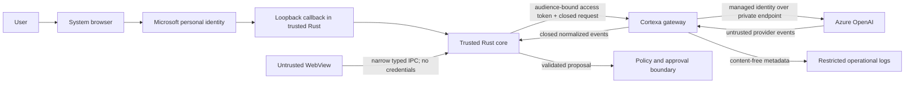

# Phase 4 gateway threat model

Status: Approved design boundary; no runtime path exists
Decision authority: D-060, D-061, D-062, D-063, and D-064
Companion specification:
[`phase4-gateway-configuration-spec.md`](phase4-gateway-configuration-spec.md)
Owner: Henry Dang, Founder & Principal Engineer, Cortexa AI
Last updated: 2026-07-19

## Purpose and current state

This threat model defines the security boundary for future Microsoft personal
identity, a Cortexa-operated Azure Container Apps gateway, and Azure OpenAI
provider access. It is a prerequisite for later provisioning and implementation
plans, not evidence that those systems exist.

Current source is transport-free. It has no OAuth/OIDC client, loopback server,
token, Keychain integration, HTTP client, gateway deployment, cloud resource,
`AgentProvider`, provider adapter, external-processing disclosure, or live
traffic. Therefore the threats below are future activation blockers rather than
currently reachable external attack paths.

## Security objectives

1. Keep identity and provider credentials out of the WebView, SQLite, logs,
   repository, ordinary CI, and model-visible data.
2. Authenticate only Microsoft personal identities issued under the approved
   authority and authorize only the exact gateway scope.
3. Send requests only from trusted Rust to one fixed Cortexa gateway origin.
4. Let only the gateway select and authenticate to the approved Azure OpenAI
   resource, deployment, model, and feature profile.
5. Preserve the local rule that model output remains untrusted and cannot
   approve or execute a device action.
6. Prevent real content from leaving the device until D-061 evidence and user
   disclosure gates pass.
7. Minimize and delete operational metadata while prohibiting content logging.
8. Fail closed on ambiguity, evidence expiry, cancellation, partial outages,
   configuration drift, and unsupported provider behavior.

## Protected assets

- Microsoft account identity, subject mapping, and account-linking state.
- Authorization codes, PKCE verifier, access tokens, and any future session
  credential.
- Azure managed-identity tokens and provider authorization.
- User-submitted text and its data classification.
- Closed gateway request, normalized events, tool-set identity, and limits.
- Policy, approval, cancellation, audit, and execution boundaries in trusted
  Rust.
- Gateway, identity, DNS, TLS, network, provider, logging, and retention
  configuration.
- Operational evidence, correlation identifiers, and incident records.
- Azure subscription, resource, deployment, and role-assignment ownership.

## Threat actors

| Actor                                        | Capability and motivation                                                                                     |
| -------------------------------------------- | ------------------------------------------------------------------------------------------------------------- |
| Malicious or compromised WebView content     | Attempts to obtain credentials, select endpoints/providers, forge IPC, or bypass disclosure and policy        |
| Malicious model or provider output           | Attempts prompt injection, schema confusion, oversized events, tool escalation, or local action authorization |
| Network attacker                             | Attempts DNS/TLS interception, redirect manipulation, token theft, replay, downgrade, or response injection   |
| Malicious local process or browser extension | Races the loopback redirect, reads process-visible data, replays codes, or impersonates the callback          |
| Compromised Microsoft account                | Uses valid identity to abuse rate, data, or authorization boundaries                                          |
| Abusive authenticated user                   | Sends prohibited data, attempts tenant/account confusion, exhausts resources, or probes provider controls     |
| Compromised gateway workload or dependency   | Exfiltrates tokens/content, changes provider settings, logs data, or reaches arbitrary destinations           |
| Cloud misconfiguration or privileged insider | Broadens ingress, egress, RBAC, logging, retention, or provider access outside the approved boundary          |
| Compromised AI provider or upstream response | Returns malformed/malicious data, changes behavior, retains content, or exposes raw errors                    |
| Supply-chain attacker                        | Introduces malicious desktop, gateway, action, container, or dependency behavior                              |

## Trust boundaries and data flows

### TB-1 - User and system browser to Microsoft identity

The browser is outside trusted Rust. Authorization parameters are generated by
trusted Rust and use one configured authority. Browser content cannot return a
credential directly to the WebView.

### TB-2 - Loopback callback to trusted Rust

The callback listener is a temporary local network boundary. It accepts one
matching response on `127.0.0.1`, verifies `state`, binds the code to the PKCE
attempt, and terminates on mismatch, timeout, cancellation, or success.

### TB-3 - Trusted Rust to Cortexa gateway

Trusted Rust sends one closed size-bounded request to the fixed HTTPS origin
with an audience-bound token. The WebView cannot supply the origin,
authorization header, provider, model, tools, schema, or limits.

### TB-4 - Gateway authentication and authorization

The gateway validates the Microsoft signature, issuer, personal-account
boundary, audience, time claims, and delegated scope before applying
server-owned rate, request, provider, model, and tool-set policy.

### TB-5 - Gateway to Azure OpenAI

The gateway uses one dedicated managed identity, exact-resource RBAC, private
endpoint, and closed provider configuration. Provider output is untrusted and
must be normalized before it reaches trusted Rust.

### TB-6 - Gateway to operational logging

Only enumerated content-free metadata may cross. Logs have restricted access,
automatic deletion within seven days, and no approval or execution authority.

### TB-7 - Trusted Rust to policy, approval, audit, and future execution

Gateway output remains non-authorizing. Existing local schema validation,
deterministic policy, exact approval, cancellation, and audit boundaries remain
mandatory. No gateway or identity result can bypass them.

### TB-8 - Operational control plane and evidence

Azure configuration, registration manifests, role assignments, ZDR evidence,
and incident controls are privileged operational data. The public repository
contains only sanitized decisions and evidence references.

## Abuse cases, controls, and required tests

| ID      | Abuse case                                                                    | Required controls                                                                                                                      | Required future evidence or test                                                                                                               |
| ------- | ----------------------------------------------------------------------------- | -------------------------------------------------------------------------------------------------------------------------------------- | ---------------------------------------------------------------------------------------------------------------------------------------------- |
| TM-001  | Authorization response injected or raced through loopback                     | Listener bound before browser launch; `127.0.0.1` only; high-entropy `state`; one callback; short timeout; PKCE S256                   | Wrong/missing/replayed `state`, second callback, wrong path/interface, timeout, and cancellation deny                                          |
| TM-002  | Authorization code intercepted and redeemed                                   | PKCE verifier retained only in Rust memory; exact redirect; one-time terminal attempt                                                  | Wrong verifier, reused code, callback replay, and post-cancel exchange deny without raw errors                                                 |
| TM-003  | Non-personal or attacker-selected issuer accepted                             | Fixed `/consumers` authority; discovery-derived closed issuer; personal-account tenant check                                           | Work, school, guest, arbitrary tenant, alternate metadata URL, wrong issuer, and unsigned token deny                                           |
| TM-004  | Token intended for another API is replayed                                    | One literal audience, exact `gateway.access` scope, time checks, bounded clock skew, short token lifetime                              | Wrong/multiple audience, missing/wrong scope, expired/future token, bad signature, and algorithm confusion deny                                |
| TM-004A | Microsoft token lifetime exceeds the accepted gateway boundary                | Maximum 15-minute gateway token remains a hard gate; no silent acceptance of the documented longer default                             | Stage B proves an enforceable personal-account configuration or a new decision is required; Stage C stays blocked                              |
| TM-005  | Email collision takes over another account                                    | Identity key is provider + normalized issuer + subject; no automatic email linking                                                     | Same email with different subject creates no link; missing email does not deny valid identity                                                  |
| TM-006  | Token or code leaks to WebView, SQLite, logs, crash output, or support bundle | Rust-memory-only access token; closed redacted errors; credential scans; no debug serialization                                        | Instrumented tests and artifact scans show no code, verifier, token, claims, or authorization header                                           |
| TM-007  | WebView or user changes gateway/provider configuration                        | Compiled or signed server-owned configuration; one gateway origin; no generic proxy or provider IPC                                    | Origin, issuer, audience, model, deployment, tool, parameter, and header injection attempts deny                                               |
| TM-008  | DNS/TLS attacker intercepts gateway traffic                                   | HTTPS only; valid certificate; fixed hostname; no TLS bypass; controlled DNS; fail closed                                              | Wrong hostname, invalid/expired certificate, HTTP, redirect, and alternate origin deny                                                         |
| TM-009  | Gateway default hostname bypasses custom-origin controls                      | Same authentication, authorization, limits, and logging on every reachable ingress; desktop trusts only custom origin                  | Direct default-host request is denied or receives identical controls; no unauthenticated route exists                                          |
| TM-010  | Authenticated user abuses request volume or size                              | Per-principal and global rate/concurrency limits; closed sizes and deadlines; bounded retries                                          | Oversized, concurrent, repeated, slow, and retry-amplification cases fail predictably                                                          |
| TM-011  | Gateway reaches arbitrary internet or internal metadata                       | Private provider endpoint; restricted egress; no caller URLs, proxy, hosted web, MCP, or redirect following                            | SSRF, metadata address, alternate provider host, redirect, DNS rebinding, and proxy-variable tests deny                                        |
| TM-012  | Compromised workload uses broad Azure authority                               | Dedicated non-shared user-assigned identity; exact-resource inference role; separate deployment principal                              | Broader role/scope scan fails; role removal denies inference; unrelated resource access denies                                                 |
| TM-013  | API-key fallback exposes provider credential                                  | Managed identity only; no provider key configuration or secret path                                                                    | Source, image, environment, deployment, log, and support-artifact scans find no provider API key                                               |
| TM-014  | Public Azure OpenAI endpoint bypasses private path                            | Private endpoint and private DNS; public network disabled before Stage C                                                               | Public endpoint request fails; private DNS resolves expected endpoint; approved private path succeeds                                          |
| TM-015  | Caller enables retained or hosted provider features                           | Gateway forces foreground `store: false`, `background: false`, strict functions, disabled parallel calls, and closed feature allowlist | Attempts to enable storage, background, hosted tools, files, retrieval, web, MCP, code, or fallback deny                                       |
| TM-016  | Provider response crosses local validation as authority                       | Gateway normalizes closed events; Rust independently validates protocol, schema, policy, approval, and cancellation                    | Unknown, malformed, oversized, out-of-order, duplicate, late, mixed, and malicious tool events deny                                            |
| TM-017  | Prompt injection changes policy or tool catalog                               | Model output remains data; local registry and policy own tool identity, schema, risk, and permission                                   | Prompt/model attempts to add tools, alter arguments after validation, grant permission, or execute deny                                        |
| TM-018  | Real or prohibited content transmits too early                                | Stage/data-class state machine; local classification; versioned disclosure acknowledgement; fail closed on uncertainty                 | Real text before Stage D and credentials, attachments, regulated, financial, health, sensitive, clipboard, file, or memory content always deny |
| TM-019  | Content appears in logs or telemetry                                          | Closed metadata allowlist; body/header/error redaction; content logging prohibited                                                     | Canary content and secret-pattern tests find no prompt, output, arguments, headers, token, or provider body                                    |
| TM-020  | Operational metadata persists beyond policy                                   | Maximum seven-day retention; automatic deletion; restricted access; deletion monitoring                                                | Expiry/deletion test, access review, failed-deletion alert, and incident procedure pass                                                        |
| TM-021  | ZDR is falsely inferred from request flags                                    | Exact provider approval, `ContentLogging=false`, stateless feature evidence, and owner sign-off are independent gates                  | Evidence validator rejects missing, expired, wrong-resource, wrong-model, or screenshot-only assertions                                        |
| TM-022  | Provider or model silently changes                                            | No automatic fallback; exact resource/deployment/model/version evidence; fail closed on mismatch                                       | Changed deployment/model/version/provider and unsupported region prevent activation                                                            |
| TM-023  | Cancellation permits late provider or tool activity                           | Abort desktop-gateway and gateway-provider streams; terminal local validator; discard late events; idempotent cancel                   | Cancellation at each boundary rejects late text, function calls, approval, retries, and continuation                                           |
| TM-024  | Raw upstream failures leak data or trigger unsafe retry                       | Closed redacted error taxonomy; opaque correlation; bounded retry only before accepted effects                                         | Raw body/header/stack trace never crosses; non-retryable and post-acceptance failures do not retry                                             |
| TM-025  | Supply-chain change weakens boundary                                          | Pinned reviewed dependencies/images/actions; minimal build inputs; SBOM/audit and provenance before release                            | Dependency, container, action, and image provenance reviews pass without unapproved network/credential paths                                   |
| TM-026  | Operator changes configuration without evidence                               | Least-privilege control plane; change review; evidence versioning; drift detection; stage rollback                                     | Drift scan detects origin, issuer, RBAC, network, provider, logging, retention, or feature changes and disables activation                     |

## Security test suites required before Stage C

### Identity contract tests

- Authorization URL contains only the approved authority, client, redirect,
  scopes, response mode, PKCE S256 challenge, `state`, and `nonce`.
- Loopback binding, callback parsing, timeout, cancellation, duplicate callback,
  and terminal cleanup pass on the target Mac.
- Token validation covers signing-key rollover, algorithm allowlist, issuer,
  personal tenant, audience, scope, expiration/not-before, maximum lifetime,
  and closed redacted errors.
- Registration and target-Mac tests prove the manifest-based `127.0.0.1`
  callback works on an ephemeral port; failure requires an additive decision
  rather than a redirect fallback.
- Credentials and provider errors are absent from WebView IPC, SQLite, logs,
  debug output, fixtures, crash output, and support artifacts.

### Gateway contract tests

- Unauthenticated, unauthorized, malformed, oversized, over-rate, and
  over-concurrency requests fail closed.
- Only the fixed origin, versioned request, approved tool set, configured model,
  and closed provider settings are accepted.
- Cancellation, timeouts, retries, connection loss, late events, and provider
  failures preserve terminal local behavior and no duplicate accepted effect.
- Error responses expose only closed codes, retryability, bounded delay, and
  opaque correlation identifiers.

### Azure boundary tests

- The runtime uses the dedicated managed identity and exact-resource inference
  role; API keys and broader control-plane permissions are absent.
- Azure OpenAI public access is disabled; private DNS/private endpoint behavior
  and restricted egress pass.
- Wrong resource, deployment, model, region, identity, role, and endpoint fail.
- Provider feature enforcement proves storage/background/parallel/hosted
  features and automatic fallback cannot be caller-enabled.

### Privacy and operational tests

- Stage and data-class gates reject real or prohibited content before the
  applicable activation.
- Disclosure acknowledgement is required before every first transmission and
  after a material version change.
- Canary data never appears in logs, traces, metrics, audit, support artifacts,
  or provider error surfaces.
- Metadata access, seven-day deletion, failed-deletion alert, evidence expiry,
  drift detection, incident shutdown, and rollback procedures pass.

## Activation blockers

### Blocks Stage B

- Unapproved plan, resource owner, evidence location, resource inventory, or
  rollback.
- Any requirement to store a secret or operational credential in the
  repository or ordinary CI.

### Blocks Stage C

- Missing or mismatched registration, issuer, audience, scope, callback,
  gateway, DNS/TLS, managed identity, RBAC, private endpoint, egress, logging,
  disclosure, or synthetic-test evidence.
- Any public provider access, API-key fallback, WebView credential exposure, or
  unrestricted endpoint selection.
- Missing separately approved implementation plan and security tests.

### Blocks Stage D

- Missing, expired, or wrong-scope provider-approved ZDR evidence.
- Missing `ContentLogging=false`, stateless Responses, retention, deletion,
  disclosure, access, incident, or exact production configuration evidence.
- Any failed security test, unresolved Critical or High blocking finding, or
  attempt to send a prohibited data class.

## Incident containment and rollback requirements

A future implementation must provide one owner-authorized kill switch that
disables new gateway requests without requiring a desktop release. On suspected
token, identity, DNS/TLS, gateway, managed-identity, provider, logging, or
retention compromise:

1. Disable traffic and real-content activation.
2. Revoke affected sessions/tokens and managed-identity role assignments.
3. Disable or isolate the gateway/provider deployment as appropriate.
4. Preserve only content-free incident evidence.
5. Assess affected users and required disclosure without making unsupported
   claims.
6. Correct the cause, rotate/recreate affected credentials or resources, rerun
   every dependent gate, and obtain explicit reactivation approval.

Rollback to an earlier stage never preserves later-stage authority.

## Residual risks and ownership

- A compromised endpoint or Microsoft account can make authorized requests;
  rate, scope, data-class, policy, and approval controls limit but do not remove
  this risk.
- A compromised trusted gateway can observe approved transmitted content;
  minimization, short processing, network isolation, least privilege, no
  content logs, and operations controls reduce the impact.
- Provider contractual or technical behavior can change; exact evidence has an
  expiration/revalidation trigger and no provider inherits another's approval.
- Local malware with the user's privileges may inspect process memory. Short
  token lifetime, no persistent session, and no WebView/SQLite exposure reduce
  persistence but do not create a hardened device boundary.
- Azure and Microsoft service availability remain external dependencies. The
  product fails closed; no silent provider or cloud fallback is permitted.

Henry Dang is the project, privacy, security, operations, provider-credential,
and incident-response owner for Phase 1. This concentration is acceptable for
the current private development stage but must be revisited before delegating
operations, onboarding staff, or production release.

## Revisit triggers

Reopen this threat model before adding another identity provider, workforce
tenant, persistent session, Keychain credential, gateway origin, cloud,
region, AI provider, provider feature, real data class, attachment, automatic
context, durable gateway audit, organization account, public release,
operational delegate, or execution capability.
